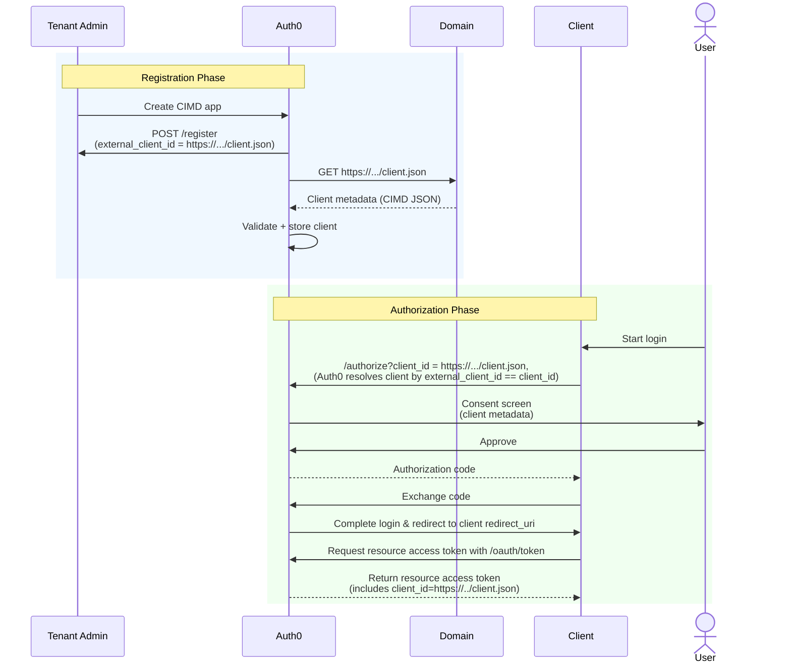

Register an MCP client in Auth0 by importing its externally hosted Client ID Metadata Document (CIMD) from a URL. A CIMD is a JSON file containing client metadata hosted on your domain (e.g., `https://example-client.com/mcp-metadata.json`). The CIMD's URL is the application's client ID and proves domain ownership, ensuring only trusted tenant administrators can register applications.

When you import an MCP client from its CIMD URL, Auth0 fetches, validates, and persists the metadata to register it as a CIMD client. While Auth0 maintains a record of these settings, the hosted CIMD remains the source of truth; metadata updates are synchronized through [manual refreshes](#refresh-client-metadata).

## Key benefits

Manual CIMD registration has the following benefits:

1. MCP clients only need to be registered with CIMD once per deployment. All instances of that deployment use the same registration credentials.
2. Uses asymmetric cryptography (public/private keys) instead of shared symmetric secrets that can be leaked.
3. Application owners manage client metadata directly in the CIMD; Auth0 automatically maps these properties to its internal configuration during registration.
4. The CIMD URL acts as a human-readable identifier in audit logs, making it easy to verify the origin of requests from specific MCP tool servers or hosts.

## Example CIMD

The following is an example CIMD for a public MCP client:

```json https://example-client.com/mcp-metadata.json wrap lines
{
  "client_id": "https://example-client.com/mcp-metadata.json",
  "client_name": "Example MCP Tool Server",
  "description": "MCP server providing tools for data analysis",
  "logo_uri": "https://example-client.com/logo.png",
  "application_type": "web",
  "grant_types": ["authorization_code", "refresh_token"],
  "redirect_uris": [
    "https://example-client.com/callback"
  ],
  "token_endpoint_auth_method": "none",
  "response_types": ["code"]
}
```

Auth0 automatically [maps and validates CIMD fields](/get-started/auth0-overview/create-applications/register-applications-with-cimd#cimd-json-validation-rules). To learn more about supported client types, read [Prerequisites](#prerequisites).

## How it works

The following diagram shows the end-to-end manual CIMD registration flow:

- [Phase 1: Registration](#phase-1-registration)
- [Phase 2: Authorization](#phase-2-authorization)



### Phase 1: Registration

During manual CIMD registration, a tenant admin registers the MCP client by importing its externally hosted metadata to Auth0:

1. **Application creation**: The tenant admin creates a CIMD app in Auth0 by:
   - Selecting **Import from URL** in the Auth0 Dashboard
   - Making a `POST` request to the `/register` endpoint, providing the `external_client_id`
2. **Metadata fetch**: Auth0 makes a `GET` request to the client's domain to retrieve the CIMD (`client.json`).
3. **Security validation**: Auth0 validates the CIMD URL against the [CIMD URL validation rules](/get-started/auth0-overview/create-applications/register-applications-with-cimd#cimd-url-validation-rules) and the JSON against the [CIMD validation rules](/get-started/auth0-overview/create-applications/register-applications-with-cimd#cimd-json-validation-rules), verifying that the internal `client_id` matches the CIMD URL, among other checks.
4. **Persistence**: Once validated, Auth0 stores the client configuration in the database, linking the internal Auth0 `client_id` with the `external_client_id` and the mapped metadata (e.g., `client_name`, `callbacks`).
5. **Confirmation**: The API returns a success response; the MCP client has been successfully registered as a CIMD client in Auth0.

### Phase 2: Authorization

Once registered, the MCP client uses its CIMD URL as its identity during the OAuth 2.1 flow.

1. **Start login**: The user logs in to the MCP client.
2. **Authorization request**: The MCP client makes a request to the Auth0 Authorization Server, passing its CIMD URL as the `client_id`.
3. **Client resolution**: The Auth0 Authorization Server queries the database to resolve the provided URL to the stored client configuration.
4. **User consent**: Auth0 displays a consent screen to the user, identifying the application by the `client_name` retrieved from the CIMD metadata.
5. **User approval**: After the user approves consent, Auth0 redirects the user back to the MCP client with an authorization code.
6. **Token exchange**: The MCP client exchanges the authorization code for an access token at the token endpoint.
7. **Login complete**: The Auth0 Authorization Server returns an access token where the `client_id` is set to the CIMD URL. The user is successfully logged in to the MCP client.

## Prerequisites

Before registering an MCP client with manual CIMD, make sure your tenant and MCP client meet the following requirements:

### Tenant configuration

- **Enable CIMD support**: Enable the **Client ID Metadata Document Registration** toggle in your [tenant settings](/get-started/tenant-settings) to import CIMD via URL.
  - Navigate to **Settings > Advanced** and scroll down to the **Settings** section.
  - Toggle on **Client ID Metadata Document Registration**.
- **Resource Parameter Compatibility Profile** (Optional): For MCP clients, we recommend enabling this profile in your [tenant settings](/get-started/tenant-settings). This allows the authorization server to handle resource-specific requests ([RFC 8707](https://datatracker.ietf.org/doc/html/rfc8707)) by checking the `resource` parameter if the `audience` is not provided.

### Supported client types

You can register the following client types with manual CIMD in Auth0:

- **Application type**: Must be a native or regular web application.
- **Third-party application**: Must be a [third-party application](/get-started/auth0-overview/create-applications/third-party-applications) (`is_first_party: false`), which are subject to [enhanced security controls](/get-started/auth0-overview/create-applications/third-party-applications#enhanced-security-controls) by default. Once registered, [configure your CIMD client as a third-party application in Auth0](#set-up-cimd-client).

### Supported authentication methods

CIMD clients cannot use authentication methods based on shared symmetric secrets, such as `client_secret_post`, `client_secret_basic`, or `client_secret_jwt`.

Depending on whether the client is public or confidential, Auth0 supports the following authentication methods for CIMD clients:

- **Public clients**:
  - Set `token_endpoint_auth_method` to `none` in client metadata
  - Must use [Proof Key for Code Exchange (PKCE)](/get-started/authentication-and-authorization-flow/authorization-code-flow-with-pkce) for secure authorization flows
  - No client authentication required at the token endpoint
- **Confidential clients**:
  - Only [Private Key JWT authentication](/get-started/authentication-and-authorization-flow/client-authentication/client-secret-alternatives/private-key-jwt) is supported; set `token_endpoint_auth_method` to `private_key_jwt` in client metadata
  - Provide a `jwks_uri` to host public keys. The `jwks_uri` must share the exact same origin (scheme, host, and port) as the CIMD URL. To learn more, read [CIMD JSON validation rules](/get-started/auth0-overview/create-applications/register-applications-with-cimd#cimd-json-validation-rules).

<Note>
CIMD clients that use Private Key JWT authentication must [implement key rotation by generating a new key pair with a new, unique kid](/get-started/authentication-and-authorization-flow/client-authentication/client-secret-alternatives/private-key-jwt#rotate-signing-keys).
</Note>

## Register applications with manual CIMD in Auth0

To register an application with manual CIMD using the Auth0 Dashboard:

1. Navigate to **Applications > Applications**.
2. Select **Create Application > Import from URL**.
3. Enter the CIMD URL. Then, select **Preview**. Auth0 validates the CIMD URL against the [CIMD URL validation rules](/get-started/auth0-overview/create-applications/register-applications-with-cimd#cimd-url-validation-rules).
4. If your CIMD URL is valid, Auth0 loads the CIMD and validates it against the [CIMD JSON validation rules](/get-started/auth0-overview/create-applications/register-applications-with-cimd#cimd-json-validation-rules). Preview your client metadata and troubleshoot it for any validation errors.
5. To register your application as a CIMD client, select **Create**.

## Set up CIMD client

Manual CIMD registration is strictly limited to third-party applications (`is_first_party: false`), which are subject to enhanced security controls. Once you've registered your CIMD client, configure it as a third-party application in Auth0:

- [Configure client grant](#configure-client-grant)
- [Promote connections to domain level](#promote-connections-to-domain-level)

### Configure client grant

Third-party applications, including CIMD clients, require an explicit client grant to access APIs, even if the [API access policy](/get-started/apis/api-authorization/configure-access-to-apis#configure-api-access-policy) is set to **Allow**.

Once you've created and registered your CIMD client, [configure the user and client access policy](/get-started/apis/api-authorization/configure-access-to-apis#configure-api-access-policy) for each API the CIMD client needs to access:

- **User access**: Set to **Per-app authorization**.
- **Client access**: Set to **Per-app authorization**.

To authorize API access for the CIMD client:

1. Navigate to **Dashboard > Applications** and select the CIMD client.
2. Under **APIs**, select **Edit** and authorize for **User access** and **client access**. Then, select your desired permissions.
3. Select **Save**.

To learn more about configuring the API access policies for third-party applications, read [Configure Third-Party Applications](/get-started/auth0-overview/create-applications/third-party-applications/configure-third-party-applications).

### Promote connections to domain level

Third-party applications, including CIMD clients, can only use [domain-level connections](/authenticate/database-connections/promote-connections-to-domain-level). You can promote any connection type (Database, Social, Enterprise, or Passwordless) to the domain level.

In the Auth0 Dashboard:

1. Navigate to **Authentication** and select the connection type (e.g., **Database**, **Social**, **Enterprise**).
2. Create a new connection or select an existing one to configure.
3. Under the **Settings** tab, scroll down to the **Promote Connection to Domain Level** setting, which is typically in the **Advanced** section.
4. Enable the toggle switch.
5. Select **Save**.

## Refresh client metadata

Once you've registered the CIMD client, you can manually refresh client metadata. Auth0 fetches fresh client metadata from the CIMD, which you can preview and save.

In the Auth0 Dashboard:

1. Navigate to **Applications > Applications** and select your CIMD client.
2. At the top-right corner, select **Refresh Client Metadata**.
3. Select **Refresh Preview** to preview the latest client metadata in the CIMD. Review any validation warnings or errors.
4. Select **Save**.

## Learn more

- [Register Applications with CIMD](/get-started/auth0-overview/create-applications/register-applications-with-cimd): Learn how to register applications with CIMD in Auth0.
