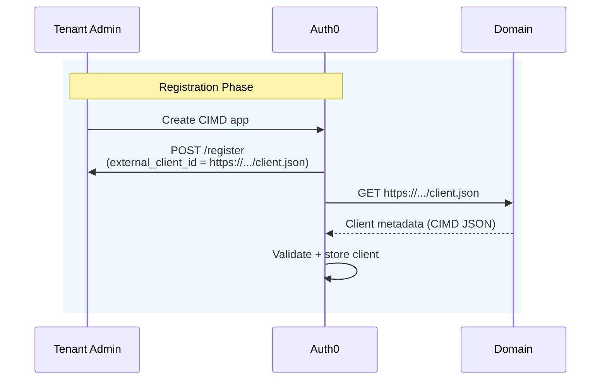

Register an MCP client in Auth0 by importing its externally hosted Client ID Metadata Document (CIMD) from a URL. A CIMD is a JSON file containing client metadata hosted on your domain (e.g., `https://example-client.com/mcp-metadata.json`). The CIMD URL serves as the application's client ID and proves domain ownership, ensuring only trusted tenant administrators can register applications.

With CIMD, you only need to register your MCP server once per deployment. All instances of that deployment use the same CIMD URL as their client ID. Whether you're running one instance or hundreds across multiple regions, they all share the same registration credentials. This eliminates the need to manage separate client IDs and secrets for each instance, simplifying credential management at scale.

You can only register [third-party applications](https://auth0.com/docs/get-started/applications/third-party-applications) using manual CIMD, which are subject to [enhanced security controls](https://auth0.com/docs/get-started/applications/third-party-applications/security-controls). Once registered, [configure the API access policy](#configure-api-access-policy) and [promote your connections to the domain level](#promote-connections-to-domain-level), which are required for third-party applications in Auth0.

## Key benefits

Manual CIMD registration has the following benefits:

1. MCP clients only need to be registered with CIMD once per deployment. All instances of that deployment use the same registration credentials.
2. Uses asymmetric cryptography (public/private keys) instead of shared symmetric secrets that can be leaked.
3. Application owners manage client metadata directly in the CIMD; Auth0 automatically maps these properties to its internal configuration during registration.
4. The CIMD URL acts as a human-readable identifier in audit logs, making it easy to verify the origin of requests from specific MCP tool servers or hosts.

## Example CIMD

The following is an example CIMD for a public MCP client:

```json https://example-client.com/mcp-metadata.json wrap lines
{
  "client_id": "https://example-client.com/mcp-metadata.json",
  "client_name": "Example MCP Tool Server",
  "description": "MCP server providing tools for data analysis",
  "logo_uri": "https://example-client.com/logo.png",
  "application_type": "web",
  "grant_types": ["authorization_code", "refresh_token"],
  "redirect_uris": [
    "https://example-client.com/callback"
  ],
  "token_endpoint_auth_method": "none",
  "response_types": ["code"]
}
```

When you import an MCP client from its CIMD URL, Auth0 fetches, [validates](https://auth0.com/docs/get-started/auth0-overview/create-applications/register-applications-with-cimd#cimd-json-validation-rules), and persists the metadata to register it as a CIMD client. While Auth0 maintains a record of these settings, the hosted CIMD remains the source of truth; metadata updates are synchronized through [manual refreshes](#refresh-client-metadata).

## How it works

The following diagram shows the end-to-end manual CIMD registration flow:


During manual CIMD registration, a tenant admin registers the application by importing its externally hosted CIMD to Auth0:

1. **Application creation**: The tenant admin creates a CIMD app in Auth0 by:
   * Selecting **Import from URL** in the Auth0 Dashboard
   * Making a `POST` request to the `/register` endpoint, providing the `external_client_id`
2. **Metadata fetch**: Auth0 makes a `GET` request to the client's domain to retrieve the CIMD (client.json).
3. **Security validation**: Auth0 maps and validates the CIMD URL against the [CIMD URL validation rules](https://auth0.com/docs/get-started/auth0-overview/create-applications/register-applications-with-cimd#cimd-url-validation-rules) and the CIMD against the [CIMD JSON validation rules](https://auth0.com/docs/get-started/auth0-overview/create-applications/register-applications-with-cimd#cimd-json-validation-rules), verifying that the `external_client_id` matches the CIMD URL, among other checks.
4. **Persistence**: Once validated, Auth0 stores the client metadata in the database.
5. **Confirmation**: Auth0 returns a success response; the application has been successfully registered as a CIMD client in Auth0.

## Prerequisites

Before registering an application with manual CIMD, make sure your tenant and application meet the following requirements:

### Tenant configuration

* **Enable CIMD support**: Enable the **Client ID Metadata Document Registration** toggle in your [tenant settings](https://auth0.com/docs/get-started/tenant-settings) to indicate CIMD support in the Auth0 Authorization Server metadata, allowing MCP clients to automatically discover this capability when connecting.
  * Navigate to **Settings > Advanced** and scroll down to the **Settings** section.
  * Toggle on **Client ID Metadata Document Registration**.
* **Resource Parameter Compatibility Profile (Optional)**: For MCP clients, we recommend enabling this profile in your [tenant settings](https://auth0.com/docs/get-started/tenant-settings). This allows the authorization server to handle resource-specific requests ([RFC 8707](https://www.rfc-editor.org/rfc/rfc8707.html#name-resource-parameter)) by checking the `resource` parameter if the `audience` is not provided.

### Supported client types

You can register the following client types with manual CIMD in Auth0:

* **Application type**: Must be a native or regular web application.
* **Third-party application**: Must be a [third-party application](https://auth0.com/docs/get-started/applications/third-party-applications) (`is_first_party: false`), which is subject to [enhanced security controls](https://auth0.com//docs/get-started/applications/third-party-applications/security-controls). Once registered, [set up your CIMD client](#set-up-cimd-client) as a third-party application in Auth0.

### Supported authentication methods

CIMD clients cannot use authentication methods based on shared symmetric secrets, such as `client_secret_post`, `client_secret_basic`, or `client_secret_jwt`.

Depending on whether the client is public or confidential, Auth0 supports the following authentication methods for CIMD clients:

* **Public clients**:
  * No client authentication required at the token endpoint; set `token_endpoint_auth_method` to `none` in client metadata
  * Must use [Proof Key for Code Exchange (PKCE)](https://auth0.com/docs/get-started/authentication-and-authorization-flow/authorization-code-flow-with-pkce) for authorization flows
* **Confidential clients**:
  * Only [Private Key JWT authentication](https://auth0.com/docs/get-started/authentication-and-authorization-flow/authenticate-with-private-key-jwt) is supported; set `token_endpoint_auth_method` to `private_key_jwt` in client metadata
  * Provide a `jwks_uri` to host public keys. The `jwks_uri` must share the exact same origin (scheme, host, and port) as the CIMD URL. To learn more, read [CIMD JSON validation rules](https://auth0.com/docs/get-started/auth0-overview/create-applications/register-applications-with-cimd#cimd-json-validation-rules).

<Callout icon="file-lines" color="#0EA5E9" iconType="regular">
  Private Key JWT authentication is available only for Enterprise customers. To learn more about Enterprise plans, review [Pricing](https://auth0.com/pricing) or contact [Auth0 Sales](https://auth0.com/contact-us).
</Callout>

<Callout icon="file-lines" color="#0EA5E9" iconType="regular">
  CIMD clients that use Private Key JWT authentication must [implement key rotation by generating a new key pair with a new, unique `kid`](https://auth0.com/docs/get-started/auth0-overview/create-applications/register-applications-with-cimd#security-considerations).
</Callout>

## Register applications with manual CIMD in Auth0

To register an application with manual CIMD using the Auth0 Dashboard:

1. Navigate to **Applications > Applications**.
2. Select **Create Application > Import from URL**.
3. Enter the CIMD URL. Then, select **Preview**. Auth0 validates the CIMD URL against the [CIMD URL validation rules](https://auth0.com/docs/get-started/auth0-overview/create-applications/register-applications-with-cimd#cimd-url-validation-rules).
4. If your CIMD URL is valid, Auth0 loads the CIMD and validates it against the [CIMD JSON validation rules](https://auth0.com/docs/get-started/auth0-overview/create-applications/register-applications-with-cimd#cimd-json-validation-rules). Preview your client metadata and troubleshoot it for any validation errors.
5. To register your application as a CIMD client, select **Create**.

## Configure API access policy

Third-party applications, including CIMD clients, require client grants for [user-delegated and client access](https://auth0.com/docs/get-started/apis/api-access-policies-for-applications#user-delegated-access-vs-client-access) to APIs. You can configure:
- [Per-application grants](#per-application-grant): Apply granular permissions to each application in your tenant.
- [Default grants](#default-grant): Apply default permissions to all third-party applications in your tenant. 

When both exist for the same API, the per-application grant takes precedence over the default grant. To learn more about configuring the API access policies for third-party applications, read [Configure Third-Party Applications](https://auth0.com/docs/get-started/applications/third-party-applications/configure-third-party-applications).

### Per-application grant

To create a per-application grant using the Auth0 Dashboard:

1. Navigate to **Applications > APIs** and select the API.
2. Go to the **Settings** tab.
3. Scroll to **Application Access Policy** and set **User-Delegated Access** and **Client Access** to **Per-app authorization**.
4. Select **Save**.

To authorize API access for the CIMD client using the Auth0 Dashboard:

1. Navigate to **Applications > APIs** and select the API.
2. Go to the **Application Access** tab.
3. Scroll to the CIMD client, select **Edit**, and then **Grant Access** for **User-Delegated Access** and/or **Client Access**. Then, select your desired permissions.
3. Select **Save**.

### Default grant

To create a default grant using the Auth0 Dashboard:

1. Navigate to **Applications > APIs** and select the API.
2. Go to the **Settings** tab.
3. Scroll to **Default Permissions for Third-Party Applications**.
4. Select **Authorized** or **All** for **User-Delegated Access** or **Client Access**. If you selected **Authorized**, select the scopes to grant.
5. Select **Save**.

## Promote connections to domain level

Third-party applications, including CIMD clients, can only use [domain-level connections](https://auth0.com/docs/authenticate/identity-providers/promote-connections-to-domain-level). You can promote any connection type (Database, Social, Enterprise, or Passwordless) to the domain level.

To promote a connection to the domain level using the Auth0 Dashboard:

1. Navigate to **Authentication** and select the connection type (e.g., **Database**, **Social**, **Enterprise**).
2. Create a new connection or select an existing one to configure.
3. Under the **Settings** tab, scroll down to the **Promote Connection to Domain Level** setting, which is typically in the **Advanced** section.
4. Enable the toggle switch.
5. Select **Save**.

## Refresh client metadata

Once you've registered the CIMD client, you can manually refresh client metadata. Auth0 fetches fresh client metadata from the CIMD, which you can preview and save.

When you refresh client metadata, Auth0 updates the `app_type` and `grant_types` to match the values in the hosted CIMD. To learn more about CIMD fields, read [CIMD JSON validation rules](https://auth0.com/docs/get-started/auth0-overview/create-applications/register-applications-with-cimd#cimd-json-validation-rules).

In the Auth0 Dashboard:

1. Navigate to **Applications > Applications** and select your CIMD client.
2. At the top-right corner, select **Refresh Client Metadata**.
3. Select **Refresh Preview** to preview the latest client metadata in the CIMD. Review any validation warnings or errors.
4. Select **Save**.

## Learn more

- [Register Applications with CIMD](https://auth0.com/docs/get-started/auth0-overview/create-applications/register-applications-with-cimd): Learn how to register applications with CIMD in Auth0.
