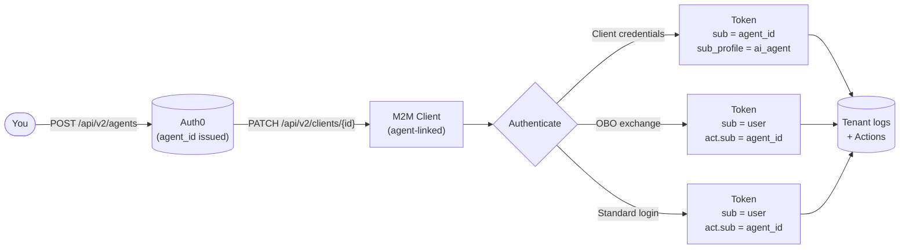

import { ReleaseStageNotice } from "/snippets/ReleaseStageNotice.jsx"

<ReleaseStageNotice
    feature="Agents as Principal"
    stage="ea"
    contact="Auth0 Support"
    terms="true"
/>

Agents as Principal introduces AI agents as first-class identities in Auth0, distinct from human users and traditional machine-to-machine (M2M) clients. An agent is a registered entity with a stable identifier and its own lifecycle management, credentials, and audit trail.

Once registered as an Auth0 principal, an agent can:

- Act on the user's behalf
- Run autonomously without a user session
- Engage in multi-hop delegation through token exchange

## Use cases

- Autonomous agents: An AI agent uses client credentials to call APIs directly as itself, with its identity tracked in logs and tokens.
- Delegated access: A user authorizes an AI agent to act on their behalf. The agent exchanges the user's access token for a delegated token that retains the user as the subject and identifies the agent as the actor.
- Multi-hop chains: An orchestrating agent delegates to a sub-agent. The delegation chain is preserved in nested `act` claims, enabling full traceability at any resource server.

## How it works

Agents as Principal works in three stages: registration, client association, and token issuance.

1. [Register the agent](/docs/ai-agents-mcp/agents-as-principal/register-an-agent): You register an agent in Auth0 using the Dashboard or Management API. Auth0 creates an [agent object](/docs/ai-agents-mcp/agents-as-principal/register-an-agent#agent-object) with a stable `agent_id` that can be traced across tokens, logs, and the Management API for its entire lifecycle.

2. [Associate the agent with a client](/docs/ai-agents-mcp/agents-as-principal/associate-agent-client): An agent has no credentials of its own; it authenticates through one or more associated clients. One agent can be linked to multiple clients, which is useful for separate clients per environment or region while maintaining a single logical identity in logs.

3. [Agent identity in tokens](/docs/ai-agents-mcp/agents-as-principal/agent-identity-in-tokens): When an agent-linked client authenticates, Auth0 embeds the agent's identity into the issued token depending on the grant type.

The `agent_id` (or `external_agent_id`, if set at creation) is also written to [tenant logs](/docs/ai-agents-mcp/agents-as-principal/tenant-logs) on every token issuance, giving you a complete per-agent audit trail. You can also access agent identity in [Actions](/docs/ai-agents-mcp/agents-as-principal/actions-context) via `event.agent` to apply custom logic at the time of token issuance.

## Migration guidance

Migrate your existing clients and resource servers to use Agents as Principal.

### Clients 

Existing clients are unaffected unless you explicitly associate them with an agent. Agent association is opt-in and reversible. To learn more, read [Associate an agent with a client](/docs/ai-agents-mcp/agents-as-principal/associate-agent-client).

### Resource servers

To receive `sub_profile` and `client_profile` claims, set `agent_subject_claims: 'auth0-v1'` on the target resource server configuration. This is opt-in per resource server. To learn more, read [Configure resource server to receive agent subject claims](/docs/ai-agents-mcp/agents-as-principal/agent-identity-in-tokens#configure-resource-server-to-receive-agent-subject-claims).