Auth0's Authentication API implements industry-standard protocols — OAuth 2.0, OpenID Connect (OIDC), SAML 2.0, and WS-Federation — to authenticate users and authorize access to your applications and APIs. Rather than operating as independent resources, the endpoints in this API work together as steps in authentication flows.

This page maps each authentication flow to the endpoints involved, describes when to use each flow, and walks through the sequence of API calls your application makes.

## Choosing a Flow

The right flow depends on your application type and security requirements.

| Application Type | Recommended Flow | Why |
| --- | --- | --- |
| Server-side web app | [Authorization Code](#authorization-code-flow) | Server can securely store client secret; exchanges code for tokens on back channel |
| Single-page app (SPA) | [Authorization Code with PKCE](#authorization-code-flow-with-pkce) | No client secret needed; PKCE protects against code interception |
| Native / mobile app | [Authorization Code with PKCE](#authorization-code-flow-with-pkce) | Same as SPA — public client that cannot store secrets |
| Machine-to-machine (M2M) | [Client Credentials](#client-credentials-flow) | No user involved; service authenticates with its own credentials |
| Smart TV / IoT / CLI | [Device Authorization](#device-authorization-flow) | Input-constrained device delegates login to a separate browser |
| Call center / kiosk | [Back-Channel Authentication (CIBA)](#back-channel-authentication-ciba) | User authenticates on their phone while an agent or device initiates the request |
| Email or SMS login | [Passwordless](#passwordless-authentication) | No password needed; user receives a code or magic link |
| Enterprise SSO (SAML) | [SAML](#saml-sso) | Integrates with enterprise SAML identity providers |
| Enterprise SSO (WS-Fed) | [WS-Federation](#ws-federation) | Integrates with ADFS and other WS-Federation providers |

---

## OAuth 2.0 and OpenID Connect Flows

### Authorization Code Flow

**Use when:** Your application runs on a server and can securely store a client secret.

This is the most common flow for server-side web applications. The user authenticates in their browser, your application receives an authorization code via redirect, and then exchanges that code for tokens on a secure back channel.

**Sequence:**

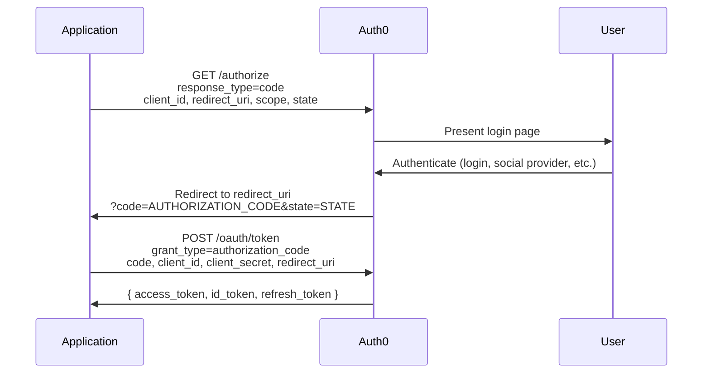

**Endpoints involved:**

| Step | Endpoint | Reference |
| --- | --- | --- |
| 1 | `GET /authorize` | [Authorization Endpoint](/docs/api/authentication/authorization/authorization-endpoint) |
| 4 | `POST /oauth/token` | [Token Endpoint](/docs/api/authentication/token-exchange/token-endpoint) |

**Key parameters:**

- `response_type=code` — tells Auth0 to return an authorization code
- `scope=openid profile email` — request an ID token with profile claims
- `state` — CSRF protection; generate a random value and verify it on callback
- `redirect_uri` — must be registered in your application's Allowed Callback URLs

---

### Authorization Code Flow with PKCE

**Use when:** Your application is a single-page app (SPA), native mobile app, or any public client that cannot securely store a client secret.

PKCE (Proof Key for Code Exchange) adds a layer of security by generating a one-time cryptographic challenge that ties the authorization request to the token exchange. This prevents authorization code interception attacks.

**Sequence:**

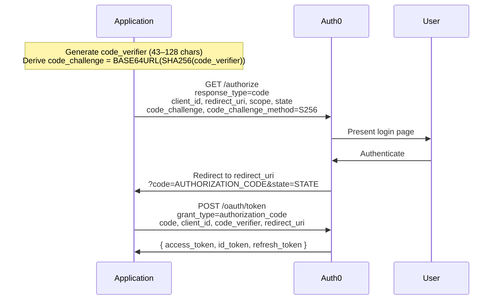

**Endpoints involved:**

| Step | Endpoint | Reference |
| --- | --- | --- |
| 2 | `GET /authorize` | [Authorization Endpoint](/docs/api/authentication/authorization/authorization-endpoint) |
| 5 | `POST /oauth/token` | [Token Endpoint](/docs/api/authentication/token-exchange/token-endpoint) |

**Key differences from standard Authorization Code Flow:**

- No `client_secret` is sent — the `code_verifier` proves the caller is the same one that initiated the flow
- `code_challenge` and `code_challenge_method=S256` are sent in the authorization request
- `code_verifier` (the original random string) is sent in the token exchange

---

### Client Credentials Flow

**Use when:** Your application is a service or daemon that needs to access an API without any user involvement. This is a machine-to-machine (M2M) flow.

There is no user interaction. Your application authenticates directly with Auth0 using its client ID and secret and receives an access token for the requested API.

**Sequence:**

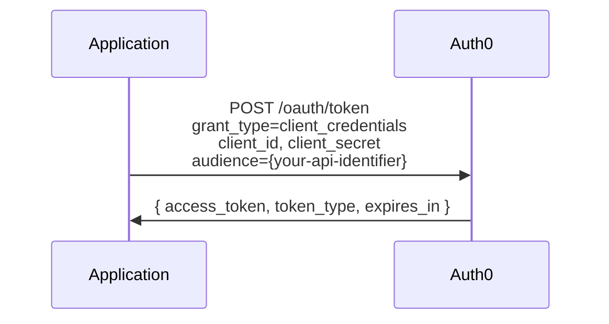

**Endpoints involved:**

| Step | Endpoint | Reference |
| --- | --- | --- |
| 1 | `POST /oauth/token` | [Token Endpoint](/docs/api/authentication/token-exchange/token-endpoint) |

**Key parameters:**

- `audience` — the unique identifier of the API you want to access (required)
- No `id_token` or `refresh_token` is returned — this flow is for API access only

---

### Device Authorization Flow

**Use when:** Your application runs on an input-constrained device (smart TV, IoT device, CLI tool) that cannot easily handle browser-based login.

The device displays a short code and URL. The user visits that URL on their phone or computer, enters the code, and authenticates. Meanwhile, the device polls for tokens until the user completes login.

**Sequence:**

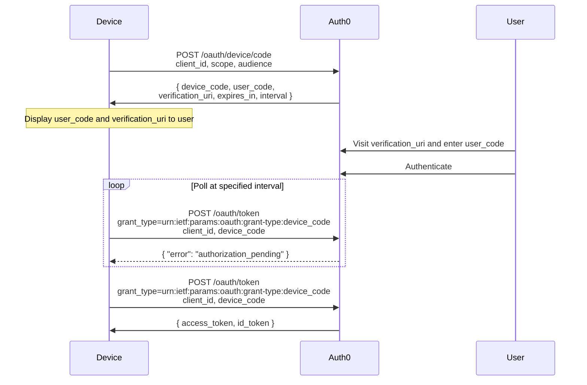

**Endpoints involved:**

| Step | Endpoint | Reference |
| --- | --- | --- |
| 1 | `POST /oauth/device/code` | [Request Device Code](/docs/api/authentication/device-authorization/request-device-code) |
| 5 | `POST /oauth/token` | [Token Endpoint](/docs/api/authentication/token-exchange/token-endpoint) |

**Key parameters:**

- `interval` — minimum seconds to wait between polling requests (typically 5)
- `expires_in` — how long the device and user codes remain valid (typically 900 seconds)
- While polling, expect `authorization_pending` responses until the user completes authentication

---

### Refresh Token Flow

**Use when:** Your application has a valid refresh token and needs to obtain a new access token without requiring the user to log in again.

Refresh tokens are issued when the `offline_access` scope is requested during initial authentication. They are long-lived credentials that let your application silently obtain fresh access tokens.

**Sequence:**

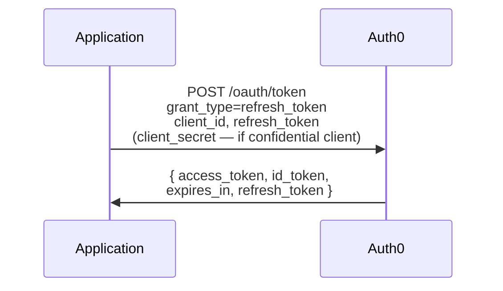

**Endpoints involved:**

| Step | Endpoint | Reference |
| --- | --- | --- |
| 1 | `POST /oauth/token` | [Token Endpoint](/docs/api/authentication/token-exchange/token-endpoint) |

**Key details:**

- A new refresh token may be returned (refresh token rotation), depending on your application settings
- To revoke a refresh token, use the [Revoke Refresh Token](/docs/api/authentication/token-management/revoke-refresh-token) endpoint

---

### Implicit Flow (Deprecated)

<Note>
**This flow is deprecated.** Use [Authorization Code Flow with PKCE](#authorization-code-flow-with-pkce) instead. The Implicit Flow is documented here for reference but should not be used in new applications.
</Note>

The Implicit Flow returns tokens directly in the URL fragment after authentication, without an intermediate authorization code exchange. This exposes tokens in browser history and is vulnerable to token leakage.

**Sequence:**

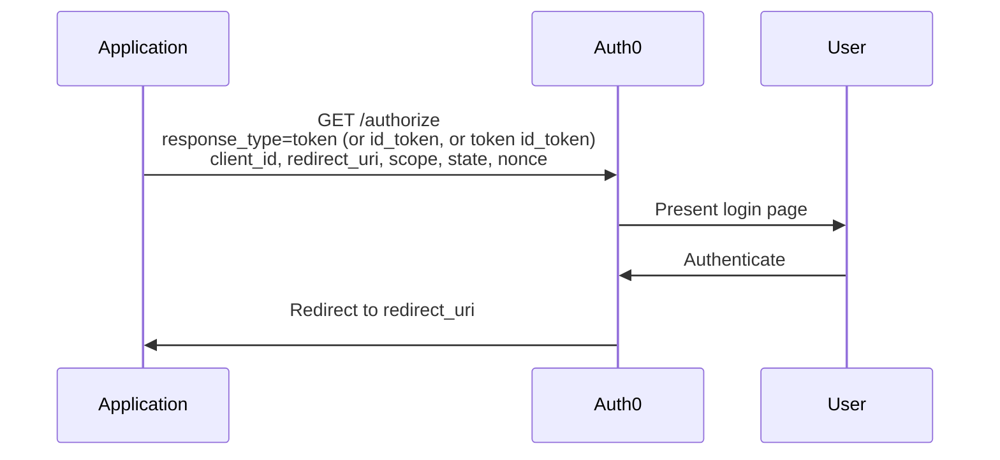

**Endpoints involved:**

| Step | Endpoint | Reference |
| --- | --- | --- |
| 1 | `GET /authorize` | [Authorization Endpoint](/docs/api/authentication/authorization/authorization-endpoint) |

---

### Resource Owner Password Flow (Legacy)

<Note>
**This flow is discouraged for new applications.** It requires your application to collect user credentials directly, which is less secure than redirect-based flows. Use [Authorization Code Flow with PKCE](#authorization-code-flow-with-pkce) when possible.
</Note>

This flow is intended for highly trusted first-party applications where redirect-based login is not feasible.

**Sequence:**

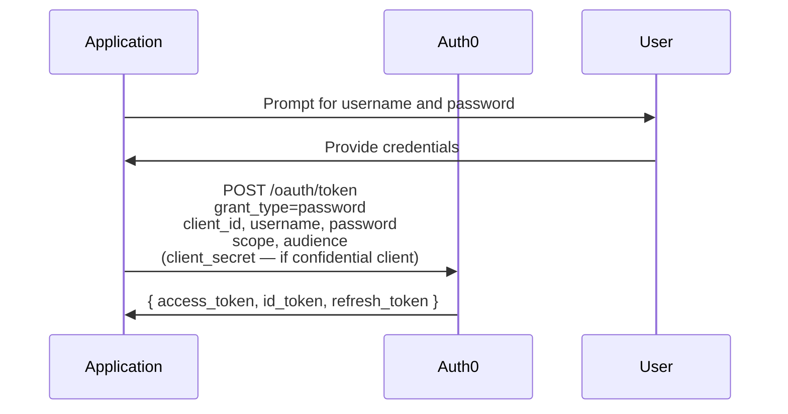

**Endpoints involved:**

| Step | Endpoint | Reference |
| --- | --- | --- |
| 2 | `POST /oauth/token` | [Token Endpoint](/docs/api/authentication/token-exchange/token-endpoint) |

---

## Extended Flows

### Passwordless Authentication

**Use when:** You want users to log in with a one-time code or magic link sent to their email or phone, instead of a password.

Passwordless authentication is a two-step process: your application triggers the delivery of a code or link, and then exchanges the code for tokens.

**Sequence (code-based):**

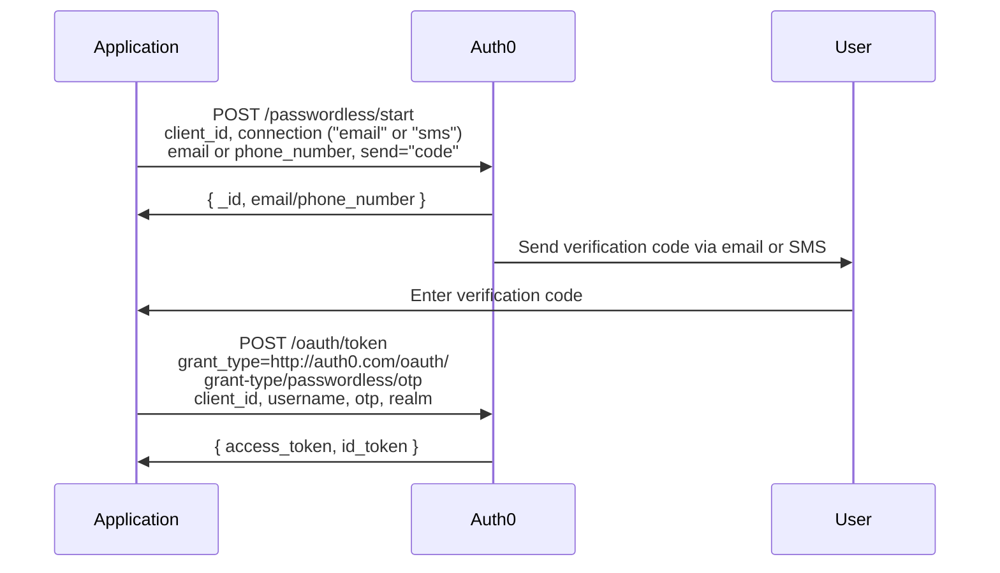

**Sequence (magic link — email only):**

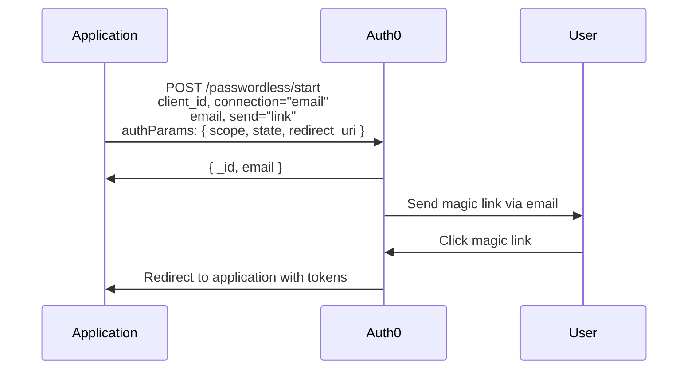

**Endpoints involved:**

| Step | Endpoint | Reference |
| --- | --- | --- |
| 1 | `POST /passwordless/start` | [Start Passwordless Authentication](/docs/api/authentication/passwordless/start-passwordless-authentication) |
| 3 | `POST /oauth/token` | [Token Endpoint](/docs/api/authentication/token-exchange/token-endpoint) |

---

### Multi-Factor Authentication

**Use when:** You require a second factor of authentication after the user provides their primary credentials. MFA is not a standalone flow — it is triggered during another authentication flow (typically Authorization Code or Resource Owner Password) when MFA is required for the user or application.

**Sequence:**

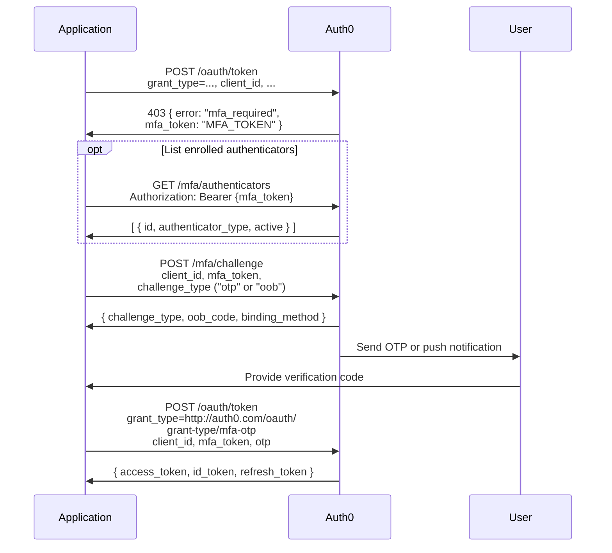

**Endpoints involved:**

| Step | Endpoint | Reference |
| --- | --- | --- |
| 1 | `POST /oauth/token` | [Token Endpoint](/docs/api/authentication/token-exchange/token-endpoint) |
| 2 | `GET /mfa/authenticators` | [List MFA Authenticators](/docs/api/authentication/multi-factor-authentication/list-mfa-authenticators) |
| 3 | `POST /mfa/challenge` | [Request MFA Challenge](/docs/api/authentication/multi-factor-authentication/request-mfa-challenge) |
| 5 | `POST /oauth/token` | [Token Endpoint](/docs/api/authentication/token-exchange/token-endpoint) |

**MFA enrollment** — If a user needs to enroll a new authenticator before they can complete MFA:

| Operation | Endpoint | Reference |
| --- | --- | --- |
| Enroll authenticator | `POST /mfa/associate` | [Associate MFA Authenticator](/docs/api/authentication/multi-factor-authentication/associate-mfa-authenticator) |
| Remove authenticator | `DELETE /mfa/authenticators/{id}` | [Delete MFA Authenticator](/docs/api/authentication/multi-factor-authentication/delete-mfa-authenticator) |

---

### Back-Channel Authentication (CIBA)

**Use when:** The user authenticates on a separate device (typically their phone) while another system initiates the authentication request. Common scenarios include call centers, point-of-sale terminals, and devices with limited interactivity.

CIBA (Client-Initiated Backchannel Authentication) sends a push notification to the user's enrolled device via the Guardian SDK. The requesting application polls for tokens until the user approves.

**Sequence:**

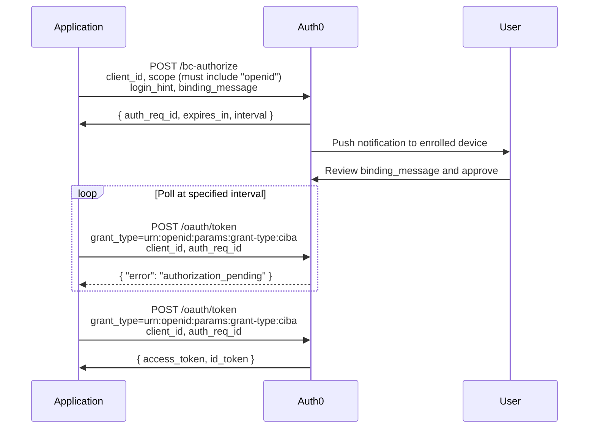

**Endpoints involved:**

| Step | Endpoint | Reference |
| --- | --- | --- |
| 1 | `POST /bc-authorize` | [Back-Channel Login](/docs/api/authentication/authorization/back-channel-login) |
| 4 | `POST /oauth/token` | [Token Endpoint](/docs/api/authentication/token-exchange/token-endpoint) |

**Prerequisites:**

- User must have a device enrolled with Guardian SDK push notifications
- `requested_expiry` can be set from 1–300 seconds (defaults to 300)

---

### Pushed Authorization Requests (PAR)

**Use when:** You need enhanced security for the authorization request itself — preventing parameter tampering, keeping sensitive parameters out of the browser, or complying with FAPI (Financial-grade API) requirements.

PAR is not a standalone flow. It is an enhancement to the [Authorization Code Flow](#authorization-code-flow) that moves authorization parameters from the front-channel (browser URL) to the back-channel (server-to-server POST).

**Sequence:**

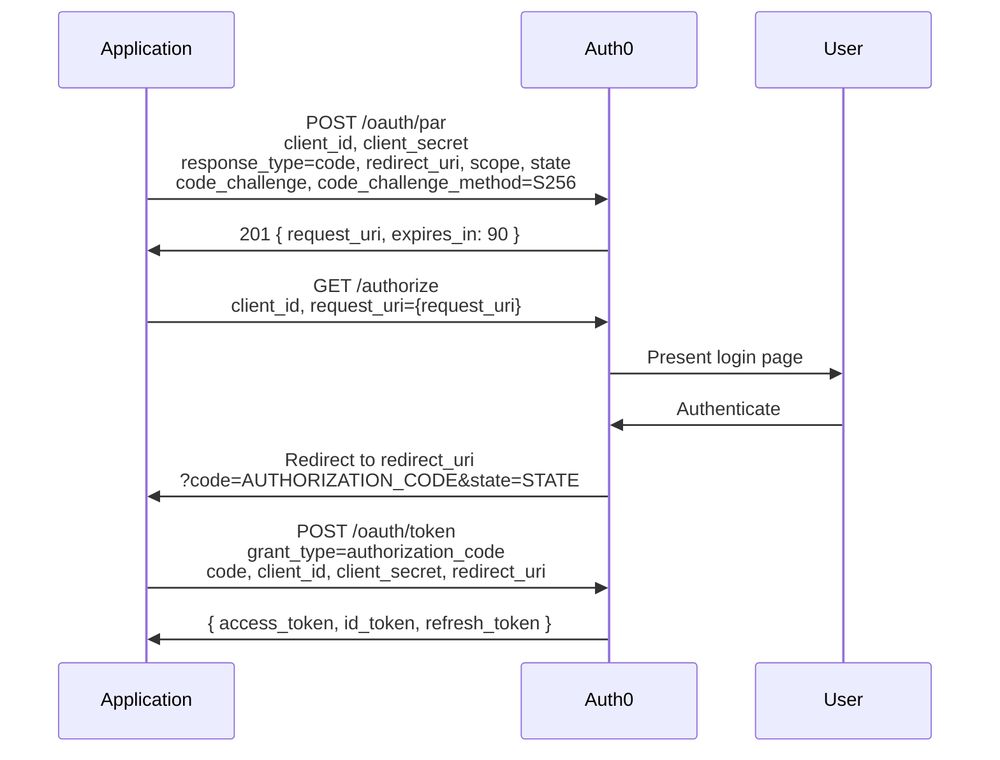

**Endpoints involved:**

| Step | Endpoint | Reference |
| --- | --- | --- |
| 1 | `POST /oauth/par` | [Pushed Authorization Request](/docs/api/authentication/pushed-authorization-requests/pushed-authorization-request-par) |
| 2 | `GET /authorize` | [Authorization Endpoint](/docs/api/authentication/authorization/authorization-endpoint) |
| 5 | `POST /oauth/token` | [Token Endpoint](/docs/api/authentication/token-exchange/token-endpoint) |

**Benefits of PAR:**

- Authorization parameters are never exposed in the browser URL
- Prevents parameter tampering since the server controls the request
- Handles large authorization requests that might exceed URL length limits
- `request_uri` is short-lived (typically 90 seconds)

---

## Protocol Flows

### SAML SSO

**Use when:** Your application integrates with enterprise identity providers that use the SAML 2.0 protocol.

Auth0 can act as both a SAML Service Provider (SP) and a SAML Identity Provider (IdP). There are two initiation patterns:

**SP-Initiated SSO** — Your application starts the login process:

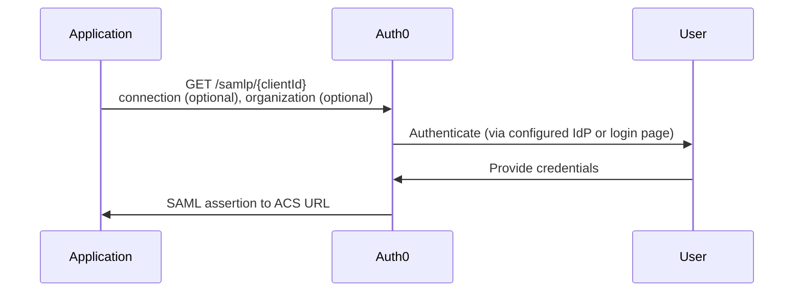

**IdP-Initiated SSO** — The identity provider starts the login process:

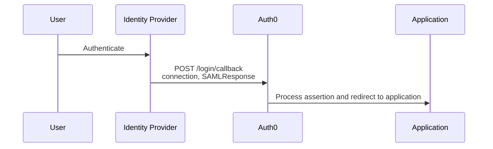

**Endpoints involved:**

| Operation | Endpoint | Reference |
| --- | --- | --- |
| SP-Initiated login | `GET /samlp/{clientId}` | [Accept Request](/docs/api/authentication/saml/accept-request) |
| IdP-Initiated callback | `POST /login/callback` | [IdP-Initiated SSO](/docs/api/authentication/saml/id-p-initiated-single-sign-on-sso-flow) |
| Get SAML metadata | `GET /samlp/metadata/{clientId}` | [Get Metadata](/docs/api/authentication/saml/get-metadata) |
| SAML logout | `POST /samlp/{clientId}/logout` | [SAML Logout](/docs/api/authentication/logout/saml-logout) |

---

### WS-Federation

**Use when:** Your application integrates with identity providers that use the WS-Federation protocol, such as Active Directory Federation Services (ADFS).

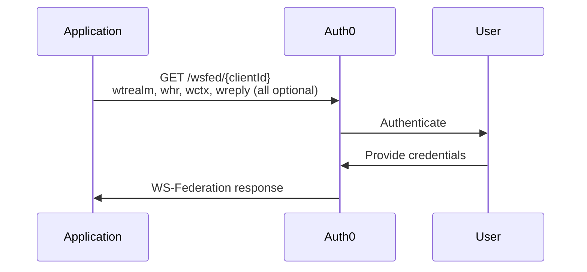

**Endpoints involved:**

| Operation | Endpoint | Reference |
| --- | --- | --- |
| Login | `GET /wsfed/{clientId}` | [Accept Request](/docs/api/authentication/ws-federation/accept-ws-federation-request) |
| Get metadata | `GET /wsfed/{clientId}/FederationMetadata/...` | [Get Metadata](/docs/api/authentication/ws-federation/get-ws-federation-metadata) |

---

## Supplementary Operations

These endpoints support authentication flows but are not flows themselves. They handle user management, session management, and token lifecycle operations.

### User Registration

Create new user accounts in Auth0 database connections. Users must authenticate separately after signup to obtain tokens.

| Operation | Endpoint | Reference |
| --- | --- | --- |
| Sign up user | `POST /dbconnections/signup` | [Sign Up User](/docs/api/authentication/database-connections/sign-up-user) |
| Request password change | `POST /dbconnections/change_password` | [Request Password Change](/docs/api/authentication/database-connections/request-password-change) |

### User Profile

Retrieve authenticated user information using an access token obtained from any authentication flow.

| Operation | Endpoint | Reference |
| --- | --- | --- |
| Get user info | `GET /userinfo` | [Get User Info](/docs/api/authentication/user-profile/get-user-info) |

The `/userinfo` endpoint returns OpenID Connect standard claims. The claims returned depend on the scopes requested during authentication:

- `openid` — returns `sub` (user ID)
- `profile` — adds `name`, `nickname`, `picture`, etc.
- `email` — adds `email` and `email_verified`

### Logout

Terminate user sessions. Auth0 supports multiple logout mechanisms depending on your protocol and requirements.

| Operation | Endpoint | When to Use | Reference |
| --- | --- | --- | --- |
| Standard logout | `GET /v2/logout` | Default logout for most applications | [Logout](/docs/api/authentication/logout/logout) |
| OIDC RP-Initiated logout | `GET /oidc/logout` | Standards-compliant OIDC logout; uses `id_token_hint` and `post_logout_redirect_uri` | [OIDC RP-Initiated Logout](/docs/api/authentication/logout/oidc-rp-initiated-logout) |
| SAML logout | `POST /samlp/{clientId}/logout` | SAML-based session termination | [SAML Logout](/docs/api/authentication/logout/saml-logout) |
| Global token revocation | `POST /oauth/global-token-revocation/connection/{connection_name}` | Revoke session cookies and refresh tokens via Okta Workforce Universal Logout | [Global Token Revocation](/docs/api/authentication/logout/global-token-revocation) |

### Token Management

| Operation | Endpoint | Reference |
| --- | --- | --- |
| Revoke refresh token | `POST /oauth/revoke` | [Revoke Refresh Token](/docs/api/authentication/token-management/revoke-refresh-token) |

Note: Only refresh tokens can be revoked. Access tokens remain valid until they expire.

### Dynamic Client Registration

Register new applications programmatically without manual dashboard configuration, following the OpenID Connect Dynamic Client Registration specification.

| Operation | Endpoint | Reference |
| --- | --- | --- |
| Register application | `POST /oidc/register` | [Dynamic Application Registration](/docs/api/authentication/dynamic-client-registration/dynamic-application-registration) |

---

## Tokens

Authentication flows issue up to three types of tokens:

| Token | Purpose | Format | Lifetime |
| --- | --- | --- | --- |
| **Access Token** | Authorize API requests. Include in the `Authorization: Bearer` header when calling your API. | JWT or opaque | Typically 24 hours (configurable) |
| **ID Token** | Contains authenticated user identity claims (name, email, etc.) per OpenID Connect. Used by your application — never sent to APIs. | Always JWT | Typically 10 hours |
| **Refresh Token** | Obtain new access tokens without re-authenticating the user. Only issued when `offline_access` scope is requested. | Opaque | Configurable; can be long-lived or rotating |
