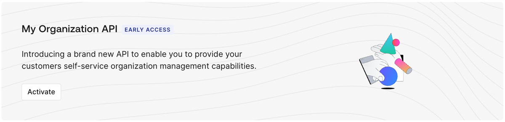

<Badge>Version: 1.0 (Current)</Badge>

<Warning>
  <p class="uppercase font-bold">Early Access</p>

My Organization API and Embeddable UI Components is currently available in Early Access for all customers. By using this feature, you agree to the applicable Free Trial terms in [Okta’s Master Subscription Agreement](https://www.okta.com/legal/?_gl=1*91d0bt*_gcl_aw*R0NMLjE3NzE0NTEyMTAuQ2owS0NRaUE0OVhNQmhEUkFSSXNBT09LSkhaZGk1ZXl4WWwtRGpsTFFscFp0U2RBMkxEMG5lUHBNclN1YjQwMkJVSG5uNkxLS1JZc081WWFBcy0wRUFMd193Y0I.*_gcl_au*MTQyOTE2NTQwOC4xNzY1NDY4OTY4*_ga*MTg0MTcwMTc5MS4xNzU3MzQwNjUx*_ga_QKMSDV5369*czE3NzIwNTM1NDkkbzE2NyRnMCR0MTc3MjA1MzU0OSRqNjAkbDAkaDA). To learn more about Auth0’s product release cycle, read [Product Release Stages](/docs/troubleshoot/product-lifecycle/product-release-stages). The Customer is responsible for ensuring that its use of the My Organization API and Embeddable UI Components comply with its security policies and applicable laws, including any permissions granted to its end users.
</Warning>

The Auth0 My Organization API provides a secure, Organization-scoped interface that allows your business customers to manage their own Organizations within your Auth0 tenant. This API serves as the technical backbone for embedded delegated administration and API-first integrations.

The My Organization API documentation follows the [My Organization API OpenAPI v3.1 schema](https://auth0.com/docs/oas/myorganization/myorganization-api-oas.json). Please note that OpenAPI v3.1 schema support is currently in Beta.

<Tip>
  <p class="uppercase font-bold">Using Auth0 domain vs. custom domain</p>

The My Organization API supports using your canonical Auth0 domain or your custom domain, but you must use the same one throughout the entire process, including:

- Getting an access token
- Setting the audience value
- Calling the My Organization API endpoint

To learn more, read [Custom Domains](https://auth0.com/docs/customize/custom-domains).

</Tip>

## Activate the My Organization API in Auth0 Dashboard

1. Navigate to **[Auth0 Dashboard > Applications > APIs](https://manage.auth0.com/#/apis)**.
2. Locate the My Organization API banner.
3. Select **Activate**.
4. The API appears in your Applications > API list as My Organization API.



Once you activate the My Organization API:
* The API is disabled for all client applications by default.
* You must grant access to applications and roles using [client grants](/docs/get-started/applications/application-access-to-apis-client-grants) or [RBAC](/docs/manage-users/access-control/configure-core-rbac/enable-role-based-access-control-for-apis) policies.
* Your business customers can retrieve Organization details or configure IdPs on behalf of their own Organizations.

By default, the My Organization API activates with the following application API access policies:

`require_client_grant` for user flows
`deny-all` for client (machine-to-machine) flows

For an application to access the My Organization API on the user's behalf, you must explicitly create a client grant for that application, which allows you to define the maximum scopes the application can request. Alternatively, you can change the policy for user access flows to `allow_all`, which allows any application in your tenant to request any scope from the My Organization API.

Because the My Organization API exposes sensitive information and operations, Auth0 does not recommend using `allow_all` for user access flows. You should follow a least privilege principle with the My Organization API to ensure applications only get access to what they truly need, minimizing potential security risks.

The final permissions granted to the application will be determined by the intersection of the scopes allowed by the application API access policy, the Role-Based Access Control (RBAC) permissions assigned to the end user, and any user consent given (if applicable).

To learn more about how to manage application API access policies and their associated client grants, read [Application Access to APIs: Client Grants](https://auth0.com/docs/get-started/applications/application-access-to-apis-client-grants).

## Client application attributes

[Create an application](/docs/get-started/auth0-overview/create-applications) in Auth0 to use with the My Organization API. Once created, navigate to **[Auth0 Dashboard > Applications > APIs](https://manage.auth0.com/#/apis)** and authorize the My Organization API, including the scopes you want the application to perform.

The client application must provide a specific configuration object (`my_organization_configuration`) containing the following properties:

| **Property** | **Description** |
| -- | ------ |
| `my_organization_configuration` | **Object.** The application must provide this object with configurations for the My Organization API to follow. If the application does not define this object, the My Organization API will give an error and reject the request.|
| `my_organization_configuration.connection_profile_id` | **Connection Profile ID.** ID of the [Connection Profile](/docs/authenticate/enterprise-connections/connection-profile) used with the application when leveraging the My Organization API. If not provided, My Organization API features that require a Connection Profile to be present will not function. This ID must refer to a valid Connection Profile in the same tenant.|
| `my_organization_configuration.user_attribute_profile_id` | **User Attribute Profile ID**. ID of the [User Attribute Profile](/docs/authenticate/enterprise-connections/user-attribute-profile) used with the application when leveraging the My Organization API. If it is not provided, My Organization API features that require a User Attribute Profile to be present will not function. This ID must refer to a valid User Attribute Profile in the same tenant.|
| `my_organization_configuration.allowed_strategies` | **Array of strings.** Each string is unique and refers to a supported strategy. The supported strategies - the values for the enum - are as follows: `pingfederate`, `ad`, `adfs`, `waad`, `google-apps`, `okta`, `oidc`, and `samlp`.|
| `my_organization_configuration.connection_deletion_behavior` | **Enum (allow, allow_if_empty).** Describes how the My Organization API behaves when an end user tries to delete a connection when attempted via the My Organization API from this application. The values and description of the enum are as follows: <p></p> 1. `allow`: Given the user has the correct scope, a user can delete the connection which results in all users originating from the connection being deleted. <p></p> 2.`allow_if_empty`: Given the user has the correct scope, a user can only delete the connection if there are no users in the connection. If users are present, the My Organization API will return an error and won’t proceed with the deletion.|

## Get an access token

You can get an access token for the My Organization API in the same way you'd get an access token for one of your own APIs.

<Note>
  <p class="uppercase font-bold">Sensitive operations</p>

If you're going to allow the My Organization API to perform sensitive operations (such as enrolling an authentication method), we strongly recommend that you use [step-up authentication](https://auth0.com/docs/secure/multi-factor-authentication/step-up-authentication) to enforce additional security policies through [multi-factor authentication (MFA)](https://auth0.com/docs/secure/multi-factor-authentication).

</Note>

## Examples 

### Authorization Code Flow Example

Use [Authorization Code Flow](/docs/get-started/authentication-and-authorization-flow/authorization-code-flow) for confidential Web Applications with a Client Secret.

```bash
curl --request POST \
--url 'https://YOUR_DOMAIN/oauth/token' \
--header 'content-type: application/x-www-form-urlencoded' \
--data 'grant_type=authorization_code' \
--data 'client_id=YOUR_CLIENT_ID' \
--data 'client_secret=YOUR_CLIENT_SECRET' \
--data 'code=AUTH_CODE' \
--data 'redirect_uri=https://yourapp/callback' \
--data 'audience=https://YOUR_DOMAIN/my-org/'
```

**Sample Response**

```json
{
  "access_token": "eyJz93a...k4laUWw",
  "token_type": "Bearer",
  "expires_in": 900,
  "scope": "read:my_org:details update:my_org:identity_providers"
}
```

### Authorization Code Flow with PKCE Example

Use [Authorization Code Flow with Proof Key for Code Exchange (PKCE)](/docs/get-started/authentication-and-authorization-flow/authorization-code-flow-with-pkce) or public applications without a Client Secret, Single-Page Applications, Mobile or Native Applications, and CLI Tools.

```bash
curl --request POST \
--url 'https://YOUR_DOMAIN/oauth/token' \
--header 'content-type: application/x-www-form-urlencoded' \
--data 'grant_type=authorization_code' \
--data 'client_id=YOUR_CLIENT_ID' \
--data 'code=AUTH_CODE' \
--data 'code_verifier=CODE_VERIFIER' \
--data 'redirect_uri=https://yourapp/callback' \
--data 'audience=https://YOUR_DOMAIN/my-org/'
```

## Profiles

The My Organization API utilizes [Connection Profiles](/docs/authenticate/enterprise-connections/connection-profile) and [User Attribute Profiles](/docs/authenticate/enterprise-connections/user-attribute-profile) to define the structure, restrictions, and rules for configurations created by third-party customers.

### Connection Profile (CP)

The Connection Profile enables Auth0 developers to specify how the private settings of an Auth0 connection should be configured when created by third parties. For more information on how the Connection Profile works, its attribute mappings and overrides, examples, and how to configure one, read [Connection Profiles](/docs/authenticate/enterprise-connections/connection-profile). 

### User Attribute Profile (UAP)

The User Attribute Profile (UAP) provides a consistent way to define, manage, and map user attributes across protocols such as SCIM, SAML, and OIDC. For more information on how the UAP works, its attribute mappings and overrides, examples, and how to configure one, read [User Attribute Profiles](/docs/authenticate/enterprise-connections/user-attribute-profile).

## Rate limits

Rate limits are enforced based on your service tier:

| **Tier** | **Read (RPS)** | **Write (RPS)** |
| --- | --- | --- |
| **Free** | 4 | 2 |
| **Public Self-Service** | 8 | 4 |
| **Public Enterprise** | 40 | 20 |
| **Private Basic** | 40 | 20 |
| **Private Performance** | 160 | 80 |

### Per-Organization rate limits

In addition to the service tier rate limits, the My Organization API also enforces per-Organization rate limits. These limits are designed to ensure fair resource allocation and prevent any single Organization from impacting the overall performance of your tenant. By enforcing these boundaries, we mitigate the ‘noisy neighbor’ effect, ensuring that a sudden surge in activity from one Organization does not consume shared resources or impact another within the same environment. Each Organization is allocated a specific number of requests per second (RPS) for both read and write operations.

| **Tier** | **Per-Organization Read (RPS)** | **Per-Organization Write (RPS)** |
| --- | --- | --- |
| **Free** | 4 | 2 |
| **Public Self-Service** | 4 | 2 |
| **Public Enterprise** | 8 | 4 |
| **Private Basic** | 8 | 4 |
| **Private Performance** | 16 | 8 |

### Authentication

<Tabs class="width-1/2" borderBottom>
  <Tab title="HTTP: Bearer Auth">

  Bearer and DPoP tokens are supported depending on the API configuration

  |                            |        |
  | -------------------------- | ------ |
  | Security Scheme Type:      | http   |
  | HTTP Authorization Scheme: | bearer |
  </Tab>
</Tabs>
