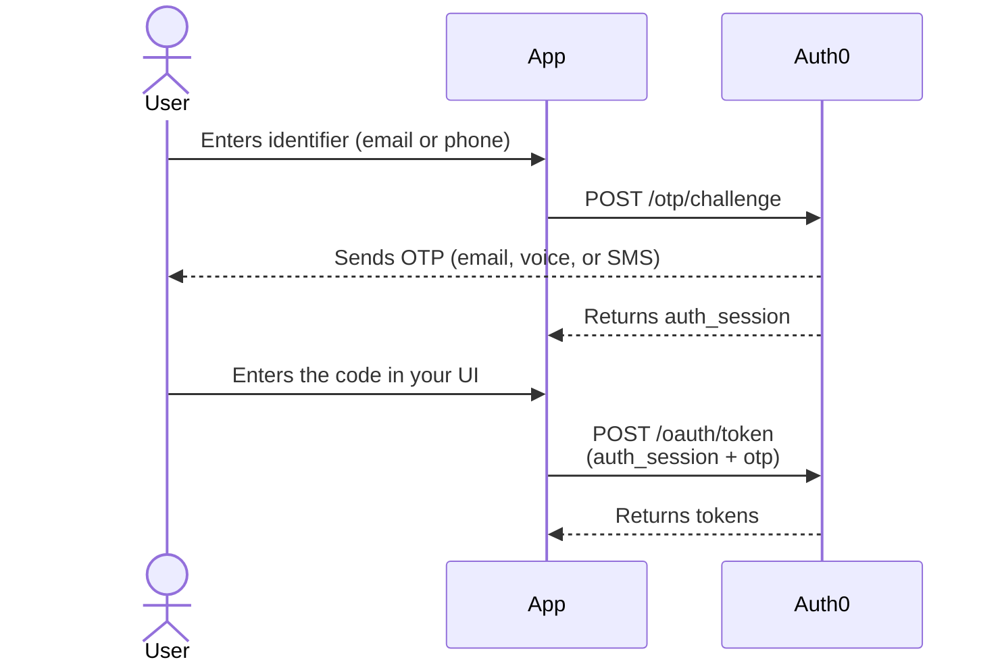

import { ReleaseStageNotice } from "/snippets/ReleaseStageNotice.jsx"

<ReleaseStageNotice
  feature="Passwordless Authentication on Database Connections with Authentication API"
  stage="ea"
  contact="support"
  terms="true"
/>

Native and back-end applications with a custom login UI can authenticate users with a one-time password (OTP) sent to an email or phone directly through the Auth0 Authentication API, with no redirect to Universal Login. This supports email OTP, SMS OTP, and voice OTP on standard database connections.

This lets you use one-time-code authentication from the same database connection that already holds your users. If you previously used `/passwordless/start` with a dedicated passwordless connection, you can consolidate onto your existing database connection instead. To use passwordless authentication with Universal Login, read [Passwordless Authentication on Database Connections](/docs/authenticate/database-connections/passwordless-authentication-for-db-connect).

<Callout icon="file-lines" color="#0EA5E9" iconType="regular">
The Passwordless OTP grant isn't available for single-page application (SPA) type applications. If your frontend is a single-page application, make the `/otp/challenge` and `/oauth/token` calls from a back-end application that has the Passwordless OTP grant enabled.
</Callout>

Authentication is a two-call flow:

1. `POST /otp/challenge` — send a one-time code to the user's email or phone.
2. `POST /oauth/token` — exchange the code the user entered for tokens.

## How it works



1. User enters an email address or phone number in your application.
2. Your application calls the [`POST /otp/challenge`](/docs/api/authentication/passwordless/get-code-or-link) endpoint.
3. The Auth0 Authorization Server sends a one-time code to the user's email or phone.
4. The Auth0 Authorization Server responds with an `auth_session` value. Store this value; no other state is required.
5. User receives the code and enters it into your application's UI.
6. Your application calls the [`POST /oauth/token`](/docs/api/authentication/passwordless/get-token) endpoint with the `auth_session` and the user-entered code.
7. The Auth0 Authorization Server verifies the code against the `auth_session` and responds with an ID token and access token (and optionally, a refresh token).

The flow is stateless from your application's perspective. The only value you carry between the two calls is the `auth_session` string returned in step 4. Auth0 determines whether the request is a login or a signup, and whether MFA is required — you don't need to track any of that yourself. To learn more, read [How Auth0 determines login vs. signup](#how-auth0-determines-login-vs-signup).

<Card title="Before you start">

- Configure `email_otp` and/or `phone_otp` as authentication methods on your database connection. To learn more, read [Passwordless Authentication on Database Connections](/docs/authenticate/database-connections/passwordless-authentication-for-db-connect).
- Enable OTP verification for signups if you want users to sign up through the implicit signup flow. To learn more, read [Passwordless Authentication on Database Connections](/docs/authenticate/database-connections/passwordless-authentication-for-db-connect).
- Enable the Passwordless OTP grant in Auth0 Dashboard or Management API. To learn more, read [Update Grant Types](/docs/get-started/applications/update-grant-types).
- Confidential applications, such as back-end web applications, must send `client_secret` on both calls. Public clients, such as native applications, do not.
- For voice OTP, enable the [Unified Phone Experience](/docs/customize/phone-messages/unified-phone/configure-unified-phone) so voice can be used as a delivery channel.

</Card>

## Initiate the OTP challenge

Send the user's identifier. Auth0 generates and delivers the code and returns an opaque `auth_session`.

```bash lines
curl --request POST \
  --url 'https://YOUR_DOMAIN/otp/challenge' \
  --header 'Content-Type: application/json' \
  --data '{
    "connection": "YOUR_CONNECTION_NAME",
    "client_id": "YOUR_CLIENT_ID",
    "email": "user@example.com"
  }'
```

### Parameters

| Parameter | Required | Description |
| --- | --- | --- |
| `connection` | Yes | Name of the database connection with email OTP and/or phone OTP configured. |
| `client_id` | Yes | The Client ID of your application. |
| `email` | Conditional | The user's email address. Provide either `email` or `phone_number`, not both. |
| `phone_number` | Conditional | The user's phone number in [E.164](https://en.wikipedia.org/wiki/E.164) format, including country code (for example, `+15555550123`). Provide either `email` or `phone_number`. |
| `client_secret` | Conditional | Required for [confidential applications](/docs/get-started/applications/confidential-and-public-applications). |
| `allow_signup` | No | When `true`, Auth0 creates the user if they don't exist and signup is enabled on the connection. Defaults to `false`. To learn more, read [Implicit signup](#implicit-signup). |
| `delivery_method` | No | For phone delivery, choose `text` or `voice` when both are enabled on the connection. |

The field name (`email` vs. `phone_number`) tells Auth0 which channel to use. You don't need to send a separate identifier `type`.

### Response

```json lines
HTTP/1.1 200 OK
Content-Type: application/json

{
  "auth_session": "507f1f77bcf86cd799439011"
}
```

`/otp/challenge` returns `200 OK` whether or not the user exists. This prevents user enumeration. An attacker can't use the endpoint to discover which identifiers have accounts. Treat `auth_session` as an opaque string: store it and pass it to the next call unchanged.

## Exchange the code for tokens

When the user enters the code, submit it with the `auth_session` from the previous call.

```bash lines
curl --request POST \
  --url 'https://YOUR_DOMAIN/oauth/token' \
  --header 'Content-Type: application/json' \
  --data '{
    "grant_type": "http://auth0.com/oauth/grant-type/passwordless/otp",
    "client_id": "YOUR_CLIENT_ID",
    "auth_session": "507f1f77bcf86cd799439011",
    "otp": "123456",
    "scope": "openid profile email"
  }'
```

### Parameters

| Parameter | Required | Description |
| --- | --- | --- |
| `grant_type` | Yes | Must be `http://auth0.com/oauth/grant-type/passwordless/otp`. |
| `client_id` | Yes | The Client ID of your application. |
| `auth_session` | Yes | The opaque value returned by `POST /otp/challenge`. |
| `otp` | Yes | The one-time password the user enters. |
| `client_secret` | Conditional | Required for confidential applications. |
| `scope` | No | Space-separated list of requested scopes. For example, `openid profile email`. |

### Response

```json lines
HTTP/1.1 200 OK
Content-Type: application/json

{
  "access_token": "eyJ...",
  "id_token": "eyJ...",
  "token_type": "Bearer",
  "expires_in": 86400
}
```

## Implicit signup

By default, Authentication API authenticates existing users only with `allow_signup: false`. You can pass `allow_signup: true` on `POST /otp/challenge` to let a successful OTP verification create the account when the user doesn't yet exist, and signup is enabled on the connection.

* `allow_signup: false`:  Auth0 never creates a user. Unknown identifiers fail at token exchange.
* `allow_signup: true`: If the user doesn't exist and the connection allows signup, the account is created when the OTP is verified and tokens are issued in the same step.

For implicit signup to succeed, the connection must require a single identifier, or make all identifiers optional. To learn more, read [Implicit Signup and Login for Passwordless Database Connections](/docs/authenticate/database-connections/implicit-signup-database-connections).

## How Auth0 determines login vs. signup

Your application always makes the same two calls regardless of whether the user is new or returning. Auth0 resolves the intent at challenge time and records it server-side against the `auth_session`. At token exchange, Auth0 looks up the session and takes the correct action.

| Situation at `/otp/challenge` | Outcome at `/oauth/token` (with correct OTP) |
| --- | --- |
| User exists | At login, Auth0 issues tokens for the existing user. |
| User not found, `allow_signup: true`, signup enabled | At signup, Auth0 creates an account and issues tokens. |

<Callout icon="file-lines" color="#0EA5E9" iconType="regular">
The blocked case returns the same error as a wrong OTP, by design, so the response never reveals whether an account exists.
</Callout>

## Multi-factor authentication

If you require MFA, `POST /oauth/token` returns `403` with an `mfa_required` error:

```json lines
HTTP/1.1 403 Forbidden
Content-Type: application/json

{
  "error": "mfa_required",
  "mfa_token": "eyJ...",
  "mfa_requirements": {
    "challenge_types": ["otp", "oob"]
  }
}
```

Use the `mfa_token` to call the [MFA API](/docs/secure/multi-factor-authentication/multi-factor-authentication-developer-resources/mfa-api) to challenge and verify the additional factor. This matches the MFA behavior of all other Auth0 grant types.

## Error responses

Both endpoints use the OAuth 2.0 error format based on [RFC 6749](https://datatracker.ietf.org/doc/html/rfc6749#section-5.2): an `error` code and a human-readable `error_description`. Parameter-validation failures (`400`) also include a `validation_errors` array identifying the specific fields.

```json lines
{
  "error": "invalid_request",
  "error_description": "Either email or phone_number must be provided",
  "validation_errors": [
    { "field": "email", "message": "Either email or phone_number must be provided" }
  ]
}
```

### POST /otp/challenge

| HTTP status | `error` | When it occurs |
| --- | --- | --- |
| 400 | `invalid_request` | Missing `connection`, missing `client_id`, neither identifier provided, or a malformed email or phone number. |
| 400 | `invalid_connection` | The connection doesn't exist, isn't a database connection, or doesn't have email or phone OTP configured. |
| 401 | `invalid_client` | Confidential application missing or sent the wrong `client_secret`. |
| 403 | `unauthorized_client` | The Passwordless OTP grant isn't enabled on the application. |
| 429 | `too_many_requests` | More than 50 requests per hour from one IP address. |
| 500 | `server_error` | Unexpected internal error. |

### POST /oauth/token

| HTTP status | `error` | When it occurs |
| --- | --- | --- |
| 400 | `invalid_request` | `auth_session` invalid, expired, or already used; missing `otp` or `client_id`; wrong or expired OTP (also returned for a blocked signup intent). |
| 401 | `invalid_client` | Confidential application missing or sent the wrong `client_secret`. |
| 403 | `access_denied` | The account is blocked by an administrator or brute-force protection. |
| 403 | `mfa_required` | MFA is required — response includes `mfa_token` and `mfa_requirements`. |
| 429 | `too_many_requests` | Global token endpoint rate limits exceeded. |
| 500 | `server_error` | Unexpected internal error. |

## Rate limits

`POST /otp/challenge` is limited to 50 requests per hour per IP address, in addition to the global [Authentication API rate limits](/docs/troubleshoot/customer-support/operational-policies/rate-limit-policy). Exceeding the limit returns `429 Too Many Requests`.

Rate-limited responses include these headers:

| Header | Description |
| --- | --- |
| `X-RateLimit-Limit` | Configured request limit for the window. |
| `X-RateLimit-Remaining` | Requests remaining in the current window. |
| `X-RateLimit-Reset` | Unix timestamp when the window resets. |
| `Retry-After` | Seconds until you may retry (on `429` responses). |

## Limitations

* Single-page applications (SPAs) can't use these endpoints directly because the Passwordless OTP grant can't be enabled on SPA-type applications. Route the calls through a back-end application with the enabled grant.
* Confidential applications must send `client_secret` on both calls.
* Authentication API authenticates against database connections with email or phone OTP configured. It doesn't replace `/passwordless/start` for dedicated email or SMS passwordless connections.

## Learn more

- [Passwordless Authentication on Database Connections](/docs/authenticate/database-connections/passwordless-authentication-for-db-connect)
- [Implicit Signup and Login for Passwordless Database Connections](/docs/authenticate/database-connections/implicit-signup-database-connections)
- [Multi-factor Authentication with the Authentication API](/docs/secure/multi-factor-authentication/authenticate-using-ropg-flow-with-mfa)
- [Authentication API Rate Limits](/docs/troubleshoot/customer-support/operational-policies/rate-limit-policy)
