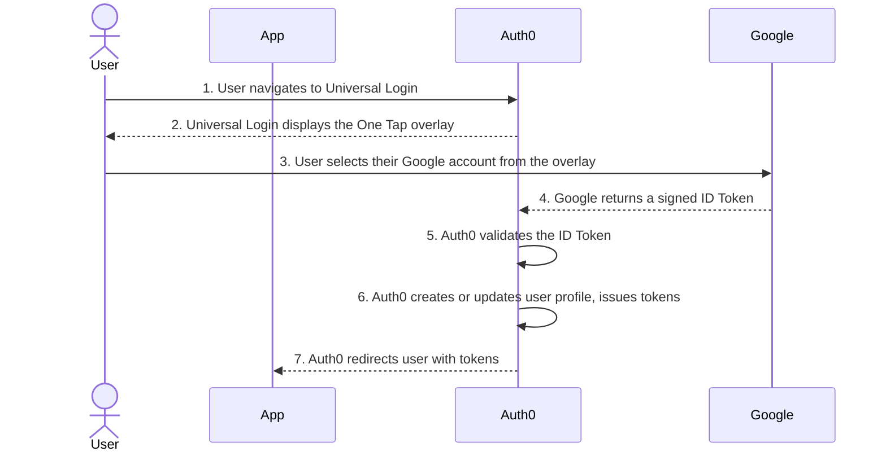

import { ReleaseStageNotice } from "/snippets/ReleaseStageNotice.jsx"

<ReleaseStageNotice
  feature="Google One Tap"
  stage="ea"
  terms="true"
  contact="Auth0 Support"
/>

Auth0 supports [Google One Tap](https://developers.google.com/identity/gsi/web/guides/overview) user authentication with [Universal Login](/docs/authenticate/login/auth0-universal-login/universal-login-vs-classic-login/universal-experience). Google One Tap allows users to sign in or sign up with a single tap by using an active Google session in their browser without leaving your Universal Login page. When a user with an active Google account visits your login page, the Google One Tap prompt appears as an overlay with the user's active account. The user selects it, and Auth0 validates the credential and creates a session. No redirect to Google is required.

## How it works

Google One Tap uses the [Federated Credential Management (FedCM) API](https://developer.chrome.com/docs/identity/fedcm/overview), a browser-native authentication standard that does not rely on third-party cookies or page redirects.



1. A user navigates to your Universal Login page with an active Google session in their browser.
2. Universal Login detects the active Google session and displays the Google One Tap overlay.
3. The user selects their Google account from the prompt.
4. Google returns a signed ID token to Universal Login.
5. Auth0 validates the ID token against the Google social connection configured for your tenant.
6. Auth0 creates or updates the user profile and issues Auth0 tokens.
7. Auth0 redirects the user to your application.

If the user's browser does not support FedCM, or if the user dismisses the prompt, the standard **Continue with Google** option remains available on the login page. If the user dismisses the prompt, Google applies an [exponential cooldown](https://developers.google.com/identity/gsi/web/guides/features#exponential_cooldown) timeframe for each time One Tap is dismissed by the user.

<Card title="Before you start">

* You must enable and configure Universal Login for your tenant. Google One Tap is not supported in the Classic Login experience. To learn more, read [Universal Login vs. Classic Login](/docs/authenticate/login/auth0-universal-login/universal-login-vs-classic-login).
* You must create and configure a Google social connection (`google-oauth2`) in your tenant. To learn more, read [Add Google Login to Your App](/docs/authenticate/identity-providers/social-identity-providers/google).

</Card>

## Enable Google One Tap

Enable Google One Tap on individual applications with Auth0 Dashboard, the Management API, or an Auth0 SDK.

<Tabs>

<Tab title="Auth0 Dashboard">

1. Navigate to [Auth0 Dashboard > Applications](https://manage.auth0.com/#/applications).
2. [Create a new application](/docs/get-started/auth0-overview/create-applications) or choose an existing application to use with Google One Tap.
3. Under Settings, search for Social Login and toggle on **Allow Google One Tap**.
<Frame></Frame>
5. Select **Save**.
6. Navigate to [Auth0 Dashboard > Authentication > Social](https://manage.auth0.com/#/connections/social).
7. Create a new Google social connection or select your existing `google-oauth2` connection.
8. Under the connection settings:
    * Under the Settings tab, verify your Google Client ID and Client Secret. You cannot use [Auth0 developer keys](/docs/authenticate/identity-providers/social-identity-providers/devkeys) with the One Tap integration.
    * Under the Applications tab, verify the application you want to use for One Tap is toggled on.
9. Select **Save**.

</Tab>

<Tab title="Management API">
Call the [Update a client](/docs/api/management/v2/clients/patch-clients-by-id) endpoint and set `fedcm_login.google.is_enabled` to `true`:

```json
PATCH /api/v2/clients/{id}

{
  "fedcm_login": {
    "google": {
      "is_enabled": true
    }
  }
}
```

To disable Google One Tap for a specific application, set `is_enabled` to `false`.

</Tab>
<Tab title="Auth0 SDKs">

Use the following examples to add Google One Tap to Universal Login with an Auth0 SDK.

<AccordionGroup>

<Accordion title="C#">

```csharp
using Auth0.ManagementApi;
using Auth0.ManagementApi.Types;
using System.Threading.Tasks;

public partial class Examples
{
    public async Task Example() {
        var client = new ManagementClient(
            token: "<token>"
        );

        await client.Clients.UpdateAsync(
            id: "id",
            request: new UpdateClientRequestContent {
                FedcmLogin = new FedCmLoginPatch {
                    Google = new FedCmLoginGooglePatch {
                        IsEnabled = true
                    }
                }
            }
        );
    }

}
```

</Accordion>

<Accordion title="Go">

```go
package example

import (
    context "context"

    management "github.com/auth0/go-auth0/management/management"
    client "github.com/auth0/go-auth0/management/management/client"
    option "github.com/auth0/go-auth0/management/management/option"
)

func do() {
    client := client.NewClient(
        option.WithToken(
            "<token>",
        ),
    )
    request := &management.UpdateClientRequestContent{
        FedcmLogin: &management.FedCmLoginPatch{
            Google: &management.FedCmLoginGooglePatch{
                IsEnabled: true,
            },
        },
    }
    client.Clients.Update(
        context.TODO(),
        "id",
        request,
    )
}
```

</Accordion>

<Accordion title="Java">

```java
package com.example.usage;

import com.auth0.client.mgmt.ManagementApi;
import com.auth0.client.mgmt.resources.clients.requests.UpdateClientRequestContent;
import com.auth0.client.mgmt.types.FedCmLoginPatch;
import com.auth0.client.mgmt.types.FedCmLoginGooglePatch;

public class Example {
    public static void main(String[] args) {
        ManagementApi client = ManagementApi
            .builder()
            .token("<token>")
            .build();

        client.clients().update(
            "id",
            UpdateClientRequestContent
                .builder()
                .fedcmLogin(
                    FedCmLoginPatch.builder()
                        .google(
                            FedCmLoginGooglePatch.builder()
                                .isEnabled(true)
                                .build()
                        )
                        .build()
                )
                .build()
        );
    }
}
```

</Accordion>

<Accordion title="PHP">

```php
<?php

namespace Example;

use Auth0\SDK\API\Management\Management;
use Auth0\SDK\API\Management\Clients\Requests\UpdateClientRequestContent;

$client = new Management(
    token: '<token>',
);
$client->clients->update(
    'id',
    new UpdateClientRequestContent([
        'fedcm_login' => [
            'google' => [
                'is_enabled' => true,
            ],
        ],
    ]),
);
```

</Accordion>

<Accordion title="Python">

```python
from auth0.management import ManagementClient
from auth0.management.types import FedCmLoginPatch, FedCmLoginGooglePatch

client = ManagementClient(
    token="<token>",
)

client.clients.update(
    id="id",
    fedcm_login=FedCmLoginPatch(
        google=FedCmLoginGooglePatch(is_enabled=True)
    ),
)
```

</Accordion>

<Accordion title="Ruby">

```ruby
require "auth0"

client = Auth0::Management.new(token: "<token>")

client.clients.update(
  id: "id",
  fedcm_login: {
    google: {
      is_enabled: true
    }
  }
)
```

</Accordion>

<Accordion title="Node.js">

```javascript
import { ManagementClient } from "auth0";

async function main() {
    const client = new ManagementClient({
        token: "<token>",
    });
    await client.clients.update("id", {
        fedcm_login: {
            google: {
                is_enabled: true,
            },
        },
    });
}
main();
```

</Accordion>
</AccordionGroup>
</Tab>
</Tabs>

## Considerations

### Advanced Customizations for Universal Login (ACUL)

ACUL customization applies to Google One Tap. If you have customized the `login`,`login-id`,`signup`, or `signup-id` screens, your configurations apply. To learn more about ACUL, read [Configure ACUL](/docs/customize/login-pages/advanced-customizations/configure/overview).

### Multi-factor authentication (MFA)

If your tenant or connection policy requires [multi-factor authentication (MFA)](/docs/secure/multi-factor-authentication), Google One Tap completes the first authentication factor using the Google ID token. Auth0 then presents the standard Universal Login MFA challenge screen for the second factor. Users complete MFA as part of the Universal Login flow.

### Enterprise connections

You can only use Google One Tap if you use a Google social connection (`google-oauth2`). It does not apply to [Google Workspace enterprise connections](/docs/authenticate/identity-providers/enterprise-identity-providers/google-apps). If your tenant uses Home Realm Discovery to route users with a corporate Google domain to an enterprise connection, that routing is unaffected.

### Browser support

Google One Tap requires browser support for the FedCM API. Auth0 passes `"itp_support: true"` to the One Tap library by default. It is supported in Chrome and Chromium-based browsers. When browsers, such as iOS and Firefox, do not support FedCM, Auth0 reverts to the standard **Continue with Google** button on your Universal Login page.

## Learn more

* [Add Google Login to Your App](/docs/authenticate/identity-providers/social-identity-providers/google)
* [Add Sign In with Google to Native Android Apps](/docs/authenticate/identity-providers/social-identity-providers/google-native)
* [Universal Login Experience](/docs/authenticate/login/auth0-universal-login/universal-login-vs-classic-login/universal-experience)
* [Enable MFA](/docs/secure/multi-factor-authentication/enable-mfa)
