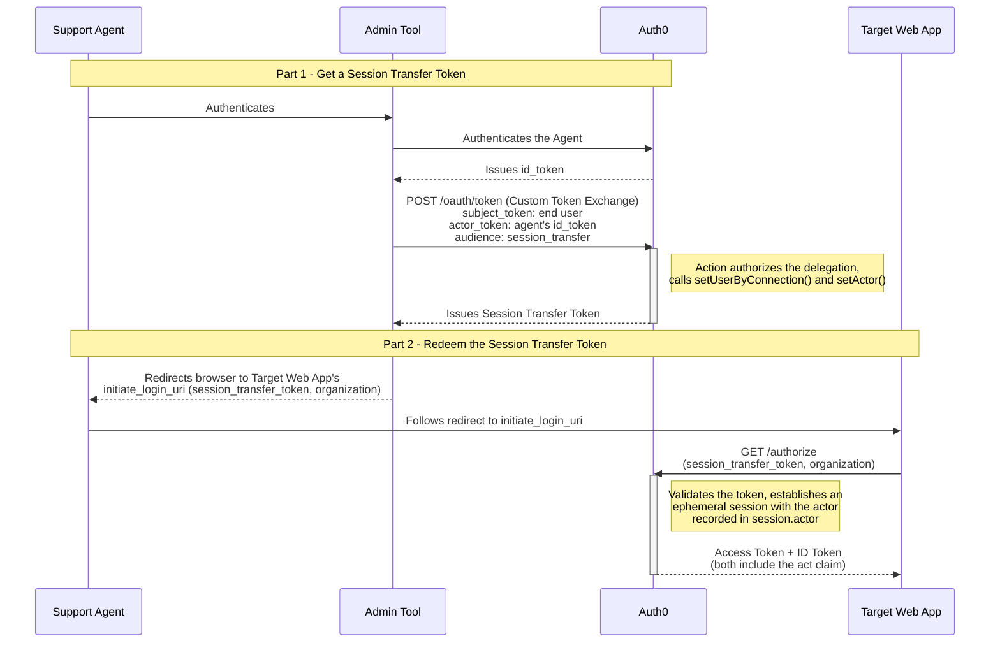

import { ReleaseStageNotice } from "/snippets/ReleaseStageNotice.jsx"

<ReleaseStageNotice
    feature="Session Delegation"
    stage="ea"
    plans="B2C Professional, B2B Professional, and Enterprise"
    terms="true"
/>

Session Delegation lets an authorized actor, for example a support agent, establish a web session as another user in your application. It builds on [Custom Token Exchange](/docs/authenticate/custom-token-exchange) to issue a Session Transfer Token that identifies both the subject user and the actor, and redeems that token into a session with the same mechanism used by [Native to Web SSO](/docs/authenticate/single-sign-on/native-to-web). The delegation itself is recorded and auditable in tenant logs.

<Callout icon="file-lines" color="#0EA5E9" iconType="regular">
Session Delegation solves a different problem than Native to Web SSO. Native to Web SSO carries an already-authenticated user's own session from your native application into your web application. Session Delegation instead lets a distinct, authorized actor establish a session **as another user**, for use cases such as support access or agent-assisted workflows. If you're looking to move a signed-in user from your native app to your web app, read [Native to Web SSO](/docs/authenticate/single-sign-on/native-to-web) instead.
</Callout>

## How it works

Session Delegation happens in two parts: your admin application first gets a Session Transfer Token, then redeems it to establish the delegated session in the target web application.

### Part 1: Get a Session Transfer Token

1. The actor (a support agent) authenticates via an admin tool with Auth0 and obtains proof of their own identity, such as an Auth0 ID token, to use as an `actor_token`.
2. The admin tool calls Auth0's [`/oauth/token`](/docs/api/authentication/custom-token-exchange/get-token) endpoint using a Custom Token Exchange request, setting `audience` to `urn:YOUR_AUTH0_TENANT_DOMAIN:session_transfer`.
3. The associated [Custom Token Exchange Action](/docs/customize/actions/explore-triggers/custom-token-exchange) authorizes the delegation, sets the subject user (typically via `setUserByConnection()`), and calls `setActor()` to record the actor. Calling `setActor()` is required to obtain a Session Transfer Token.
4. Auth0 issues a Session Transfer Token identifying the subject user, with the actor recorded for the transaction.

### Part 2: Redeem the Session Transfer Token (browser redirect)

How your application passes the Session Transfer Token to the target web application is up to your implementation, but a recommended approach is to attach it as a query parameter on the target application's `initiate_login_uri`:

5. Your application redirects the actor's browser to the target application's `initiate_login_uri`, with the Session Transfer Token, and an `organization` parameter if the login needs to happen in the scope of an organization, attached as query parameters.
6. This sends the browser to your Auth0 tenant's `/authorize` endpoint carrying the Session Transfer Token, which triggers seamless redemption. Auth0 validates the token and establishes an ephemeral, delegated session for the subject user, recording the actor in `session.actor` for auditing.
7. The target application completes the login and receives an access token and ID token, both including an `act` claim that identifies the delegation.

Read [Implement Session Delegation](/docs/authenticate/single-sign-on/session-delegation/implement-session-delegation) for the full request/response detail, how to build the redirect, and how to handle the resulting tokens. Learn how to [Configure Session Delegation](/docs/authenticate/single-sign-on/session-delegation/configure-session-delegation) for your application, and read [Delegated Session Behavior and Monitoring](/docs/authenticate/single-sign-on/session-delegation/session-delegation-behavior-and-monitoring) to understand session behavior and audit logging.

## Limitations

* Only the Authorization Code flow is supported for establishing a delegated session. SAML, WS-Federation, and the Implicit flow are not supported.
* Only single-level actors are supported. Unlike Custom Token Exchange access tokens, which support up to five levels of nested actors, a Session Transfer Token accepts a single actor only.
* **No refresh tokens are issued for delegated sessions.**
* A delegated session cannot be established if MFA, consent, or an enrollment prompt would be required. The request fails with `interaction_required` instead of prompting.
