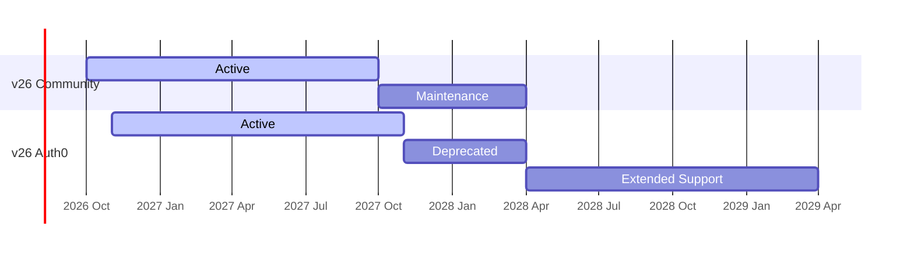

TBD

import { ReleaseChart } from '/snippets/ReleaseChart.jsx'

<ReleaseChart releases={[
  { version: '12', status: 'LTS', left: '0', width: '0' },
  { version: '16', status: 'LTS', left: '0', width: '0' },
  { version: '18', status: 'LTS', left: '0', width: '0' },
  { version: '22', status: 'Active', left: '0', width: '0' },
  { version: '26', status: 'Active', left: '0', width: '0' }
]} />

## Release Schedule

{/*

title Node.js Runtime AvailaRelease Schedule

section Node.js 12
    Initial Release :done,  v20_start, 2023-04-18, 2023-10-24
    Active          :active, v20_active, 2023-10-24, 2024-10-22
    LTS             :v20_lts, 2024-10-22, 2026-04-30
    
    section Node.js 16
    Initial Release :done, v22_start, 2024-04-23, 2024-10-29
    Active          :active, v22_active, 2024-10-29, 2025-10-21
    Maintenance     :v22_maint, 2025-10-21, 2027-04-30

        section Node.js 18
    Initial Release :done, v22_start, 2024-04-23, 2024-10-29
    Active          :active, v22_active, 2024-10-29, 2025-10-21
    Maintenance     :v22_maint, 2025-10-21, 2027-04-30
    
    section Node.js 22
    Initial Release :done, v22_start, 2024-04-23, 2024-10-29
    Active          :active, v22_active, 2024-10-29, 2025-10-21
    Maintenance     :v22_maint, 2025-10-21, 2027-04-30

*/}