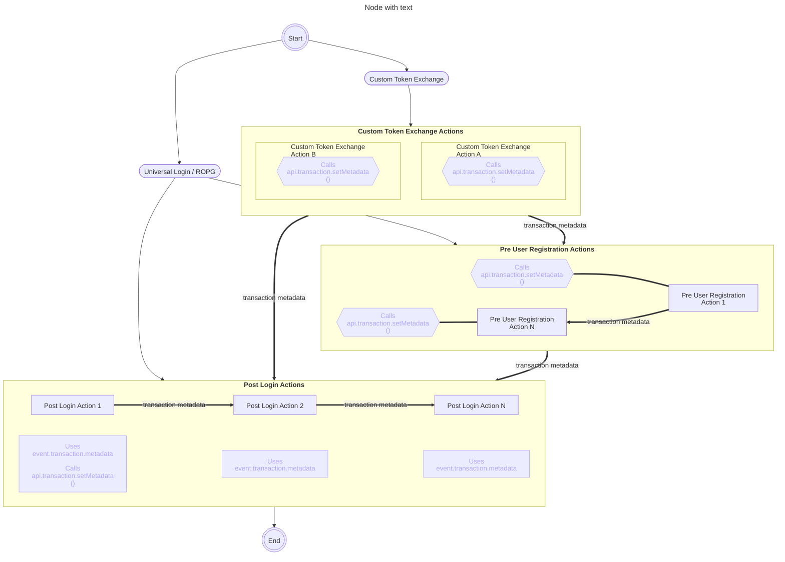

Actions Transaction Metadata stores, accesses, and/or shares, custom metadata for the duration of a transaction, from supported Actions.

Previously, each Action operated independently, making it difficult to pass information between them. With Actions Transaction Metadata, now it's possible to:

* Share data across supported Actions, such as API responses or intermediate calculations.
* Eliminate the need to re-fetch or re-calculate the same information in different Actions.
* Pass information from a Custom Token Exchange Action forward to Post Login Actions.

<Callout icon="file-lines" color="#0EA5E9" iconType="regular">

Before using transaction metadata in development, we recommend reviewing the limitations and coding guidelines;
- [Actions Limitations](/docs/customize/actions/limitations)
- [Actions Coding Guidelines](/docs/customize/actions/actions-conding-guidelines)

</Callout>

## How it works

Use the `api.transaction.setMetadata` to set the key/value pair in order to store transaction metadata.

Use the `event.transaction.metadata` to access stored key/value pair in the same Action or subsequent Actions for a single execution.

The API and Event objects accept the following parameters:

| Value | Type | Description |
| --- | --- | --- |
| `Key` | `String` | The key of the metadata property to be set. |
| `Value` | `String`, `Number`, `Boolean` | The value of the metadata property. Set to `null` removes the property. |

To learn more about writing Actions, read [Write Your First Action](/docs/customize/actions/write-your-first-action).

## Supported Action types

Currently, the following Action types are supported:
- [post-login](/docs/customize/actions/explore-triggers/signup-and-login-triggers/login-trigger)
- [custom-token-exchange](/docs/customize/actions/explore-triggers/custom-token-exchange)

## Cross-trigger capabilities

Some of the supported Action types allow passing custom metadata across different triggers that execute one after the other for an specific transaction.

The diagram below shows a few of the execution lines which allow cross-trigger transaction metadata sharing. Particularly:
- Transaction metadata set and shared by a Custom Token Exchange Action flowing into the Post-Login trigger
- Transaction metadata set and shared forward between Post-Login Actions in the same execution sequence

## Latency

Using Actions Transaction Metadata could cause a nominal additional latency. Any latency would be proportional to the metadata payload size and would be relevant when Action suspensions happen. For example, triggering <Tooltip tip="" cta="View Glossary" href="/docs/glossary?term=MFA">MFA</Tooltip>, redirecting from Actions, or rendering Forms, could cause latency issues due to the need of reloading data from storage.

Still, the potential latency should be minimal than the redundant outgoing HTTP requests to retrieve data the sequence of Actions needs.

## Examples

### Basics

* [Access Metadata Immediately](/docs/customize/actions/transaction-metadata/access-metadata-immediately)
* [Set Supported Values](/docs/customize/actions/transaction-metadata/set-supported-values)
* [Serialize Values](/docs/customize/actions/transaction-metadata/serialize-values)
* [Update Metadata](/docs/customize/actions/transaction-metadata/update-metadata)
* [Remove Metadata](/docs/customize/actions/transaction-metadata/remove-metadata)

### Single Trigger and Cross-trigger

* [Share Values Between Actions within the same Trigger](/docs/customize/actions/transaction-metadata/share-values-between-actions)
* [Share Values from Custom Token Exchange to Post Login](/docs/customize/actions/transaction-metadata/share-values-custom-token-exchange-to-post-login)

### Advanced

* [Preserve Values on Redirect to External Sites](/docs/customize/actions/transaction-metadata/preserve-values-on-redirect)
* [Preserve Values on Forms Rendering](/docs/customize/actions/transaction-metadata/preserve-values-on-forms-rendering)
* [Share Values with Forms](/docs/customize/actions/transaction-metadata/share-values-with-forms)
