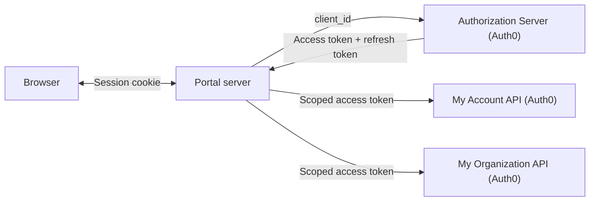
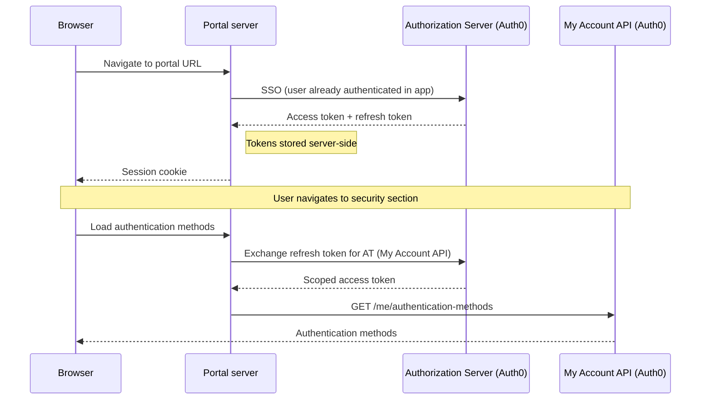
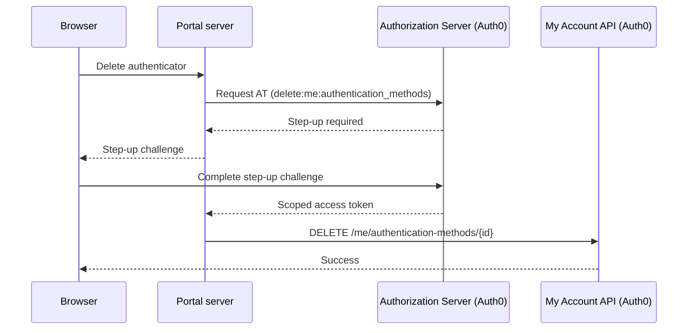
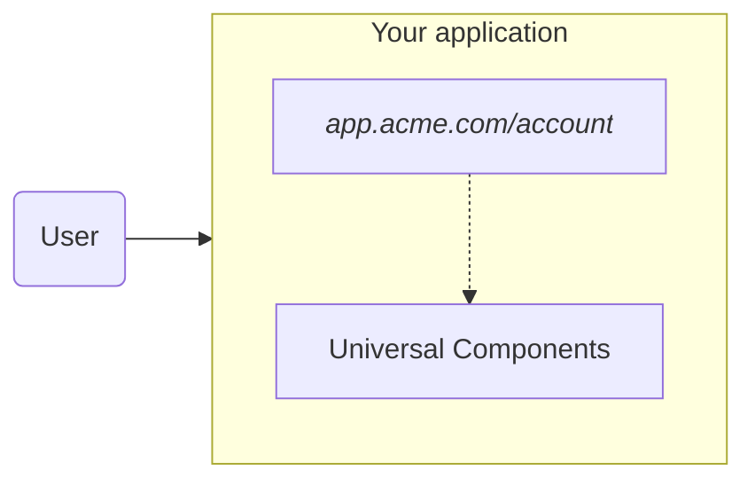
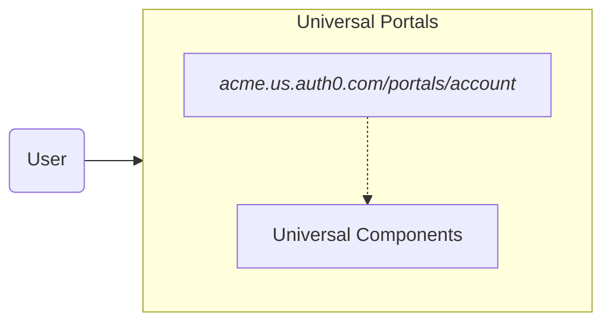

import { ReleaseStageNotice } from "/snippets/ReleaseStageNotice.jsx"

<ReleaseStageNotice
    feature="Auth0 Universal Portals"
    stage="beta"
    terms="true"
    contact="Auth0 Support"
/>

Auth0 Universal Portals is a hosted identity experience platform that lets you deploy pre-built, fully managed portals - profile management, organization settings, and more - without writing code, hosting infrastructure, or maintaining custom UI.

<Frame></Frame>

## How it works



A universal portal has three moving parts:

* The [**portal application**](/docs/get-started/auth0-overview/create-applications/regular-web-apps#register-regular-web-applications), the Regular Web App registered in your tenant, identified by its `client_id`.
* The **portal server** (the Auth0-hosted backend).
* The Authorization Server (Auth0).

The diagrams below are simplified to illustrate the conceptual flow.

### Universal Portals with sessions and tokens

Users typically arrive at a portal from within your application. When they navigate to the portal URL, the portal server performs [SSO](/docs/authenticate/single-sign-on/inbound-single-sign-on) with Auth0 - because the user is already authenticated, this happens transparently with no login prompt. Auth0 issues an [access token](/docs/secure/tokens/access-tokens) and a [refresh token](/docs/secure/tokens/refresh-tokens), both stored server-side. The browser receives only an encrypted [session](/docs/manage-users/sessions) cookie.

As the user navigates between sections, the portal server uses the refresh token to obtain a fresh access token scoped to only the resource that section needs. The refresh token issued at login can be exchanged for access tokens for different audiences - the [My Account API](/docs/api/myaccount) for personal settings, or the [My Organization API](/docs/api/myorganization) for organization management. Each access token carries only the minimum scopes required.

In the example below, the user navigates to the security section to manage their authentication methods, which requires the My Account API. The diagram is illustrative.



### Universal Portals and step-up challenges

Some operations require a higher level of assurance. When a user attempts a sensitive action - such as [deleting an authenticator](/docs/api/myaccount/authentication-methods/delete-authentication-method), which requires the `delete:me:authentication_methods` scope - Auth0 signals that a step-up is required. Universal Portals handles this automatically: it presents the step-up challenge, and retries the original operation once the user completes it. The diagram is illustrative.



## Universal Portals vs Universal Components

Universal Portals and [Universal Components](/docs/get-started/universal-components/universal-components-overview) use the same component library, but differ in who owns the delivery.

* Universal Portals provides a hosted experience.
* Universal Components provides an embedded experience.

**Embedded**



**Hosted**



| | Universal Components (embedded) | Universal Portals (hosted) |
|---|---|---|
| **Your responsibility** | Hosting, layout, auth wiring, token management | Page content and configuration |
| **End-user flow** | Stays within your app | Redirected to a separate portal URL |
| **When to choose** | Full control over UX; no redirect required | Fastest deployment; no infrastructure to manage |


## Universal Portals key features

### Visual builder

Compose portal pages using a drag-and-drop editor. The component library includes:

- **Identity components** - pre-built [Universal Components](/docs/get-started/universal-components/universal-components-overview) for profile management, MFA enrollment, password changes, and organization settings
- **[Auth0 Forms](/docs/customize/forms)** - use forms in portal pages to collect information from end-users, such as profile updates, policy acceptance, and marketing communication preferences
- **Layout components** - sections, dividers, and other structural elements for arranging pages visually

### Portal and application

Every portal is backed by a Regular Web App in your Auth0 tenant. When you create a portal in the Dashboard, Auth0 creates and configures the application automatically - callbacks, logout URLs, API access, and grants are all wired up. You can also provision these resources manually using the Auth0 CLI or the Management API, and link the application during portal creation.

Portals are served from your configured domain at:

```
https://YOUR_AUTH0_DOMAIN/portals/YOUR_PORTAL_SLUG
https://YOUR_CUSTOM_DOMAIN/portals/YOUR_PORTAL_SLUG
```

### Branding inheritance

Portals inherit your tenant's branding settings - logo, colors, and fonts - automatically. In B2B scenarios, branding adapts to the organization context.

### Zero infrastructure

Portals are fully hosted by Auth0. There is nothing to deploy, scale, or maintain.

### Security defaults

Universal Portals implements identity security best practices by default. Among those:

- **Backchannel logout** - when a session ends for any reason (logout from another device, session revocation, account changes), the portal session is terminated automatically across all devices. No user interaction required, regardless of how or where the logout was triggered.
- **Automatic MFA step-up** - when a user accesses a sensitive operation, the portal handles the authentication challenge transparently and retries the original operation on success.
- **Secure, HttpOnly cookies** - session cookies are HttpOnly and encrypted, preventing client-side scripts from accessing session data.

You do not need to build, configure, or maintain any of this.

## Use cases

**Consumer portals** give end-users self-service access to their account - profile management, MFA enrollment, password changes, and security settings. Replaces the My Account page every application builds from scratch.

<Frame></Frame>

**Business portals** give organization members self-service control over their organization - configuration, domain verification, and team management. Replaces the My Organization page every B2B application builds from scratch.

<Frame></Frame>

## Next steps

Read [Get started with Universal Portals](/docs/customize/portals/quickstart) to set up your first portal.
