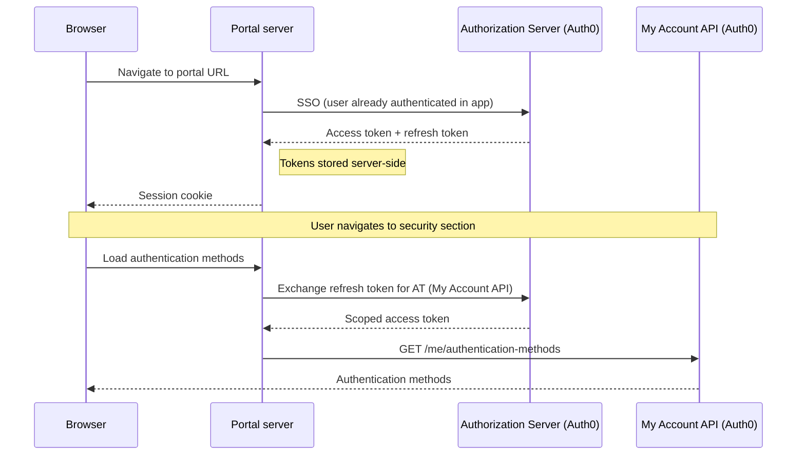
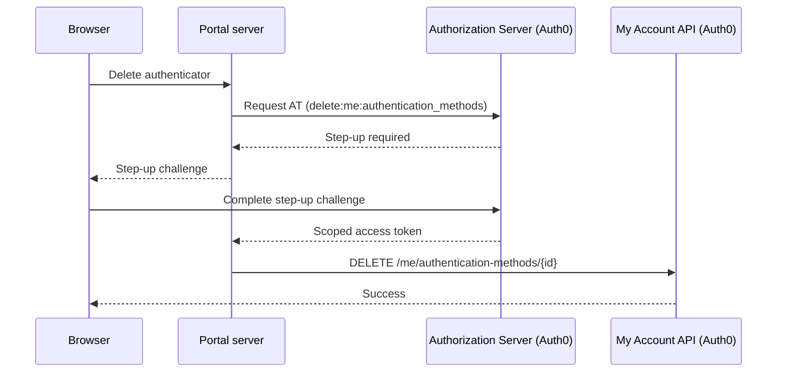
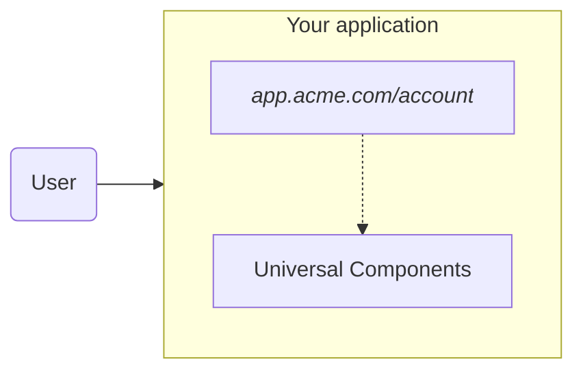
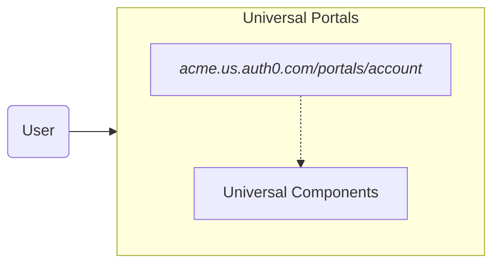

import { ReleaseStageNotice } from "/snippets/ReleaseStageNotice.jsx"

<ReleaseStageNotice
    feature="Auth0 Universal Portals"
    stage="beta"
    terms="true"
    contact="Auth0 Support"
/>

Auth0 Universal Portals is a hosted identity experience platform. It lets you deploy pre-built, fully managed portals that offer profile management, organization settings, and more. You do not need to write code, host infrastructure, or maintain custom UI.

Universal Portals allows you to create Auth0 hosted self-service portals using [My Account API](/docs/api/myaccount) for personal settings, or [My Organization API](/docs/api/myorganization) for organization management. 

<Frame></Frame>

## Use cases

Universal Portals supports the following use cases:

- Create self-service **consumer portals** to give end-users access to their account profile management, [multi-factor authentication (MFA)](/docs/secure/multi-factor-authentication#multi-factor-authentication-mfa) enrollment, password changes, and security settings.
This use case replaces the **My Account** page that you host and build from scratch. 

<Frame></Frame>

- Create self-service **business portals** to give organization members control over their organization's configuration, domain verification, and team management.
This use case replaces the **My Organization** page that you host and build from scratch.

<Frame></Frame>

## Key features

Universal Portals provides the following features with no need to build, configure, or maintain:

- **Visual builder**: configure portal pages using a drag-and-drop editor. It includes:

    - **Identity components**: use pre-built [Universal Components](/docs/get-started/universal-components/universal-components-overview) for profile management, MFA enrollment, password changes, and organization settings.
    - **[Auth0 Forms](/docs/customize/forms)**: use forms in portal pages to collect information from end-users, such as profile updates, policy acceptance, and marketing communication preferences.
    - **Layout components**: add sections, dividers, and other structural elements to arrange pages visually.

- **Portal and application**: every portal is backed by an Auth0 [Regular Web App](/docs/get-started/auth0-overview/create-applications/regular-web-apps#register-regular-web-applications).
    - When you create a portal using the Auth0 Dashboard, Auth0 creates and configures the application automatically, callbacks, logout URLs, API access, and grants are all wired up. 
    - You can also provision these resources manually using the Auth0 CLI or the Management API, and link the application during portal creation. To learn more, read [Universal Portals Quickstart](/docs/customize/portals/quickstart).

- **Branding inheritance**: portals inherit your tenant's branding settings, logo, colors, and fonts automatically. In B2B scenarios, branding adapts to the organization context.

- **Zero infrastructure**: portals are fully hosted by Auth0. There is nothing to deploy, scale, or maintain.

- **Security defaults**: Universal Portals implements identity security best practices by default:

    - [**Backchannel logout**](/docs/authenticate/login/logout/back-channel-logout): when a session ends for any reason (logout from another device, session revocation, account changes), the portal session is automatically terminated across all devices.
    - **Automatic MFA step-up**: when a user accesses a sensitive operation, the portal handles the authentication challenge transparently and retries the original operation on success.

## How it works

Universal Portals allows your authenticated users to visit a portal from within your application. 
When they navigate to the portal URL, the portal server performs an Auth0 [single sign-on](/docs/authenticate/single-sign-on/inbound-single-sign-on). This happens transparently with no login prompt. 

Auth0 issues an [access token](/docs/secure/tokens/access-tokens) and a [refresh token](/docs/secure/tokens/refresh-tokens), which are stored server-side. The browser receives only an encrypted [session](/docs/manage-users/sessions) cookie.

As the user navigates between sections, the portal server uses the refresh token to obtain a fresh access token scoped to only the resource that section needs.
The refresh token issued at login can be exchanged for access tokens for different audiences, such as the [My Account API](/docs/api/myaccount) for personal settings, or the [My Organization API](/docs/api/myorganization) for organization management. 

In the diagram below, the user navigates to the security section to manage their authentication methods, which requires the My Account API. 

### Step-up challenges

Some operations require a higher level of assurance. When a user attempts a sensitive action, such as [deleting an authenticator](/docs/api/myaccount/authentication-methods/delete-authentication-method), which requires the `delete:me:authentication_methods` scope, Auth0 signals that a step-up challenge is required.

Universal Portals handles this automatically: it presents the step-up challenge and retries the original operation once the user completes it. 

## Universal Portals and Universal Components

Universal Portals and [Universal Components](/docs/get-started/universal-components/universal-components-overview) use the same component library, but differ in who owns the delivery.

- Universal Portals provides a fully hosted experience.
- Universal Components provides an embedded experience.

| | **Universal Components (Embedded)** | **Universal Portals (Hosted)** |
|---|---|---|
| **Your responsibility** | Hosting, layout, auth wiring, token management | Page content and configuration |
| **End-user flow** | Stays within your app | Redirected to a separate portal URL |
| **When to choose** | Full control over UX; no redirect required | Fastest deployment; no infrastructure to manage |

**Universal Components (Embedded)**

**Universal Portals (Hosted)**

## Learn more

  <Card title="Universal Portals Quickstart" icon="gear" href="/docs/customize/portals/quickstart" horizontal>
    Learn how to configure and create a portal.
  </Card>
