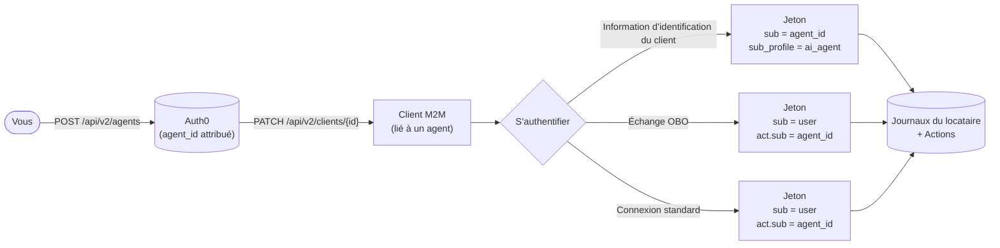

import { ReleaseStageNotice } from "/snippets/fr-ca/ReleaseStageNotice.jsx"

<ReleaseStageNotice feature="Agent as Principal" stage="ea" contact="Auth0 Support" terms="true" />

L’agent comme mandant fait des agents d&#39;IA des identités de première classe dans Auth0, distinctes des utilisateurs humains et des clients traditionnels de communication entre machines (M2M). Un agent est une entité enregistrée dotée d&#39;un identifiant stable, de sa propre gestion du cycle de vie, de ses propres informations d&#39;identification et de sa propre piste d&#39;audit.

Une fois enregistré comme principal Auth0, un agent peut :

* agir au nom de l&#39;utilisateur;
* s&#39;exécuter de façon autonome, sans session utilisateur;
* participer à une délégation à sauts multiples par échange de jetons.

## Cas d&#39;utilisation {#use-cases}

* Agents autonomes : un agent d&#39;IA utilise des informations d&#39;identification de client pour appeler directement des API en son propre nom, son identité étant consignée dans les journaux et les jetons.
* Accès délégué : un utilisateur autorise un agent d&#39;IA à agir en son nom. L&#39;agent échange le jeton d&#39;accès de l&#39;utilisateur contre un jeton délégué qui conserve l&#39;utilisateur comme sujet et désigne l&#39;agent comme acteur.
* Chaînes à sauts multiples : un agent orchestrateur délègue à un sous-agent. La chaîne de délégation est préservée dans des demandes `act` imbriquées, ce qui permet une traçabilité complète à n&#39;importe quel serveur de ressources.

## Fonctionnement {#how-it-works}

L&#39;agent comme mandant fonctionne en trois étapes : l&#39;enregistrement, l&#39;association du client et l&#39;émission du jeton.

1. [Enregistrer l&#39;agent](/docs/fr-ca/ai-agents-mcp/agent-as-principal/register-an-agent) : vous enregistrez un agent dans Auth0 à l&#39;aide du Dashboard ou de la Management API. Auth0 crée un [objet agent](/docs/fr-ca/ai-agents-mcp/agent-as-principal/register-an-agent#agent-object) doté d&#39;un `agent_id` stable qu&#39;il est possible de suivre dans les jetons, les journaux et la Management API tout au long de son cycle de vie.

2. [Associer l&#39;agent à un client](/docs/fr-ca/ai-agents-mcp/agent-as-principal/associate-agent-client) : un agent ne possède pas d&#39;information d&#39;identification qui lui soit propre; il s&#39;authentifie par l&#39;entremise d&#39;un ou de plusieurs clients associés. Un même agent peut être lié à plusieurs clients, ce qui est utile pour avoir des clients distincts par environnement ou par région tout en conservant une seule identité logique dans les journaux.

3. [Identité de l&#39;agent dans les jetons](/docs/fr-ca/ai-agents-mcp/agent-as-principal/agent-identity-in-tokens) : lorsqu&#39;un client lié à un agent s&#39;authentifie, Auth0 intègre l&#39;identité de l&#39;agent au jeton émis selon le type d&#39;autorisation.

L&#39;`agent_id` (ou l&#39;`external_agent_id`, s&#39;il est défini à la création) est également inscrit dans les [journaux du locataire](/docs/fr-ca/ai-agents-mcp/agent-as-principal/tenant-logs) à chaque émission de jeton, ce qui vous procure une piste de vérification complète pour chaque agent. Vous pouvez aussi accéder à l&#39;identité de l&#39;agent dans les [Actions](/docs/fr-ca/ai-agents-mcp/agent-as-principal/actions-context) au moyen de `event.agent` afin d&#39;appliquer une logique personnalisée au moment de l&#39;émission du jeton.

## Conseils de migration {#migration-guidance}

Migrez vos clients et serveurs de ressources existants afin d&#39;utiliser l&#39;agent comme mandant.

### Clients {#clients}

Les clients existants ne sont pas touchés, sauf si vous les associez explicitement à un agent. L&#39;association à un agent est optionnelle et réversible. Pour en savoir plus, consultez [Associer un agent à un client](/docs/fr-ca/ai-agents-mcp/agent-as-principal/associate-agent-client).

### Serveurs de ressources {#resource-servers}

Pour recevoir les demandes `sub_profile` et `client_profile`, définissez `agent_subject_claims: 'auth0-v1'` dans la configuration du serveur de ressources visé. Cette option s&#39;active individuellement pour chaque serveur de ressources. Pour en savoir plus, consultez [Configurer un serveur de ressources pour recevoir les demandes de sujet d&#39;agent](/docs/fr-ca/ai-agents-mcp/agent-as-principal/agent-identity-in-tokens#configure-resource-server-to-receive-agent-subject-claims).