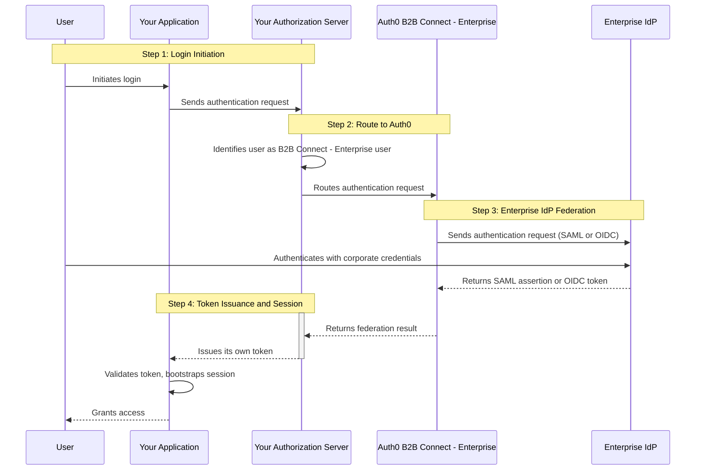

import { ReleaseStageNotice } from "/snippets/fr-ca/ReleaseStageNotice.jsx"

<ReleaseStageNotice feature="B2B Connect - Enterprise" stage="ea" contact="votre équipe technique de compte ou le soutien Auth0" terms="true" />

Auth0 B2B Connect - Enterprise est une couche d&#39;intégration modulaire et prête pour l&#39;entreprise qui ajoute à votre pile d&#39;authentification existante les fonctionnalités B2B d&#39;entreprise d&#39;Auth0 (comme l&#39;<Tooltip tip="Authentification unique (SSO) : service qui, après la connexion d'un utilisateur à une application, connecte automatiquement cet utilisateur aux autres applications." cta="Voir le glossaire" href="/docs/fr-ca/glossary?term=SSO">authentification unique (SSO)</Tooltip>, la fourniture d&#39;utilisateurs à l&#39;aide de System for Cross-domain Identity Management (SCIM) et Universal Logout). Avec B2B Connect - Enterprise, vous pouvez ajouter les services B2B d&#39;Auth0 à votre serveur d&#39;autorisation existant et garder la maîtrise de l&#39;émission des jetons, de la gestion des sessions et de la connexion, tout en offrant à vos clients B2B la possibilité d&#39;utiliser leur fournisseur d&#39;identité (IdP) d&#39;entreprise pour l&#39;authentification des utilisateurs.

## Avantages {#benefits}

Pourquoi utiliser B2B Connect - Entreprise ? Chaque fois que vous vous lancez dans la création de produits destinés à une clientèle B2B, vous risquez de devoir bâtir des outils d&#39;identité B2B complexes uniquement pour couvrir les éléments fondamentaux de l&#39;intégration et de la gestion de la clientèle.

Ce travail incombe généralement à une équipe d&#39;identité de plateforme qui doit composer avec des priorités concurrentes. Il en résulte une pression constante pour faire des compromis entre trois piliers structurellement essentiels :

1. Maintenir une sécurité et une interopérabilité rigoureuses.
2. Offrir à la clientèle une expérience d&#39;intégration et de cycle de vie irréprochable.
3. Libérer et soutenir l&#39;innovation au sein de votre produit principal.

Pour répondre à ces trois exigences, deux voies s&#39;offrent habituellement à vous : migrer vers une plateforme d&#39;identité moderne ou greffer des capacités d&#39;entreprise à votre pile existante. La migration est une avenue éprouvée, mais elle exige un délai considérable. Pour les équipes qui ont besoin de fonctionnalités d&#39;entreprise plus rapidement, ou pour les plateformes où une migration complète comporte un risque inutile, B2B Connect - Entreprise propose une troisième voie : ajouter des capacités B2B de calibre entreprise sans remplacer votre pile existante.

## Cas d&#39;utilisation {#use-cases}

B2B Connect - Entreprise prend en charge des scénarios d&#39;identité B2B avancés sans qu&#39;il soit nécessaire de changer de plateforme, notamment les cas d&#39;utilisation suivants :

* Ajouter le SSO d&#39;entreprise à un serveur d&#39;autorisation existant
* Offrir une intégration en libre-service à vos clients d&#39;entreprise
* Préserver votre expérience de connexion et votre émission de jetons actuelles
* Enrichir les jetons d&#39;ID de vos applications avec des demandes d&#39;entreprise
* Diriger les utilisateurs vers les IdP d&#39;entreprise selon le domaine de courriel vérifié
* Déléguer l&#39;administration des identités à vos clients B2B
* Prendre en charge la gestion des sessions conforme à IPSIE et Universal Logout

## Fonctionnement {#how-it-works}

Auth0 B2B Connect - Entreprise se place entre le serveur d&#39;autorisation de votre application et les fournisseurs d&#39;identité d&#39;entreprise de vos clients :



1. L&#39;utilisateur amorce la connexion dans votre application.
2. Votre application envoie une demande d&#39;authentification à votre serveur d&#39;autorisation au moyen de son flux existant.
3. Votre serveur d&#39;autorisation reconnaît l&#39;utilisateur comme un utilisateur B2B Connect - Entreprise et acheminE la demande vers Auth0.
4. Auth0 B2B Connect - Entreprise envoie une demande d&#39;authentification à l&#39;IdP d&#39;entreprise de l&#39;utilisateur (comme Okta, Microsoft Entra ID, Google Workspace ou PingFederate) au moyen de SAML ou d&#39;OpenID Connect (OIDC).
5. L&#39;utilisateur s&#39;authentifie auprès de l&#39;IdP d&#39;entreprise avec ses informations d&#39;identification d&#39;entreprise.
6. L&#39;IdP d&#39;entreprise renvoie une assertion SAML ou un jeton OIDC à Auth0 B2B Connect - Entreprise.
7. Votre serveur d&#39;autorisation renvoie son propre jeton à votre application.
8. Votre application valide le jeton et amorce sa propre session.
9. L&#39;utilisateur obtient l&#39;accès à votre application.

Pour le type d&#39;intégration application, l&#39;application redirige directement vers Auth0, ce qui retire le serveur d&#39;autorisation intermédiaire du flux de fédération.

## Connexions d&#39;entreprise prises en charge {#supported-enterprise-connections}

B2B Connect - Enterprise prend en charge les [connexions d&#39;entreprise](/docs/fr-ca/authenticate/enterprise-connections) suivantes :

* SAML
* OIDC
* Okta Workforce
* Microsoft Entra ID (Azure AD)
* Google Workspace
* Active Directory / LDAP
* ADFS
* PingFederate

## Intégrer B2B Connect - Entreprise {#integrate-b2b-connect-enterprise}

Vous pouvez intégrer B2B Connect - Entreprise à l’aide de l’assistant Créer une intégration B2B Connect dans le [Auth0 Dashboard](https://manage.auth0.com/#/b2b-integrations), ce qui établit la topologie. Le choix que vous faites à l’étape 1 (Nom et type) de l’assistant détermine tout votre parcours d’intégration.

<Frame></Frame>

| Type | Intégration                              | Redirection vers Auth0 depuis | SDK Auth0 requis | Protocole    |
| ---- | ---------------------------------------- | ----------------------------- | ---------------- | ------------ |
| 1    | Serveur d’autorisations personnalisées   | Serveur d’autorisation        | Non requis       | OIDC ou SAML |
| 2    | Serveur d’autorisation géré par un tiers | Serveur d’autorisation        | Non requis       | OIDC ou SAML |
| 3    | Application (directe)                    | Application                   | Recommandé       | OIDC         |

### Serveur d’autorisations personnalisées {#custom-authorization-server}

Utilisez ce type si vous avez conçu votre propre serveur d’autorisation et que celui-ci peut agir comme partie utilisatrice auprès d’Auth0 via OIDC ou SAML. Les utilisateurs Entreprise sont redirigés de votre serveur d’authentification vers Auth0, tandis que les utilisateurs non-Entreprise demeurent entièrement sur votre serveur d’authentification.

```
Application → Custom Auth Server → Auth0 B2B Connect - Enterprise → Enterprise IdP
                    ↑                         |
                    └─────── identity ────────┘
```

Dans l&#39;assistant, les étapes sont les suivantes :

1. Nom et type : nommez l&#39;intégration, puis sélectionnez **Custom Authorization Server**.
2. Authentification : sélectionnez **OIDC (recommandé)** ou **SAML**.
3. Configurer Auth0 comme IdP : fournissez les valeurs tirées de votre serveur d&#39;authentification pour qu&#39;Auth0 puisse agir à titre de fournisseur d&#39;identité :
   * OIDC : URL de l&#39;émetteur et URL de rappel de votre application.
   <Callout icon="file-lines" color="#0EA5E9" iconType="regular">
     Déployez **Show individual endpoints** si votre serveur d&#39;authentification ne prend pas en charge la découverte de l&#39;émetteur, afin d&#39;obtenir l&#39;URL d&#39;autorisation, l&#39;URL du jeton, le Client ID et le Client Secret.
   </Callout>
   * SAML : émetteur, empreinte SHA1 du fournisseur d&#39;identité, URL de connexion du fournisseur d&#39;identité, certificat Auth0 ou métadonnées de l&#39;IdP, et URL de rappel de votre application.
4. Intégration créée : passez à la configuration des [Organizations](/docs/fr-ca/manage-users/organizations) et de la [configuration Entreprise en libre-service (SSEC)](/docs/fr-ca/authenticate/enterprise-connections/self-service-enterprise-configuration) pour intégrer votre premier client B2B.

### Serveur d&#39;autorisation géré par un tiers {#third-party-managed-authorization-server}

Utilisez ce type si vous utilisez un serveur d&#39;autorisation acheté ou géré. La topologie et le flux de l&#39;assistant sont identiques à ceux du type 1. Consultez la documentation du fournisseur de votre serveur d&#39;autorisation pour savoir comment configurer Auth0 comme fournisseur d&#39;identité.

```
Application → Third-party Auth Server → Auth0 B2B Connect - Enterprise → Enterprise IdP
                    ↑                              |
                    └──────────identity ───────────┘
```

B2B Connect - Entreprise prend en charge les serveurs d&#39;autorisation gérés par des tiers qui offrent la fédération via OIDC ou SAML. En voici quelques exemples :

* Amazon Cognito
* PingIdentity PingOne
* Ory
* Keycloak
* Transmit Security

Dans l&#39;assistant, les étapes sont les suivantes :

1. Nom et type : nommez l&#39;intégration, puis sélectionnez **Third-party Managed Authorization Server**.
2. Protocole d&#39;authentification : sélectionnez OIDC (recommandé) ou SAML.
3. Configurer Auth0 comme IdP : mêmes champs OIDC ou SAML que pour le type 1. Enregistrez Auth0 comme fournisseur d&#39;identité en amont dans votre serveur d&#39;authentification géré.
4. Intégration créée : passez à la configuration des [Organizations](/docs/fr-ca/manage-users/organizations) et de la [SSEC](/docs/fr-ca/authenticate/enterprise-connections/self-service-enterprise-configuration).

### Application {#application}

Utilisez ce type lorsque votre application s&#39;intègre directement à Auth0, sans serveur d&#39;autorisation distinct. L&#39;application intègre le SDK Auth0 et gère entièrement la session. Ce type est exclusivement OIDC et ne comporte pas d&#39;étape de sélection du protocole.

```
Application (embeds Auth0 SDK) → Auth0 B2B Connect - Enterprise → Enterprise IdP
         ↑                                    |
         └──────────── identity ──────────────┘
```

Dans l&#39;assistant, les étapes sont les suivantes :

1. Nom et type : nommez l&#39;intégration, puis sélectionnez **Application**.
2. Configurer l&#39;intégration : saisissez vos URL de rappel autorisées. Auth0 redirige les utilisateurs vers ces URL après l&#39;authentification. Au moins une URL est requise.
3. Poursuivre la configuration : l&#39;intégration est créée. Suivez le guide de démarrage rapide pour ajouter un bouton Se connecter avec SSO à votre application et configurer les [Organizations](/docs/fr-ca/manage-users/organizations) et la [SSEC](/docs/fr-ca/authenticate/enterprise-connections/self-service-enterprise-configuration).

## Configurer l&#39;intégration des clients {#configure-customer-onboarding}

La configuration d&#39;entreprise en libre-service (SSEC) offre à vos clients B2B un flux guidé leur permettant de configurer leur IdP d&#39;entreprise et leurs mappages de demandes sans devoir faire appel directement à votre équipe.

Pour configurer l&#39;intégration des clients :

1. Dans Auth0 Dashboard, accédez à [B2B Connect](https://manage.auth0.com/#/b2b-integrations). Sous l&#39;onglet Organizations, sélectionnez **Set up**.
2. Saisissez un nom pour votre profil de configuration d&#39;entreprise en libre-service.
   <Frame></Frame>
3. Facultatif. Ajoutez une description.
4. Auth0 crée un [profil d&#39;attribut utilisateur (UAP)](/docs/fr-ca/authenticate/enterprise-connections/user-attribute-profile) portant le nom de votre profil SSEC. Sélectionnez **Continue**.
5. Choisissez la façon dont vous souhaitez générer les tickets SSEC :
   * Intégration par API
   * Auth0 Dashboard
6. Sélectionnez **Done**.

<Callout icon="file-lines" color="#0EA5E9" iconType="regular">
  Pour connaître le nombre maximal de profils SSEC que vous pouvez créer par locataire, consultez [Configuration d&#39;entreprise en libre-service](/docs/fr-ca/authenticate/enterprise-connections/self-service-enterprise-configuration#how-it-works).
</Callout>

## Créer ou configurer une Organization Auth0 {#create-or-configure-an-auth0-organization}

Une fois la configuration de l’intégration des clients terminée, associez une Organization Auth0 à chaque demande de ticket en libre-service.

Pour que vos clients B2B puissent s’authentifier, accordez à chaque Organization l’accès à l’application d’intégration B2B, en plus d’activer sa connexion d’entreprise.

### Créer une nouvelle Organization Auth0 {#create-a-new-auth0-organization}

1. Sélectionnez **+Create Organization** ou le symbole **&lt;&gt;** pour obtenir les instructions d&#39;intégration à l&#39;API.
2. Indiquez un **Name** destiné aux utilisateurs finaux.
3. Facultatif. Indiquez un **nom d’affichage**. S&#39;il est omis, le nom d’affichage reprend par défaut le nom de l&#39;Organization.
4. Pour ignorer la création du billet d&#39;intégration, sélectionnez **Create**.
5. Pour créer un billet d&#39;intégration pour cette Organization :
   * Cochez la case, puis sélectionnez **Create and Continue**.
   * Ajoutez un **nom de connexion** et un **nom d’affichage**.
   * Sélectionnez **Create and Continue**.
   * Copiez l&#39;URL du billet et transmettez-la à votre client B2B. Sélectionnez **Copy and Close**.
6. L&#39;administrateur de votre client lance l&#39;assistant en libre-service à partir de l&#39;URL du billet et suit les étapes pour configurer sa connexion et effectuer la vérification du domaine.
   <Frame></Frame>

### Configurer une Organization Auth0 existante {#configure-an-existing-auth0-organization}

1. Dans B2B Connect - Entreprise, sélectionnez dans la liste l&#39;icône de l&#39;Organization que vous souhaitez configurer.
2. Ajoutez un nom de connexion (Connection Name) et un nom d&#39;affichage (Display Name).
3. Sélectionnez Create and Continue.
4. Copiez l&#39;URL du billet et transmettez-la à votre client B2B. Sélectionnez Copy and Close.
5. L&#39;administrateur de votre client ouvre l&#39;assistant en libre-service à partir de l&#39;URL du billet, puis suit les étapes indiquées pour configurer sa connexion et effectuer la vérification du domaine.

Une fois la configuration terminée, testez-la avec un utilisateur test.

## Auth0 Events {#auth0-events}

Utilisez [Auth0 Event](/docs/fr-ca/customize/events) pour configurer des notifications en temps réel lors des événements de cycle de vie, afin de maintenir votre magasin d&#39;identité en aval synchronisé avec les changements effectués dans Auth0. Vous pouvez vous abonner aux événements liés aux utilisateurs, aux Organizations et aux connexions d’entreprise.

### Configurer les événements de cycle de vie {#configure-lifecycle-events}

Pour configurer les événements de cycle de vie :

1. Dans Auth0 Dashboard, allez à **[Event Streams](https://manage.auth0.com/#/event-streams)**.
2. Sélectionnez **+ Create Event Stream**.
3. Choisissez votre destination : **Webhooks**, **AWS EventBridge** ou **[Auth0 Actions](/docs/fr-ca/customize/actions)**.
4. Saisissez votre configuration et choisissez les catégories d&#39;événements que vous souhaitez recevoir :
   * Événements d&#39;utilisateur : [`user.created`](/docs/fr-ca/events/user/user.created), [`user.deleted`](/docs/fr-ca/events/user/user.deleted), [`user.updated`](/docs/fr-ca/events/user/user.updated)
   * Événements d&#39;Organization : [`organization.created`](/docs/fr-ca/events/organization/organization.created), [`organization.deleted`](/docs/fr-ca/events/organization/organization.deleted), `organization.member.*`, [`organization.updated`](/docs/fr-ca/events/organization/organization.updated)
   * Événements de connexion : [`connection.created`](/docs/fr-ca/events/connection/connection.created), [`connection.deleted`](/docs/fr-ca/events/connection/connection.deleted), [`connection.updated`](/docs/fr-ca/events/connection/connection.updated)
5. Sélectionnez **Save**.

Auth0 transmet les événements au terminal de votre flux d&#39;événements. Utilisez ces événements pour synchroniser l&#39;état des identités d&#39;entreprise entre Auth0 et votre serveur d&#39;autorisation, sans avoir à interroger la Management API.

<Callout icon="file-lines" color="#0EA5E9" iconType="regular">
  Si vous configurez une [connexion prise en charge](#supported-enterprise-connections), vous recevez les événements de cycle de vie `connection.created`, `connection.updated` et `connection.deleted` pour tous les types de connexions pris en charge. Utilisez ces événements pour tenir à jour votre table d&#39;association de domaines locale à mesure que vos clients B2B configurent et modifient leurs connexions d&#39;entreprise.
</Callout>

## Intégrer les SDK Auth0 {#integrate-auth0-sdks}

Auth0 offre des SDK permettant d&#39;intégrer B2B Connect - Entreprise à votre application ou à votre serveur d&#39;autorisation.

### SDK pris en charge {#supported-sdks}

| SDK                      | Langage              | Type d&#39;application   |
| ------------------------ | -------------------- | ------------------------ |
| `@auth0/auth0-server-js` | Node.js              | Application web standard |
| `@auth0/nextjs-auth0`    | Node.js / Next.js    | Application web standard |
| `express-openid-connect` | Node.js / Express    | Application web standard |
| `auth0-server-python`    | Python               | Application web standard |
| `@auth0/auth0-spa-js`    | JavaScript           | Application monopage     |
| `@auth0/auth0-react`     | JavaScript / React   | Application monopage     |
| `@auth0/auth0-angular`   | JavaScript / Angular | Application monopage     |
| `@auth0/auth0-vue`       | JavaScript / Vue     | Application monopage     |

Des démarrages rapides pour chaque SDK sont offerts dans l&#39;onglet **Quickstart** de votre intégration B2B.

### Modèle d&#39;intégration {#integration-pattern}

B2B Connect - Entreprise utilise un modèle de transmission sans état. Auth0 gère l&#39;aller-retour SSO vers l&#39;IdP d&#39;entreprise et renvoie un jeton d&#39;ID enrichi ; votre serveur d&#39;autorisation ou votre application existante demeure l&#39;autorité de session. Cette approche diffère d&#39;une intégration Auth0 standard à plusieurs égards :

* Mode sans état : les SDK serveur omettent le magasin de session (`stateStore` / `state_store`). La méthode de rappel (`completeInteractiveLogin` / `complete_interactive_login`) renvoie directement les demandes de l&#39;utilisateur ainsi que le jeton d&#39;ID. Lisez l&#39;identité à partir de la valeur renvoyée plutôt qu&#39;avec getSession().
* Aucun jeton d&#39;actualisation : B2B Connect - Entreprise n&#39;émet pas de jetons d&#39;actualisation. Attribuez à `scope` la valeur `openid profile email` et omettez `offline_access`.
* Organization requise : transmettez `organization` à `/authorize` pour lier la connexion à la bonne Organization Auth0 et activer la transmission silencieuse vers l&#39;IdP d&#39;entreprise. Validez la demande org&#95;id dans le jeton renvoyé avant de faire confiance à la connexion.
* Déconnexion fédérée : au moment de la déconnexion, redirigez vers le `/v2/logout` d&#39;Auth0 avec `federated: true` afin de mettre fin à la session de l&#39;IdP d&#39;entreprise. Sans cela, la session de l&#39;IdP demeure active.

### Connexion avec SSO {#login-with-sso}

Utilisez `loginWithRedirect` (SDK pour applications monopages) ou `startInteractiveLogin` (SDK serveur) pour lancer le flux d&#39;authentification. Transmettez `login_hint` (le courriel de l&#39;utilisateur), `connection` et `organization` dans `authorizationParams`. Les guides de démarrage rapide de l&#39;onglet **Quickstart** fournissent les instructions d&#39;intégration complètes pour chaque SDK.

### Routage des utilisateurs par domaine (Webfinger) {#domain-based-user-routing-webfinger}

B2B Connect - Entreprise expose un terminal Webfinger standard qui vous permet de détecter si le domaine de courriel d&#39;un utilisateur est géré par Auth0.

Avant d&#39;utiliser le terminal Webfinger, l&#39;administrateur du locataire doit activer l&#39;indicateur Local Resource Discovery.

Accédez à [**Tenant Settings &gt; Advanced**](https://manage.auth0.com/#/tenant/advanced) et activez Local Resource Discovery.
<Frame></Frame>

```bash
GET https://{your-auth0-domain}/.well-known/webfinger
  ?resource=urn:auth0:discovery:domain:{user-domain}
  &rel=http://openid.net/specs/connect/1.0/issuer
```

Si le domaine de courriel de l&#39;utilisateur est enregistré auprès d&#39;une Organization Auth0 et d&#39;une connexion d&#39;entreprise, le terminal retourne l&#39;émetteur Auth0. Sinon, rabattez-vous sur votre parcours d&#39;authentification existant.
Auth0 offre aussi, par commodité, un SDK de recherche de domaine qui encapsule ce terminal :

```javascript
const isAuth0Managed = await isFederatedDomain(AUTH0_DOMAIN, 'acme.com');
if (isAuth0Managed) {
  // rediriger vers B2B Connect - Entreprise
} else {
  // rediriger vers le flux d'authentification existant
}
```

#### Approche de routage recommandée {#recommended-routing-approach}

Dès que Webfinger confirme que l&#39;utilisateur est géré par Auth0, transmettez uniquement son courriel à Auth0 comme `login_hint`. Vous n&#39;avez pas besoin de maintenir votre propre mappage domaine-organisation ou domaine-connexion : Auth0 prend en charge la découverte du domaine d&#39;origine (Home Realm Discovery) à partir du `login_hint`, en s&#39;appuyant sur la configuration de l&#39;Organization et du domaine établie lors de l&#39;intégration.

Auth0 achemine ensuite l&#39;utilisateur en silence vers son IdP d&#39;entreprise. Deux scénarios sont possibles, selon le nombre de connexions activées pour l&#39;Organization :

* Une seule connexion activée : Auth0 effectue la HRD au niveau de l&#39;org à l&#39;aide du domaine de courriel et achemine l&#39;utilisateur directement vers l&#39;IdP d&#39;entreprise. Aucune configuration additionnelle n&#39;est requise.
* Plusieurs connexions activées : Auth0 effectue la HRD au niveau de l&#39;org, puis la HRD au niveau de la connexion. Cela exige que [Identifier First](/docs/fr-ca/authenticate/login/auth0-universal-login/identifier-first) soit activé sur votre locataire afin qu&#39;Auth0 puisse déterminer la bonne connexion sans solliciter l&#39;utilisateur.

L&#39;assistant d&#39;intégration B2B configure votre client avec les paramètres d&#39;organisation et de domaine nécessaires pour que tout cela fonctionne automatiquement. Pour en savoir plus sur le fonctionnement des flux de connexion avec les Organizations, consultez [Flux de connexion pour les Organizations](/docs/fr-ca/manage-users/organizations/login-flows-for-organizations).

## Gestion des sessions {#session-management}

### Expiration de session IPSIE (OIDC) {#ipsie-session-expiry-oidc}

Auth0 B2B Connect - Entreprise prend en charge la [demande personnalisée IPSIE `session_expiry`](/docs/fr-ca/authenticate/enterprise-connections/session-expiry-enterprise-connections) pour les fournisseurs d&#39;identité OIDC d&#39;entreprise. Lorsqu&#39;Auth0 reçoit un signal d&#39;expiration de session d&#39;un IdP OIDC d&#39;entreprise, il inclut la demande personnalisée `session_expiry` dans le jeton renvoyé à votre serveur d&#39;autorisation. Utilisez cette demande personnalisée pour mettre fin aux sessions en aval conformément à la politique de session de l&#39;IdP d&#39;entreprise.

### DPoP {#dpop}

B2B Connect - Entreprise prend en charge la [démonstration de la possession d&#39;une clé (DPoP)](/docs/fr-ca/secure/sender-constraining/demonstrating-proof-of-possession-dpop) pour les connexions d&#39;entreprise. DPoP lie les jetons au client qui les a demandés, ce qui protège contre le vol de jetons et les attaques par réinsertion.

Si votre serveur d&#39;autorisation existant prend lui aussi en charge [DPoP](/docs/fr-ca/authenticate/enterprise-connections/enable-dpop-enterprise-connections), il peut être utilisé avec le client B2B Connect lorsque Auth0 agit à titre de fournisseur d&#39;identité.

### Universal Logout {#universal-logout}

B2B Connect - Entreprise prend en charge [Universal Logout](/docs/fr-ca/authenticate/login/logout/universal-logout) avec les connexions Okta Workforce Identity, OIDC et SAML que vous pouvez activer dans le Auth0 Dashboard. Universal Logout ne peut pas être configuré par vos clients B2B; vous devez l&#39;activer en leur nom.

## Administration déléguée {#delegated-administration}

B2B Connect - Entreprise prend aussi en charge l&#39;administration déléguée grâce aux [composants d&#39;interface et à l&#39;API My Organization](/docs/fr-ca/manage-users/my-organization-api). Avec My Organization, vous pouvez créer une expérience d&#39;administration en libre-service qui permet à vos clients B2B de gérer eux-mêmes les paramètres de leur Organization sans avoir à communiquer avec votre équipe.

Les clients B2B qui utilisent l&#39;interface My Organization peuvent :

* Gérer la configuration de l&#39;IdP d&#39;entreprise de leur organisation
* Gérer la vérification des domaines
* Inviter et gérer les membres de l&#39;organisation
* Attribuer et retirer des rôles aux membres
* Mettre à jour les renseignements et l&#39;image de marque de l&#39;organisation

Les composants d&#39;interface My Organization peuvent être intégrés à votre portail d&#39;administration existant ou affichés dans une page autonome.

## Dépannage {#troubleshoot}

### La liste des connexions est vide {#connection-list-is-empty}

Si les connexions d’entreprise sont activées pour une Organization, mais que celle-ci n’a pas obtenu l’accès à votre application d’intégration B2B, vos administrateurs de locataire ne verront aucune connexion dans l’onglet Enterprise Connections du Auth0 Dashboard.

Pour résoudre ce problème : allez à **[Auth0 Dashboard &gt; Organizations](https://manage.auth0.com/dashboard/#/organizations/list)**, sélectionnez votre application, puis ouvrez l’onglet **Applications**. Vérifiez que l’intégration B2B voulue y figure. Si elle est absente, vous devrez peut-être cliquer sur **+ Add Application**. Pour utiliser la découverte de ressources locales par Webfinger, l’accès par application doit présentement être désactivé pour l’Organization.

### Le client B2B n&#39;a pas reçu son billet libre-service {#b2b-customer-did-not-receive-self-service-ticket}

Si un client B2B ne reçoit pas son billet d&#39;intégration, créez-en un nouveau. Dans B2B Connect - Entreprise, accédez à l&#39;onglet **[Organizations](https://manage.auth0.com/dashboard/#/b2b-integrations/organizations)**, sélectionnez l&#39;Organization voulue, puis générez un nouveau billet d&#39;intégration.

### La connexion d’entreprise n’apparaît pas dans le flux de connexion {#enterprise-connection-does-not-surface-in-the-login-flow}

Vérifiez les conditions suivantes :

1. Assurez-vous que la connexion d’entreprise est activée sur la bonne Organization.
2. Confirmez que l’Organization a obtenu l’accès à l’application d’intégration B2B (accès par application).
3. Vérifiez que le domaine de courriel de l’utilisateur correspond au domaine vérifié associé à l’Organization.