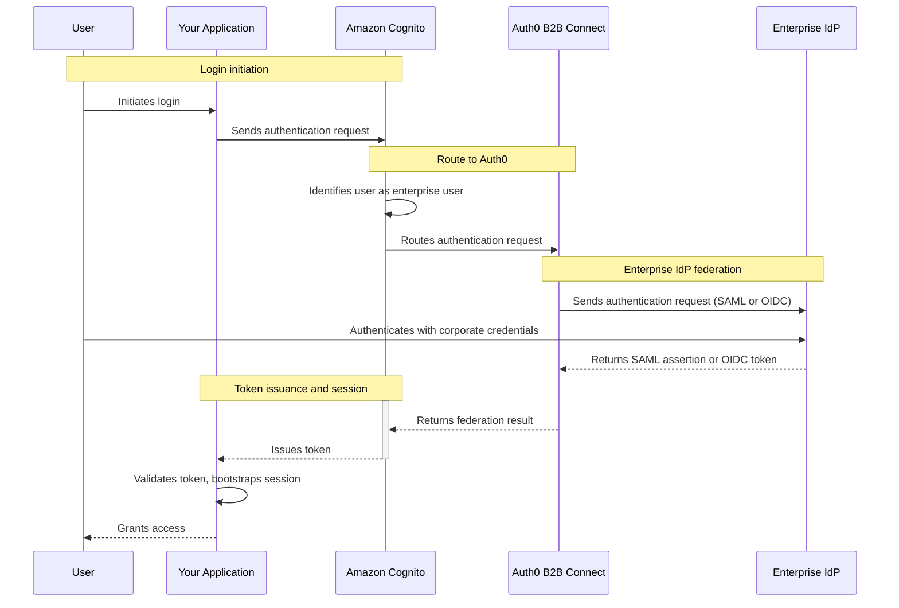

import { ReleaseStageNotice } from "/snippets/fr-ca/ReleaseStageNotice.jsx"

<ReleaseStageNotice feature="B2B Connect - Enterprise" stage="ea" contact="votre équipe technique de compte ou le soutien Auth0" terms="true" />

[Amazon Cognito](https://aws.amazon.com/cognito/) est un service de gestion des identités de calibre entreprise offert par Amazon Web Services (AWS) qui assure l&#39;authentification, l&#39;autorisation et la fédération des utilisateurs pour les applications Web et mobiles. Configurez Amazon Cognito pour qu&#39;il se fédère à Auth0 B2B Connect comme <Tooltip tip="OpenID : norme ouverte d'authentification qui permet aux applications de vérifier l'identité des utilisateurs sans recueillir ni stocker leurs renseignements de connexion." cta="Consulter le glossaire" href="/docs/fr-ca/glossary?term=OpenID">OpenID Connect (OIDC)</Tooltip> ou <Tooltip tip="Security Assertion Markup Language (SAML) : protocole normalisé permettant à deux parties d'échanger des renseignements d'authentification sans mot de passe." cta="Consulter le glossaire" href="/docs/fr-ca/glossary?term=SAML">SAML 2.0</Tooltip> <Tooltip tip="Fournisseur d'identité (IdP) : service qui stocke et gère les identités numériques." cta="Consulter le glossaire" href="/docs/fr-ca/glossary?term=identity+provider">fournisseur d&#39;identité</Tooltip> afin d&#39;ajouter l&#39;<Tooltip tip="Authentification unique (SSO) : service qui, après la connexion d'un utilisateur à une application, le connecte automatiquement aux autres applications." cta="Consulter le glossaire" href="/docs/fr-ca/glossary?term=SSO">authentification unique d&#39;entreprise (SSO)</Tooltip> à votre Cognito User Pool existant.

## Le fonctionnement de l&#39;authentification {#how-authentication-works}



1. L&#39;utilisateur amorce la connexion dans votre application.
2. L&#39;application envoie une demande d&#39;authentification à Amazon Cognito.
3. Amazon Cognito reconnaît qu&#39;il s&#39;agit d&#39;un utilisateur d&#39;entreprise et achemine la demande vers Auth0 B2B Connect.
4. Auth0 B2B Connect envoie une demande d&#39;authentification au fournisseur d&#39;identité d&#39;entreprise de l&#39;utilisateur (par exemple, Okta ou Microsoft Entra ID) au moyen de SAML ou d&#39;OpenID Connect (OIDC).
5. L&#39;utilisateur s&#39;authentifie auprès du fournisseur d&#39;identité d&#39;entreprise avec ses informations d&#39;identification d&#39;entreprise.
6. Le fournisseur d&#39;identité d&#39;entreprise renvoie une assertion SAML ou un jeton OIDC à Auth0 B2B Connect.
7. Auth0 B2B Connect effectue la découverte de domaine et transmet le résultat de la fédération à Amazon Cognito.
8. Amazon Cognito émet un jeton à l&#39;application.
9. L&#39;application valide le jeton, initialise sa session et accorde l&#39;accès à l&#39;utilisateur.

## Informations requises {#prerequisites}

* Un locataire Auth0 avec [B2B Connect - Enterprise](/docs/fr-ca/get-started/b2b-connect-enterprise) activé
* Une [Auth0 Organization](/docs/fr-ca/manage-users/organizations) dont la découverte de domaine est activée vers une [connexion d’entreprise](/docs/fr-ca/authenticate/enterprise-connections) (par exemple, Okta). Pour en savoir plus, lisez [Créer des domaines d’Organization](/docs/fr-ca/manage-users/organizations/configure-organizations/create-org-domains).
* Un compte AWS avec un Amazon Cognito User Pool actif
* Un client d’application Cognito configuré avec un Cognito Domain actif

## Configurer Auth0 B2B Connect {#configure-auth0-b2b-connect}

Pour créer une nouvelle intégration B2B Connect :

1. Accédez à [**Auth0 Dashboard &gt; Applications &gt; B2B Connect**](https://manage.auth0.com/dashboard/#/b2b-integrations) et sélectionnez **+Créer une intégration** pour lancer l&#39;assistant B2B Connect.
2. Saisissez un **Nom d&#39;intégration** (par exemple, « AWS Cognito »).
3. Sous **Type d&#39;intégration**, sélectionnez **Serveur d&#39;autorisation géré par un tiers**.
4. Sélectionnez **Continuer**.
5. Sous **Protocole d&#39;authentification**, indiquez de quelle façon votre serveur d&#39;authentification prend en charge la fédération : OIDC ou SAML.
6. Sélectionnez **Continuer**.

<Frame></Frame>

## Sélectionner et configurer le protocole d’authentification {#select-and-configure-the-authentication-protocol}

Dans l’assistant, vous avez le choix entre OIDC et SAML. Sélectionnez votre protocole d’authentification, puis suivez les étapes de configuration.

<Tabs>
  <Tab title="OIDC">
    1. Saisissez l’**URL de rappel de l’application** de votre groupe d’utilisateurs Cognito :
       ```text
       https://YOUR_AWS_COGNITO_DOMAIN/oauth2/idpresponse
       ```
    2. Sélectionnez **Continue**.
    3. À l’écran de confirmation, sélectionnez **Done** pour terminer l’assistant.

### Copier les informations d’identification depuis l’onglet Settings {#copy-credentials-from-the-settings-tab}

    Une fois l’assistant de configuration terminé, sélectionnez l’intégration que vous venez de créer et copiez les valeurs de l’onglet Settings nécessaires à votre configuration AWS. Vous devez copier :

    * Client ID
    * Client Secret
    * Issuer URL

    <Frame></Frame>
  </Tab>

  <Tab title="SAML">
    1. Saisissez l’**URL de rappel de l’application** de votre groupe d’utilisateurs Cognito :
       ```text
       https://YOUR_AWS_COGNITO_DOMAIN/saml2/idpresponse
       ```
    2. Sélectionnez **Continue**.
    3. À l’écran de confirmation, sélectionnez **Done** pour terminer l’assistant.

### Télécharger les métadonnées de l’IdP {#download-idp-metadata}

    Une fois l’assistant de configuration terminé, allez à l’onglet **Settings** de la page de l’intégration. Sous **Authentication**, téléchargez le fichier **IdP Metadata**. Vous le téléverserez vers AWS Cognito à la section suivante.
  </Tab>
</Tabs>

## Configurer AWS Cognito {#configure-aws-cognito}

### Ajouter un fournisseur d&#39;identité externe {#add-an-external-identity-provider}

Dans la [console AWS Cognito](https://console.aws.amazon.com/cognito/), sélectionnez votre groupe d&#39;utilisateurs. Allez à **Authentication** dans le panneau de navigation de gauche, puis sélectionnez **Social and external providers**. Sélectionnez ensuite **Add identity provider**.

<Tabs>
  <Tab title="OIDC">
    1. Pour **Identity provider**, sélectionnez **OpenID Connect (OIDC)**.
    2. Dans **Provider name**, indiquez l&#39;étiquette que les utilisateurs finaux verront à l&#39;écran de connexion (par exemple, « Auth0 »).
    3. Saisissez le Client ID figurant dans l&#39;onglet B2B Connect Settings.
    4. Saisissez le Client secret figurant dans l&#39;onglet B2B Connect Settings.
    5. Mettez à jour les **Authorized scopes** selon les exigences de votre application (par exemple, `openid profile email`).
    6. Pour activer la redirection automatique vers Auth0 pour les utilisateurs d&#39;entreprise, saisissez leurs domaines de courriel sous **Identifiers** (par exemple, `acme.com`).
    7. Saisissez l&#39;Issuer URL figurant dans l&#39;onglet B2B Connect Settings dans le champ **Issuer URL**.
    8. Sélectionnez **Add identity provider**.
  </Tab>

  <Tab title="SAML">
    1. Pour **Identity provider**, sélectionnez **SAML**.
    2. Dans **Provider name**, indiquez l&#39;étiquette que les utilisateurs verront à l&#39;écran de connexion (par exemple, « Auth0 »).
    3. Pour activer la redirection automatique vers Auth0 pour les utilisateurs d&#39;entreprise, saisissez leurs domaines de courriel sous **Identifiers** (par exemple, `acme.com`).
    4. Sous **Metadata document source**, téléversez le fichier IdP Metadata que vous avez téléchargé depuis l&#39;onglet B2B Connect Settings.
    5. Sélectionnez **Add identity provider**.
  </Tab>
</Tabs>

### Configurer le mappage des attributs (recommandé) {#configure-attribute-mapping-recommended}

Le mappage des attributs relie les attributs d&#39;identité des utilisateurs provenant d&#39;Auth0 aux enregistrements d&#39;utilisateurs locaux de votre Cognito User Pool. Ainsi, les adresses de courriel et les noms sont provisionnés automatiquement.

1. Sous **Attribute mapping**, sélectionnez **Edit**, puis associez les attributs d&#39;utilisateur requis par votre application :

   * OIDC : associez `username` à `sub` et `email` à `email`
   * SAML : associez `email` à `http://schemas.xmlsoap.org/ws/2005/05/identity/claims/emailaddress`

2. Sélectionnez **Save changes**.

### Permettre aux utilisateurs de se connecter avec le fournisseur d&#39;identité {#allow-users-to-sign-in-with-the-identity-provider}

1. Dans la console AWS Cognito, sélectionnez votre groupe d&#39;utilisateurs, rendez-vous à **Applications** dans le menu de gauche, sélectionnez **App clients**, puis choisissez votre application.
2. Sélectionnez l&#39;onglet **Login pages**, puis cliquez sur **Edit**.
3. Sous **Identity providers**, sélectionnez votre fournisseur d&#39;identité (par exemple, « Auth0 ») dans la liste déroulante.
4. Cliquez sur **Save changes**.

### Vérifier le fournisseur d&#39;identité {#verify-the-identity-provider}

1. Ouvrez la page de connexion de votre application et vérifiez qu&#39;un bouton **Continue with Auth0** s&#39;affiche et vous redirige bien vers Auth0.
2. À l&#39;écran de connexion Auth0, saisissez votre adresse courriel. La découverte de domaine Auth0 se déclenche et vous redirige vers votre IdP en amont pour terminer l&#39;authentification.

## Redirection silencieuse OIDC (optionnelle) {#oidc-silent-redirection-optional}

Pour contourner les pages de connexion d&#39;AWS Cognito et d&#39;Auth0 et acheminer silencieusement les utilisateurs vers l&#39;IdP de leur entreprise, configurez votre application afin qu&#39;elle transmette `login_hint` et `idp_identifier` dans la requête d&#39;autorisation.

1. Modifiez votre application pour y ajouter un champ de saisie d&#39;adresse de courriel. À la soumission du formulaire, extrayez le courriel et transmettez `login_hint` ainsi que `idp_identifier` dans la requête d&#39;autorisation envoyée à AWS Cognito :

   ```js lines
   const params = new URLSearchParams({
     response_type: 'code',
     client_id: 'YOUR_COGNITO_APP_CLIENT_ID',
     redirect_uri: 'YOUR_REDIRECT_URI',
     scope: 'openid profile email',
     identity_provider: 'Auth0',
     login_hint: userEmail,
     idp_identifier: userEmail.split('@')[1],
   });

   window.location.href =
     `https://YOUR_AWS_COGNITO_DOMAIN/oauth2/authorize?${params}`;
   ```

2. Dès lors, votre application transmet `login_hint` et `idp_identifier` à AWS Cognito, qui effectue une redirection silencieuse à travers AWS Cognito et Auth0, pour aboutir directement sur l&#39;IdP d&#39;entreprise en amont.