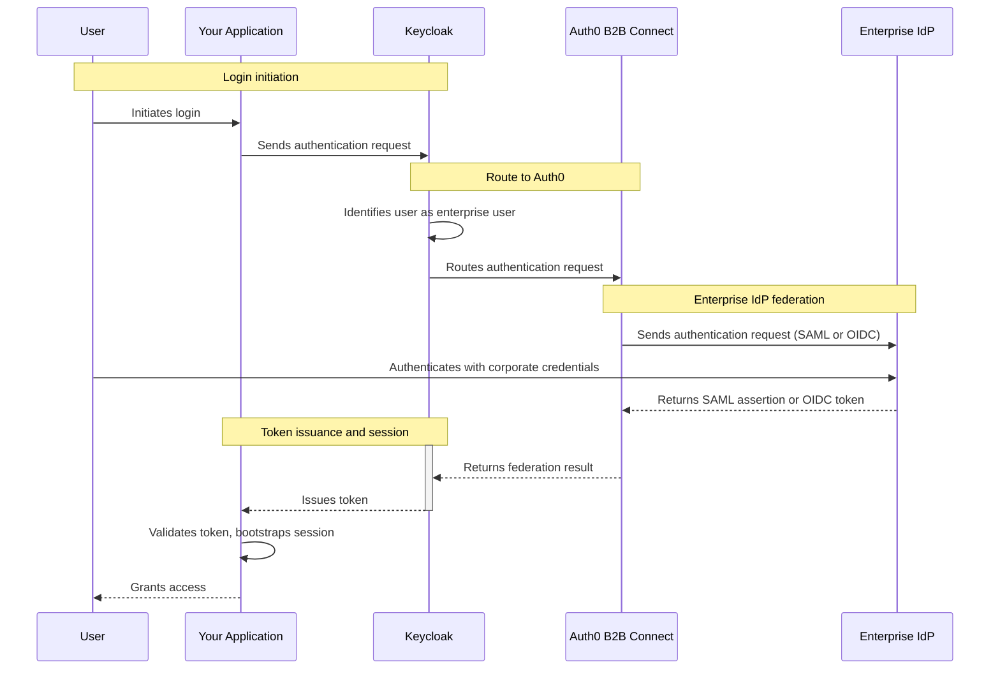

import { ReleaseStageNotice } from "/snippets/fr-ca/ReleaseStageNotice.jsx"

<ReleaseStageNotice feature="B2B Connect - Enterprise" stage="ea" contact="votre équipe technique de compte ou le soutien Auth0" terms="true" />

[Keycloak](https://keycloak.org) est une plateforme à code source ouvert de gestion des identités et des accès qui assure l&#39;authentification, l&#39;autorisation et la fédération des utilisateurs pour les applications. Configurez Keycloak pour le fédérer à Auth0 B2B Connect à titre de <Tooltip tip="OpenID : norme ouverte d'authentification qui permet aux applications de vérifier l'identité des utilisateurs sans recueillir ni stocker les renseignements de connexion." cta="Consulter le glossaire" href="/docs/fr-ca/glossary?term=OpenID">OpenID Connect (OIDC)</Tooltip> ou <Tooltip tip="Security Assertion Markup Language (SAML) : protocole normalisé permettant à deux parties d'échanger des renseignements d'authentification sans mot de passe." cta="Consulter le glossaire" href="/docs/fr-ca/glossary?term=SAML">SAML</Tooltip> <Tooltip tip="Fournisseur d'identité (IdP) : service qui stocke et gère les identités numériques." cta="Consulter le glossaire" href="/docs/fr-ca/glossary?term=identity+provider">fournisseur d&#39;identité</Tooltip> afin d&#39;ajouter l&#39;<Tooltip tip="Authentification unique (SSO) : service qui, une fois l'utilisateur connecté à une application, le connecte automatiquement aux autres applications." cta="Consulter le glossaire" href="/docs/fr-ca/glossary?term=SSO">authentification unique d&#39;entreprise (SSO)</Tooltip> à votre pile d&#39;authentification Keycloak existante.

## Fonctionnement de l&#39;authentification {#how-authentication-works}



1. L&#39;utilisateur amorce la connexion dans votre application.
2. L&#39;application envoie une demande d&#39;authentification à Keycloak.
3. Keycloak reconnaît l&#39;utilisateur comme un utilisateur d&#39;entreprise et achemine la demande vers Auth0 B2B Connect.
4. Auth0 B2B Connect envoie une demande d&#39;authentification au fournisseur d&#39;identité d&#39;entreprise de l&#39;utilisateur (par exemple, Okta ou Microsoft Entra ID) au moyen de SAML ou d&#39;OpenID Connect (OIDC).
5. L&#39;utilisateur s&#39;authentifie auprès du fournisseur d&#39;identité d&#39;entreprise à l&#39;aide de ses informations d&#39;identification d&#39;entreprise.
6. Le fournisseur d&#39;identité d&#39;entreprise renvoie une assertion SAML ou un jeton OIDC à Auth0 B2B Connect.
7. Auth0 B2B Connect effectue la découverte de domaine et transmet le résultat de la fédération à Keycloak.
8. Keycloak émet un jeton à l&#39;application.
9. L&#39;application valide le jeton, amorce sa session et accorde l&#39;accès à l&#39;utilisateur.

## Informations requises {#prerequisites}

* Un locataire Auth0 avec [B2B Connect - Enterprise](/docs/fr-ca/get-started/b2b-connect-enterprise) activé
* Une [Auth0 Organization](/docs/fr-ca/manage-users/organizations) dont la découverte de domaine est activée vers une [connexion d’entreprise](/docs/fr-ca/authenticate/enterprise-connections) (par exemple, Okta). Pour en savoir plus, consultez [Créer des domaines d’Organization](/docs/fr-ca/manage-users/organizations/configure-organizations/create-org-domains).
* Un serveur Keycloak [avec accès administrateur](https://www.keycloak.org/docs/latest/server_admin/index.html#using-the-admin-console)
* Un domaine configuré dans Keycloak pour votre application
* Des [mappeurs de fournisseur d&#39;identité](https://www.keycloak.org/docs/latest/server_admin/#_mappers) configurés selon les besoins de votre application

## Configurer Auth0 B2B Connect {#configure-auth0-b2b-connect}

Pour créer une nouvelle intégration B2B Connect :

1. Accédez à [**Auth0 Dashboard &gt; Applications &gt; B2B Connect**](https://manage.auth0.com/dashboard/#/b2b-integrations), puis sélectionnez **+Create Integration** pour lancer l&#39;assistant B2B Connect.
2. Saisissez un **Integration Name** (par exemple, « Keycloak Production »).
3. Sous **Integration Type**, sélectionnez **Third-party Managed Authorization Server**.
4. Sélectionnez **Save And Continue**.

<Frame></Frame>

### Sélectionner et configurer le protocole d&#39;authentification {#select-and-configure-the-authentication-protocol}

Dans l&#39;assistant, vous avez le choix entre OIDC et SAML. Sélectionnez votre protocole d&#39;authentification, puis suivez les étapes de configuration.

<Tabs>
  <Tab title="OIDC">
    1. Saisissez l&#39;**URL de rappel de l&#39;application**. Il s&#39;agit du terminal de votre courtier Keycloak, selon le format suivant :

       ```text
       https://YOUR_KEYCLOAK_DOMAIN/realms/YOUR_REALM_NAME/broker/YOUR_ALIAS/endpoint
       ```

       <Callout icon="file-lines" color="#0EA5E9" iconType="regular">
         Remplacez `YOUR_ALIAS` par l&#39;alias du fournisseur d&#39;identité que vous souhaitez utiliser dans Keycloak (par exemple, « oidc »).
       </Callout>

    2. Sélectionnez **Save And Continue**.

    3. À l&#39;écran de confirmation, sélectionnez **Done** pour terminer l&#39;assistant.

### Copier les informations d&#39;identification depuis l&#39;onglet Settings {#copy-credentials-from-the-settings-tab}

    Une fois l&#39;assistant de configuration terminé, allez à l&#39;onglet **Settings** de la page d&#39;intégration. Copiez les valeurs suivantes, qui vous serviront lors de la configuration de Keycloak :

    * Client ID
    * Client Secret
    * URL d’émetteur
  </Tab>

  <Tab title="SAML">
    1. Saisissez l&#39;**URL de rappel de l&#39;application**. Il s&#39;agit du terminal de votre courtier Keycloak, selon le format suivant :

       ```text
       https://YOUR_KEYCLOAK_DOMAIN/realms/YOUR_REALM_NAME/broker/YOUR_ALIAS/endpoint
       ```

       <Callout icon="file-lines" color="#0EA5E9" iconType="regular">
         Remplacez `YOUR_ALIAS` par l&#39;alias du fournisseur d&#39;identité que vous souhaitez utiliser dans Keycloak (par exemple, « saml »).
       </Callout>

    2. Sélectionnez **Save And Continue**.

    3. À l&#39;écran de confirmation, sélectionnez **Done** pour terminer l&#39;assistant.

### Télécharger les métadonnées de l&#39;IdP {#download-idp-metadata}

    Une fois l&#39;assistant de configuration terminé, allez à l&#39;onglet **Settings** de la page d&#39;intégration. Sous **Authentication**, téléchargez le fichier **IdP Metadata**. Vous le téléverserez dans Keycloak à la section suivante.
  </Tab>
</Tabs>

## Configurer Keycloak {#configure-keycloak}

### Ajouter un fournisseur d&#39;identité {#add-an-identity-provider}

Dans la console d&#39;administration Keycloak, sélectionnez votre domaine (realm), puis rendez-vous à **Identity providers** dans la barre latérale de gauche.

Sous **User-defined**, sélectionnez :

* OpenID Connect v1.0
* SAML v2.0

<Tabs>
  <Tab title="OIDC">
    1. Attribuez à **Alias** la valeur que vous avez utilisée dans l&#39;**URL de rappel de l&#39;application** dans Auth0 (par exemple, « oidc »). Le **Redirect URI** en haut du formulaire est généré automatiquement à partir de cet alias.
    2. Définissez un **Display name** (par exemple, « Se connecter avec l&#39;authentification unique »).
    3. Dans le champ **Discovery endpoint**, entrez votre **URL d&#39;émetteur** tirée de l&#39;onglet Paramètres de B2B Connect, suivie de `.well-known/openid-configuration` (par exemple, `https://YOUR_TENANT.auth0.com/.well-known/openid-configuration`).
    4. Entrez le Client ID tiré de l&#39;onglet Paramètres de B2B Connect.
    5. Entrez le Client Secret tiré de l&#39;onglet Paramètres de B2B Connect.
    6. Laissez Client authentication à sa valeur par défaut. Le Client Secret est envoyé dans le corps de la requête.
    7. Sélectionnez **Add**.
    8. Dans la page des paramètres du fournisseur, faites défiler jusqu&#39;à **OpenID Connect settings**, puis déployez la section **Advanced**.
    9. Activez **Pass login&#95;hint**.
  </Tab>

  <Tab title="SAML">
    1. Attribuez à **Alias** la valeur que vous avez utilisée dans l&#39;**URL de rappel de l&#39;application** dans Auth0 (par exemple, « saml »). Le **Redirect URI** en haut du formulaire est généré automatiquement à partir de cet alias.
    2. Définissez un **Display name** (par exemple, « Se connecter avec l&#39;authentification unique »).
    3. Laissez **Service provider entity ID** à sa valeur par défaut (l&#39;URL de votre domaine).
    4. Désactivez **Use entity descriptor**.
    5. Sous **Import config from file**, téléversez le fichier XML de métadonnées de l&#39;IdP que vous avez téléchargé depuis l&#39;onglet Paramètres de B2B Connect. Keycloak remplira automatiquement les champs **Identity provider entity ID**, **Single Sign-On service URL** et **Validating X509 certificates**.
    6. Sélectionnez **Add**.
  </Tab>
</Tabs>

### Configurer la découverte du domaine d&#39;origine (Home Realm Discovery) {#set-up-home-realm-discovery}

Auth0 recommande de configurer la [découverte du domaine d&#39;origine (HRD)](/docs/fr-ca/authenticate/login/auth0-universal-login/identifier-first) au moyen des [Keycloak Organizations](https://www.keycloak.org/docs/latest/server_admin/#_managing_organizations) afin d&#39;acheminer automatiquement les utilisateurs d&#39;entreprise vers Auth0 en fonction de leur domaine de courriel.

#### Exemple d&#39;acheminement des utilisateurs avec la HRD {#route-users-with-hrd-example}

Pour acheminer vers Auth0 B2B Connect tous les utilisateurs dont le courriel se termine par `@acme.com` :

1. Allez à **Configure &gt; Realm settings** et activez le bouton bascule **Organizations**.
2. Sélectionnez **Save**.
3. Dans la barre latérale de gauche, allez à **Organizations** et sélectionnez **Create organization**.
4. Saisissez un **Name** (par exemple, « AcmeCorp »), réglez le **Domain** à `acme.com`, puis sélectionnez **Save**.
5. Allez à l&#39;onglet **Identity providers** et sélectionnez **Link identity provider**.
6. Sélectionnez le fournisseur d&#39;identité Auth0 dans la liste déroulante.
7. Sous **Domain**, sélectionnez le domaine que vous avez ajouté (par exemple, `acme.com`).
8. Activez **Redirect when email domain matches**.
9. Sélectionnez **Save**.

Lorsqu&#39;un utilisateur ayant un courriel `@acme.com` se connecte, Keycloak le redirige automatiquement vers Auth0 B2B Connect pour l&#39;authentification.

### Vérifier le fournisseur d&#39;identité {#verify-the-identity-provider}

1. Ouvrez la page de connexion de votre application.
2. Vérifiez que le bouton du fournisseur d&#39;identité s&#39;affiche avec le nom d&#39;affichage que vous avez configuré.
3. Sélectionnez-le et confirmez que vous êtes bien redirigé vers la page de connexion de votre fournisseur d&#39;identité.