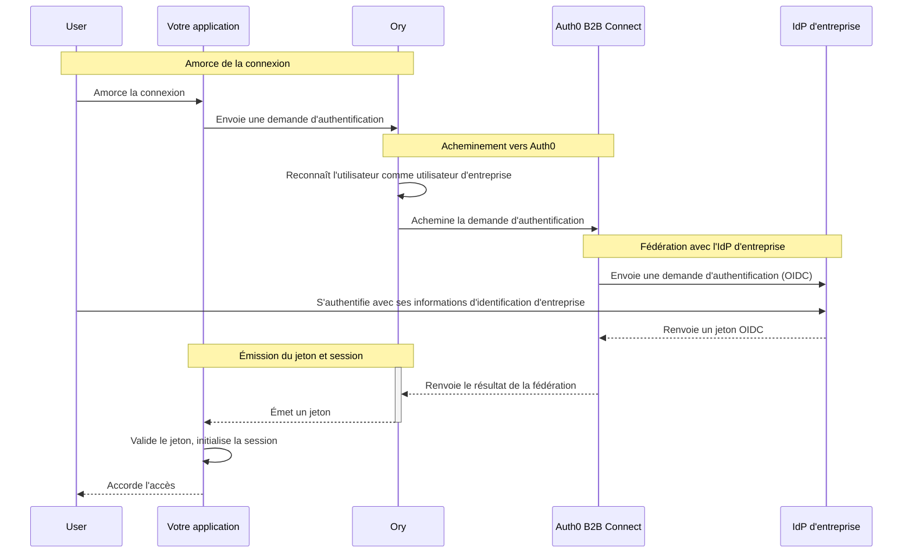

import { ReleaseStageNotice } from "/snippets/fr-ca/ReleaseStageNotice.jsx"

<ReleaseStageNotice feature="B2B Connect - Enterprise" stage="ea" contact="your Technical Account Team or Auth0 Support" terms="true" />

[Ory](https://www.ory.sh) est une plateforme d&#39;identité à code source ouvert de calibre entreprise qui offre l&#39;authentification, l&#39;autorisation et la fédération d&#39;utilisateurs axées sur les API pour les applications modernes. Configurez Ory pour qu&#39;il se fédère à Auth0 B2B Connect en tant que <Tooltip tip="OpenID : norme ouverte d'authentification qui permet aux applications de vérifier l'identité des utilisateurs sans collecter ni stocker les renseignements de connexion." cta="Consulter le glossaire" href="/docs/fr-ca/glossary?term=OpenID">OpenID Connect (OIDC)</Tooltip> <Tooltip tip="Fournisseur d'identité (IdP) : service qui stocke et gère les identités numériques." cta="Consulter le glossaire" href="/docs/fr-ca/glossary?term=identity+provider">fournisseur d&#39;identité</Tooltip> afin d&#39;ajouter l&#39;<Tooltip tip="Authentification unique (SSO) : service qui, une fois qu'un utilisateur s'est connecté à une application, le connecte automatiquement aux autres applications." cta="Consulter le glossaire" href="/docs/fr-ca/glossary?term=SSO">authentification unique (SSO) d&#39;entreprise</Tooltip> à votre pile d&#39;authentification Ory existante.

## Le fonctionnement de l&#39;authentification {#how-authentication-works}



1. L&#39;utilisateur amorce la connexion dans votre application.
2. L&#39;application envoie une demande d&#39;authentification à Ory.
3. Ory reconnaît qu&#39;il s&#39;agit d&#39;un utilisateur d&#39;entreprise et achemine la demande vers Auth0 B2B Connect.
4. Auth0 B2B Connect envoie une demande d&#39;authentification au fournisseur d&#39;identité d&#39;entreprise de l&#39;utilisateur (par exemple, Okta ou Microsoft Entra ID) au moyen d&#39;OpenID Connect (OIDC).
5. L&#39;utilisateur s&#39;authentifie auprès du fournisseur d&#39;identité d&#39;entreprise avec ses informations d&#39;identification d&#39;entreprise.
6. Le fournisseur d&#39;identité d&#39;entreprise renvoie un jeton OIDC à Auth0 B2B Connect.
7. Auth0 B2B Connect effectue la découverte de domaine et renvoie le résultat de la fédération à Ory.
8. Ory émet un jeton à l&#39;application.
9. L&#39;application valide le jeton, amorce sa session et accorde l&#39;accès à l&#39;utilisateur.

## Informations requises {#prerequisites}

Pour utiliser Auth0 B2B Connect Enterprise avec Ory, vous devez :

* Disposer d&#39;un locataire Auth0 où [B2B Connect - Enterprise](/docs/fr-ca/get-started/b2b-connect-enterprise) est activé
* Créer une [Organization Auth0](/docs/fr-ca/manage-users/organizations) dont la découverte de domaine pointe vers une [connexion d&#39;entreprise](/docs/fr-ca/authenticate/enterprise-connections) (par exemple, Okta). Pour en savoir plus, consultez [Créer des domaines d&#39;Organization](/docs/fr-ca/manage-users/organizations/configure-organizations/create-org-domains).
* Pouvoir accéder à votre projet Ory Network Developer Tier depuis la console Ory Network
* Disposer d&#39;une application Ory OAuth 2.0 existante

<Callout icon="file-lines" color="#0EA5E9" iconType="regular">
  La découverte de domaine d&#39;entreprise (HRD) requiert obligatoirement les Organizations Ory B2B. Le routage automatisé natif des domaines repose sur la liaison des domaines de courriel vérifiés et des fournisseurs d&#39;identité en amont (SAML ou OIDC) directement à une Organization, ce qui permet à Ory de rediriger les utilisateurs en arrière-plan vers leur SSO d&#39;entreprise pendant un [flux de connexion Identifier-First](/docs/fr-ca/authenticate/login/auth0-universal-login/identifier-first).
</Callout>

## Configurer Auth0 B2B Connect {#configure-auth0-b2b-connect}

Pour créer une nouvelle intégration B2B Connect :

1. Accédez à [**Auth0 Dashboard &gt; Applications &gt; B2B Connect**](https://manage.auth0.com/dashboard/#/b2b-integrations) et sélectionnez **+Create Integration** pour lancer l&#39;assistant B2B Connect.
2. Saisissez un **Integration Name** (par exemple, « Ory »).
3. Sous **Integration Type**, sélectionnez **Third-party Managed Authorization Server**.
4. Sélectionnez **Continue**.

<Frame></Frame>

5. Sous **Authentication Protocol**, sélectionnez **OIDC** (OpenID Connect).

6. Sélectionnez **Continue**.

7. Saisissez l&#39;**Application Callback URL**. Il s&#39;agit de l&#39;URI de redirection de votre fournisseur d&#39;authentification OIDC Ory, selon le format suivant :

   ```text lines
   https://YOUR_ORY_DOMAIN/self-service/methods/oidc/callback/YOUR_PROVIDER_ID
   ```

   A. Remplacez `YOUR_PROVIDER_ID` par l&#39;alias du fournisseur d&#39;identité que vous trouverez dans votre console Ory. Si vous n&#39;avez pas encore cette valeur, vous pourrez mettre à jour l&#39;**Application Callback URL** plus tard dans l&#39;onglet **Settings** de B2B Connect, à l&#39;adresse :

   ```text lines
   https://YOUR_AUTH_DOMAIN/dashboard/YOUR_REGION/YOUR_TENANT_NAME/b2b-integrations/YOUR_B2B_CONNECT_CLIENT_ID/settings
   ```

8. Sélectionnez **Continue**.

9. À l&#39;écran de confirmation, sélectionnez **Done** pour terminer l&#39;assistant.

### Copier les informations d&#39;identification depuis l&#39;onglet Settings {#copy-credentials-from-the-settings-tab}

Une fois l&#39;assistant de configuration terminé, vous devez sélectionner l&#39;intégration que vous venez de créer et copier certaines valeurs de l&#39;onglet **Settings** pour votre configuration Ory. Vous devez copier :

* Client ID
* Client Secret
* URL de l&#39;émetteur

<Frame></Frame>

## Configurer Ory {#configure-ory}

Utilisez la console Ory pour configurer Auth0 B2B Connect en tant que fournisseur OIDC de connexion sociale pour votre projet Ory Developer Tier.

### Ajouter et configurer un fournisseur d&#39;identité {#add-and-configure-an-identity-provider}

Pour ajouter Auth0 comme IdP, suivez les instructions dans votre console Ory :

1. Sélectionnez votre espace de travail.
2. Allez dans **Authentication**, puis sélectionnez **Social Sign-In (OIDC)**.
3. Sélectionnez **Add new OpenID Connect provider**.

<Callout icon="file-lines" color="#0EA5E9" iconType="regular">
  Ajoutez la **Redirect URI** affichée dans le Auth0 Dashboard à votre application Auth0 B2B Connect, sous **Allowed Callback URLs**, dans l&#39;onglet **Settings** de l&#39;étape 7.
</Callout>

4. Donnez au **Label** le nom qui sera affiché aux utilisateurs à l&#39;écran de connexion.
5. Saisissez le **Client ID** figurant dans l&#39;onglet Settings de B2B Connect.
6. Saisissez le **Client Secret** figurant dans l&#39;onglet Settings de B2B Connect.
7. Saisissez l&#39;**Issuer URL** figurant dans l&#39;onglet Settings de B2B Connect dans le champ **Tenant URL**.
8. Sélectionnez **Save**.

### Vérifier le fournisseur d&#39;identité {#verify-the-identity-provider}

1. À l&#39;aide d&#39;une application intégrée à votre client OAuth 2 Ory existant, amorcez un flux de connexion et vérifiez que le bouton **Sign in with Auth0** s&#39;affiche et vous redirige bien vers Auth0.

2. À l&#39;écran de connexion d&#39;Auth0, saisissez votre adresse courriel. La découverte de domaine d&#39;Auth0 se déclenche et vous redirige vers votre IdP en amont (par exemple, Okta) pour terminer l&#39;authentification.