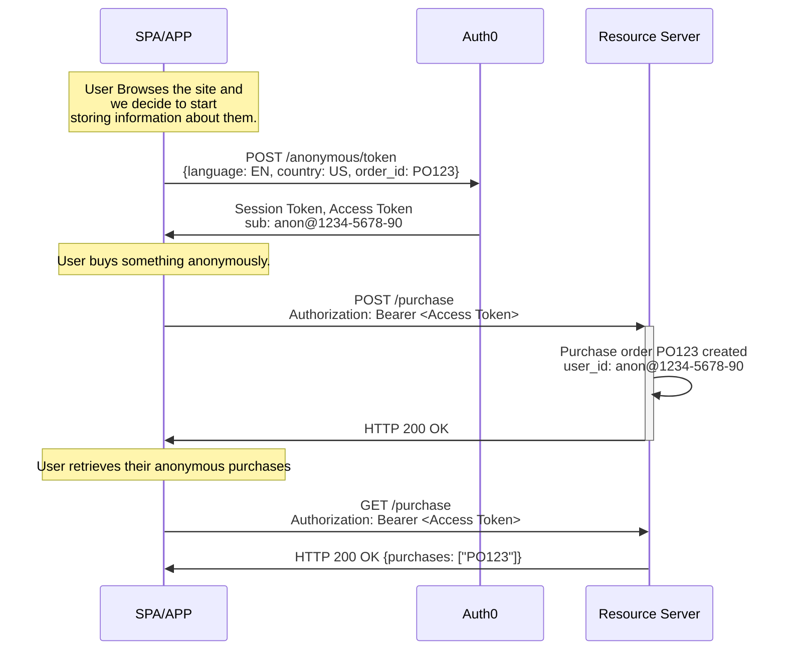
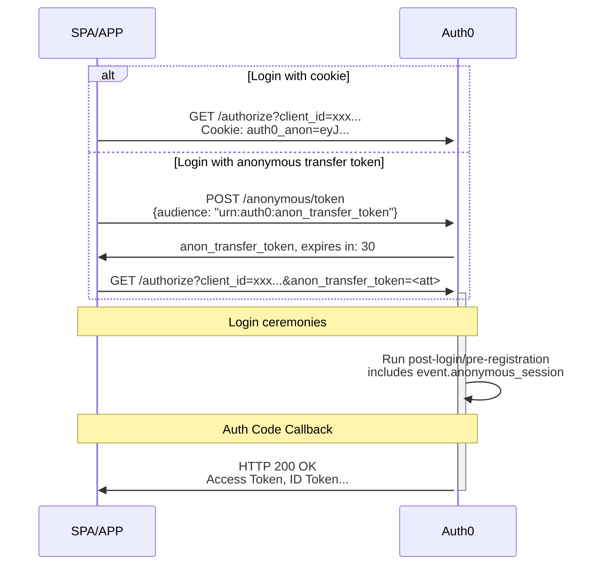

import { ReleaseStageNotice } from "/snippets/fr-ca/ReleaseStageNotice.jsx"

<ReleaseStageNotice feature="Anonymous Sessions" stage="ea" plans="Enterprise" contact="your Account Executive" />

Les sessions anonymes vous permettent de créer et de gérer des [sessions utilisateur](/docs/fr-ca/manage-users/sessions) sans exiger d’authentification.

Les utilisateurs peuvent parcourir le site, ajouter des articles à leur panier ou à leurs listes de souhaits, effectuer des achats et définir des préférences avant de créer un compte. Ils peuvent ensuite transférer leur activité vers leur profil authentifié lorsqu’ils s’inscrivent ou se connectent.

Les sessions anonymes font partie de la [suite de conversion d’identité Auth0](/docs/fr-ca/customize/identity-conversion-suite).

Utilisez les sessions anonymes dans les cas d’utilisation suivants :

* **Suivre les utilisateurs invités** d’un chargement de page à l’autre et d’une session à l’autre
* **Stocker des métadonnées** telles que des références de panier, des préférences, des consentements et des renseignements de profilage
* **Émettre des jetons d’accès** pour les appels d’API sans exiger d’authentification
* **Transférer l’activité anonyme** vers des comptes authentifiés lorsque les utilisateurs s’inscrivent ou se connectent

<Warning>
  Les métadonnées des sessions anonymes Auth0 ne constituent pas un stockage de données sécurisé et ne doivent pas servir à stocker des renseignements sensibles.
  Cela comprend les secrets et les renseignements personnels identifiables (PII) à haut risque, comme les numéros d’assurance sociale et de carte de crédit.

  De plus, l’exactitude ou la véracité des données stockées dans une session anonyme n’est pas vérifiée; elles ne doivent donc jamais être considérées comme fiables.

  Auth0 recommande fortement à ses clients d’évaluer les données stockées dans les métadonnées et de ne stocker que celles nécessaires au balisage des sessions et à la gestion des accès.
  Pour en savoir plus, consultez [la conformité d’Auth0 au Règlement général sur la protection des données](/docs/fr-ca/secure/data-privacy-and-compliance/gdpr).
</Warning>

## Recueillir des données sur les sessions anonymes {#gather-anonymous-sessions-data}

Lorsque vous commencez à recueillir des renseignements sur un utilisateur, même s’il ne s’est pas encore authentifié, votre application envoie une requête `POST` au terminal `/anonymous/token`.

Auth0 renvoie deux jetons :

* Un [**jeton de session**](/docs/fr-ca/secure/tokens/session-tokens) qui identifie et enregistre la session anonyme.
* Un [**jeton d’accès**](/docs/fr-ca/secure/tokens/access-tokens) que l’utilisateur peut présenter à vos [serveurs de ressources (API)](/docs/fr-ca/get-started/apis).

Les requêtes ultérieures qui comprennent le jeton de session poursuivent la même session pour le même `user_id`, ce qui permet de retracer toute l’activité jusqu’à une même origine.
À l’aide du jeton d’accès, les utilisateurs anonymes peuvent appeler n’importe laquelle de vos API existantes.



```json Anonymous session data of user anon@1234-5678-90
{
  "user_id": "anon@1234-5678-90",
  "session_id": "sess_456",
  "metadata": {
    "language": "EN",
    "country": "US",
    "purchase": "P0123"
  }
}
```

## Transférer les données de session anonyme vers les métadonnées de l&#39;utilisateur {#transfer-anonymous-session-data-to-the-users-metadata}

Il existe différents mécanismes pour convertir une session anonyme en utilisateur authentifié, selon le flux utilisé et selon l&#39;emplacement de votre application sur le plan des domaines et des FQDN. Dans les flux de redirection (code d&#39;autorisation, code d&#39;autorisation avec PKCE), utilisez soit un témoin, soit un billet de transfert.

### Transférer une session au moyen d’un témoin {#transfer-a-session-through-a-cookie}

Lorsqu’un utilisateur disposant d’une session anonyme décide de se connecter ou de s’inscrire, votre application transmet le `anonymous_session_token` au terminal `/authorize` au moyen d’un témoin. Ce mécanisme fonctionne lorsque votre application et le serveur d’autorisation se trouvent dans le même domaine, par exemple lorsque votre application se trouve à `application.mydomain.com` et que le domaine personnalisé du serveur d’autorisation est `auth.mydomain.com`. Dans ce cas, le témoin est considéré comme appartenant au même domaine et est transmis automatiquement au serveur d’autorisation, de sorte que la connexion fonctionne comme d’habitude :

```javascript cookie example
// Aucun code supplémentaire n’est nécessaire, le cookie est envoyé automatiquement
await auth0.loginWithRedirect();
```

### Transférer une session au moyen d’un billet de transfert {#transfer-a-session-through-a-transfer-ticket}

Dans les scénarios où les témoins devraient circuler entre domaines, plusieurs mécanismes du navigateur empêcheront l’envoi du témoin de session anonyme sur le réseau. Même avec une configuration CORS adéquate sur le serveur et le client, des mécanismes avancés comme la protection intelligente contre le suivi (ITP) d’Apple peuvent bloquer ou supprimer le témoin, ce qui donne lieu à des utilisateurs non appariés.

Pour contourner ce problème, utilisez un mécanisme de transfert de session anonyme en deux étapes qui ne repose pas sur les témoins :

1. Appelez le terminal `/anonymous/token` en demandant le public `urn:auth0:anon_transfer_token` afin de recevoir en échange un `anon_transfer_token`.
2. Incluez le `anon_transfer_token` comme paramètre dans l’appel `/authorize`.

Le `anon_transfer_token` est lié à l’adresse IP qui l’a demandé. Si vous prévoyez utiliser ce mécanisme sans témoins pour la connexion, Auth0 recommande de désactiver l’émission de témoins de session anonyme dans vos [paramètres de locataire](/docs/fr-ca/manage-users/sessions/anonymous-sessions/configure-anonymous-sessions#configure-anonymous-sessions) afin d’éviter des conflits ou des injections indésirables.



Une fois la connexion réussie, Auth0 met les données de session anonyme à votre disposition dans les déclencheurs Actions [`pre-user-registration`](/docs/fr-ca/customize/actions/explore-triggers/signup-and-login-triggers/pre-user-registration-trigger) et [`post-login`](/docs/fr-ca/customize/actions/explore-triggers/signup-and-login-triggers/login-trigger) à l’aide de l’objet `event.anonymous_session`.

```json anonymous session object
{
  "anonymous_session": {
    "user_id": "anon@1234-5678-90",
    "session_id": "sess_123",
    "created_at": "2026-05-14T10:30:00Z",
    "metadata": {
      "language": "en",
      "country": "US",
      "order_id": "PO123"
    }
  }
}
```

### Transférer une session dans un scénario Resource Owner Password Grant (ROPG) {#transfer-a-session-in-a-resource-owner-password-grant-ropg-scenario}

Lorsque vous utilisez ROPG pour la connexion, incluez le `anonymous_session_token` dans le corps de la requête de l’appel `/oauth/token` :

```http Anonymous session token in a ROPG request
POST /oauth/token HTTP/1.1

username=YOUR_USERNAME&
password=YOUR_PASSWORD&
client_id=YOUR_CLIENT_ID&
scope=YOUR_SCOPES&
grant_type=http://auth0.com/oauth/grant-type/password-realm&
client_secret=YOUR_CLIENT_SECRET&
realm=YOUR_REALM&
audience=YOUR_AUDIENCE&
anonymous_session_token=ANONYMOUS_SESSION_eyJ...
```

Pour en savoir plus sur les sessions anonymes avec Actions, consultez les [cas d’utilisation des sessions anonymes](/docs/fr-ca/manage-users/sessions/anonymous-sessions/anonymous-sessions-use-cases).

## Mettre fin à la session anonyme après le transfert {#end-the-anonymous-session-after-transfer}

Les témoins de session anonyme ne sont pas automatiquement supprimés lorsqu’un utilisateur s’authentifie; le témoin peut donc continuer d’être envoyé lors des connexions subséquentes. Pour mettre fin à la session, utilisez le terminal `/anonymous/logout` :

```javascript wrap lines
// Dans votre application, après une connexion réussie
if (wasAnonymousSession) {
  await fetch('https://YOUR_DOMAIN/anonymous/logout', {
    method: 'POST',
    headers: { 'Content-Type': 'application/json' },
    credentials: 'include', // Envoyer les cookies
    body: JSON.stringify({ client_id: 'YOUR_CLIENT_ID' }),
  });
}
```

Auth0 n’offre pas d’invalidation côté serveur pour les sessions anonymes. La déconnexion d’une session ne fait que supprimer le témoin de session anonyme. Si le navigateur ou l’application conserve le jeton après la suppression du témoin, ce jeton peut toujours être utilisé normalement.

Si vous souhaitez un meilleur contrôle sur les sessions anonymes, vous pouvez [configurer votre locataire pour qu’il n’émette aucun témoin pour les sessions anonymes](/docs/fr-ca/manage-users/sessions/anonymous-sessions/configure-anonymous-sessions#configure-anonymous-sessions).

## Bonnes pratiques {#best-practices}

Voici quelques bonnes pratiques pour les sessions anonymes :

* Configurez des [durées de vie appropriées pour les sessions anonymes](/docs/fr-ca/manage-users/sessions/anonymous-sessions/configure-anonymous-sessions#configure-anonymous-sessions) afin d’éviter de perdre les données de session anonyme d’un utilisateur. Auth0 recommande une durée de vie d’au moins 30 jours.

* Limitez les actions que les utilisateurs anonymes `anon@` peuvent effectuer dans votre API.

* Validez les jetons et assainissez les métadonnées. Ne faites jamais confiance aux métadonnées ou aux jetons provenant des clients sans validation côté serveur.

* Mettez en cache les [jetons d’accès](/docs/fr-ca/secure/tokens/access-tokens), car ils peuvent être réutilisés jusqu’à leur expiration.

## Limites {#limitations}

* Les flux de [réinitialisation du mot de passe](/docs/fr-ca/customize/actions/explore-triggers/password-reset-triggers#password-reset-triggers) ne sont pas pris en charge pour les sessions anonymes.
* Le [Device Code](/docs/fr-ca/get-started/authentication-and-authorization-flow/device-authorization-flow) n’est pas pris en charge, car la requête d’authentification et la connexion proprement dite ont lieu sur des appareils différents.
* L’[authentification CIBA (Client-Initiated Backchannel Authentication)](/docs/fr-ca/get-started/applications/configure-client-initiated-backchannel-authentication) n’est pas prise en charge, car la requête d’authentification et la confirmation ont lieu sur des appareils différents.
* L’[échange de jeton personnalisé](/docs/fr-ca/authenticate/custom-token-exchange/cte-example-use-cases) n’est pas pris en charge en raison de la nature des transactions (par exemple, l’usurpation d’identité), qui risque d’attribuer des données anonymes au mauvais utilisateur.
* L’[échange de jeton d’actualisation](/docs/fr-ca/secure/call-apis-on-users-behalf/token-vault/configure-token-vault#configure-token-exchange) n’est pas pris en charge pour les sessions anonymes, car l’utilisateur est déjà connecté s’il possède un jeton d’actualisation.