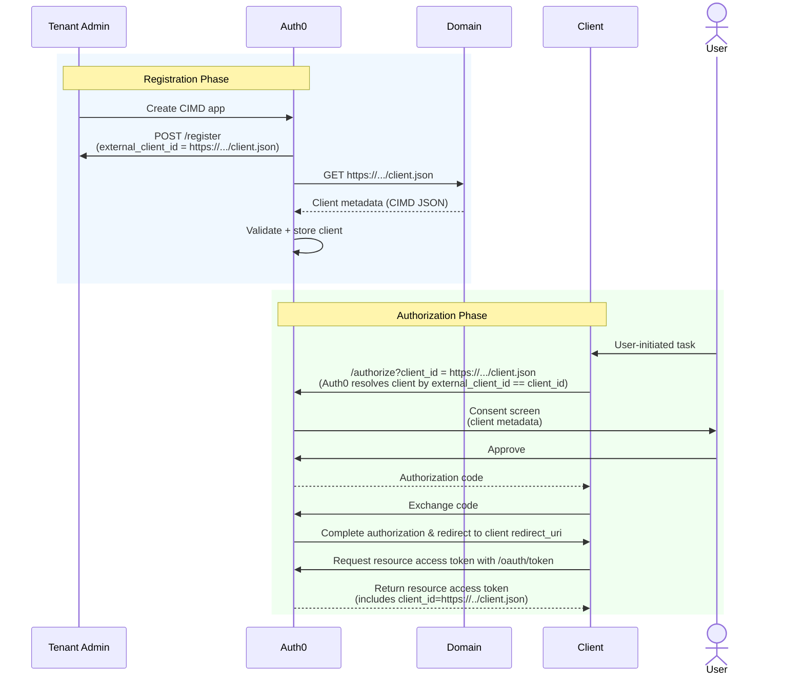
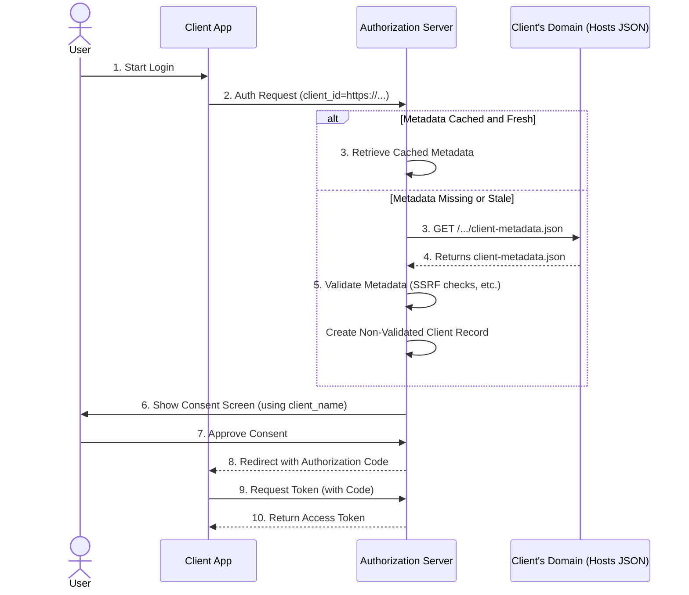

import { ReleaseStageNotice } from "/snippets/ReleaseStageNotice.jsx"

<ReleaseStageNotice
    feature="Dynamic CIMD Registration"
    stage="ea"
    contact="Auth0 Support"
    terms="true"
/>

Register an application in Auth0 by importing an externally hosted Client ID Metadata Document (CIMD) from a URL. A CIMD is a JSON file containing client metadata hosted on your domain (e.g., `https://example-client.com/mcp-metadata.json`). The CIMD URL is the application's client ID and proves domain ownership, ensuring only trusted applications can be registered in Auth0. While Auth0 maintains a record of these settings, the hosted CIMD remains the source of truth.

Auth0 supports manual CIMD and dynamic CIMD registration:
- Manual CIMD registration: Manually import an application from its CIMD URL. Auth0 fetches and validates the CIMD to register the application as a CIMD client; metadata updates are synchronized through manual refreshes.
- Dynamic CIMD registration: The application registers itself via its CIMD URL at runtime when it sends an OAuth request to Auth0; metadata updates are synchronized reactively on-demand for authorization requests and proactively in the background for frequently-used clients.

Only [third-party applications](/docs/get-started/applications/third-party-applications) can be registered with CIMD, which are subject to [enhanced security controls](/docs/get-started/applications/third-party-applications/security-controls). Once registered, [set up your CIMD client](/docs/get-started/auth0-overview/create-applications/register-applications-with-cimd#set-up-cimd-client) as a third-party application in Auth0.

For dynamically registered CIMD clients, tenant administrators can use [Application Profiles](/docs/get-started/applications/application-profiles) to apply consistent application settings around refresh token lifetimes and Organizations behavior.

<Callout icon="file-lines" color="#0EA5E9" iconType="regular">
CIMD clients always register with `third_party_security_mode: "strict"`, regardless of your tenant's **Create Permissive Third-Party Clients by Default** setting. Permissive mode is not available for CIMD clients. Strict third-party applications [do not support Rules](/docs/get-started/applications/third-party-applications/security-controls#features-not-supported), and login flows for CIMD clients fail if your tenant has active Rules. If you use Rules, [migrate to Actions](/docs/customize/actions/migrate/migrate-from-rules-to-actions) before registering CIMD clients.
</Callout>

<Callout icon="file-lines" color="#0EA5E9" iconType="regular">
You cannot switch a CIMD client from manual or dynamic once registered. To do so, delete and re-register the client.
</Callout>

## Key benefits

Manual and dynamic CIMD registration have the following benefits:

1. MCP clients only need to be registered with CIMD once per deployment. All instances of that deployment use the same registration credentials.
2. Uses asymmetric cryptography (public/private keys) instead of shared symmetric secrets that can be leaked.
3. Application owners manage client metadata directly in the CIMD; Auth0 automatically maps these properties to its internal configuration during registration.
4. The CIMD URL acts as a human-readable identifier in audit logs, making it easy to verify the origin of requests from specific MCP tool servers or hosts.

<Callout icon="file-lines" color="#0EA5E9" iconType="regular">
Rate limits for CIMD clients will be introduced in a future release. You will be able to set a specific rate limit for a CIMD client, as well as a shared rate limit on the aggregated traffic from all CIMD clients in a tenant.
</Callout>

## Use cases

Common use cases for manual and dynamic CIMD registration include:

- MCP clients: Only need to be registered with CIMD once per deployment. All instances of that deployment use the same registration credentials. To learn how Auth0 secures MCP clients and servers, read [Auth for MCP](https://auth0.com/ai/docs/mcp/intro/overview).
- Third-party integrations: Partner applications, SaaS platforms, and external services that authenticate users on behalf of organizations. These applications manage their own client metadata and cryptographic keys, enabling independent updates and key rotation without sharing secrets.

## Example CIMD

The following is an example CIMD for a public MCP client, where `"token_endpoint_auth_method": "none"`:

```json https://example-client.com/mcp-metadata.json wrap lines
{
  "client_id": "https://example-client.com/mcp-metadata.json",
  "client_name": "Example MCP Tool Server",
  "description": "MCP server providing tools for data analysis",
  "logo_uri": "https://example-client.com/logo.png",
  "application_type": "web",
  "grant_types": ["authorization_code", "refresh_token"],
  "redirect_uris": [
    "https://example-client.com/callback"
  ],
  "token_endpoint_auth_method": "none",
  "response_types": ["code"]
}
```

Auth0 automatically [maps and validates CIMD fields](/docs/get-started/auth0-overview/create-applications/cimd-validation-rules#cimd-json-validation-rules). To learn more about supported client types, read [Prerequisites](/docs/get-started/auth0-overview/create-applications/register-applications-with-cimd#prerequisites).

## Manual vs. dynamic CIMD registration

The following table compares manual CIMD registration and dynamic CIMD registration:

| Feature | Manual CIMD Registration | Dynamic CIMD Registration |
|---------|--------------------------|----------------------------|
| **Client ID** | HTTPS URL (e.g., `https://yourdomain.com/client.json`) | HTTPS URL (e.g., `https://yourdomain.com/client.json`) |
| **Authentication** | Asymmetric keys only (no secrets) | Asymmetric keys only (no secrets) |
| **Identity verification** | Domain ownership via HTTPS hosting | Domain ownership via HTTPS hosting |
| **Registration trigger** | Tenant admin imports the application from its CIMD URL | Application registers itself at runtime on its first OAuth request |
| **Metadata management** | Source of truth is CIMD; refreshed manually | Source of truth is CIMD; refreshed automatically (reactively and in the background) |
| **Admin review of metadata changes** | Admin reviews and approves changes before they apply | No admin review; validated changes apply automatically |
| **Key rotation** | Multiple keys supported in `jwks_uri`; refreshed manually | Multiple keys supported in `jwks_uri`; resolved automatically on demand |
| **Application type** | Third-party applications only | Third-party applications only |
| **Best for** | MCP clients, third-party integrations | High-volume or ephemeral clients, such as AI agents, that register without manual provisioning |


## How it works

Learn about how manual and dynamic CIMD work in Auth0:

<Tabs><Tab title="Manual CIMD registration">
The following diagram shows the end-to-end manual CIMD registration flow:

- [Phase 1: Registration](#phase-1-registration)
- [Phase 2: Authorization](#phase-2-authorization)



### Phase 1: Registration

During manual CIMD registration, a tenant admin registers the application by importing its externally hosted CIMD to Auth0:

1. **Application creation**: The tenant admin creates a CIMD app in Auth0 by:
   - Selecting **Import from URL** in the Auth0 Dashboard
   - Making a POST request to the `/register` endpoint, providing the `external_client_id`
2. **Metadata fetch**: Auth0 makes a GET request to the client's domain to retrieve the CIMD (client.json).
3. **Security validation**: Auth0 maps and validates the CIMD URL against the [CIMD URL validation rules](/docs/get-started/auth0-overview/create-applications/cimd-validation-rules#cimd-url-validation-rules) and the CIMD against the [CIMD validation rules](/docs/get-started/auth0-overview/create-applications/cimd-validation-rules#cimd-json-validation-rules), verifying that the `external_client_id` matches the CIMD URL, among other checks.
4. **Persistence**: Once validated, Auth0 stores the client metadata in the database.
5. **Confirmation**: Auth0 returns a success response; the application has been successfully registered as a CIMD client in Auth0.

### Phase 2: Authorization

Once registered, the application uses its CIMD URL as its identity during the OAuth flow.

1. **User-initiated task**: The user initiates a task that requires the application to access an API.
2. **Authorization request**: The application makes a request to the Auth0 Authorization Server, passing its CIMD URL as the `client_id`.
3. **Client resolution**: The Auth0 Authorization Server queries the database to resolve the provided URL (`client_id`) to the stored client configuration (`external_client_id`).
4. **User consent**: Auth0 displays a consent screen to the user, identifying the application by the `client_name` retrieved from the CIMD metadata.
5. **Redirection**: After the user approves consent, Auth0 redirects the user back to the application with an authorization code.
6. **Code exchange**: The application exchanges the authorization code for an access token at the token endpoint.
7. **Authorization complete**: The Auth0 Authorization Server returns an access token where the `client_id` is set to the CIMD URL. The application can now access the API on the user's behalf.

</Tab><Tab title="Dynamic CIMD registration">

The following diagram shows the end-to-end dynamic CIMD registration flow:



During dynamic CIMD registration, the application registers itself with Auth0 at runtime, without a prior manual registration step:

1. **Start login**: The user initiates a login from the client application.
2. **Authorization request**: The application sends an authorization request to the Auth0 Authorization Server, passing its CIMD URL as the `client_id`.
3. **Metadata resolution**: If Auth0 already has fresh, cached metadata for the client, it uses the cached copy and skips the next steps. Otherwise, Auth0 sends a `GET` request to the client's domain to retrieve the CIMD (`client-metadata.json`).
4. **Metadata returned**: The client's domain returns the CIMD.
5. **Security validation**: Auth0 validates the CIMD against the [CIMD URL validation rules](/docs/get-started/auth0-overview/create-applications/cimd-validation-rules#cimd-url-validation-rules) and [CIMD JSON validation rules](/docs/get-started/auth0-overview/create-applications/cimd-validation-rules#cimd-json-validation-rules), including SSRF checks, and registers the application as a non-validated CIMD client.
6. **User consent**: Auth0 displays a consent screen to the user, identifying the application by the `client_name` retrieved from the CIMD metadata.
7. **Approve consent**: The user approves the consent request.
8. **Redirection**: Auth0 redirects the user back to the application with an authorization code.
9. **Token request**: The application exchanges the authorization code for an access token at the token endpoint.
10. **Access token returned**: The Auth0 Authorization Server returns an access token to the application. The application can now access the API on the user's behalf.

Auth0-registered dynamic CIMD clients that never complete an authorization flow are temporarily held and automatically removed; a client is only persisted once a user successfully completes authorization.

</Tab></Tabs>

## Get started
