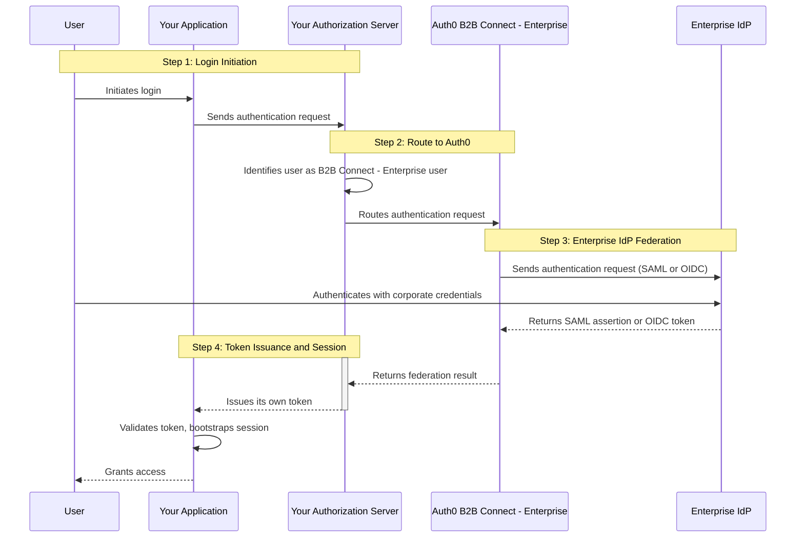

---
description:
title: B2B Connect — Enterprise
---

import { ReleaseStageNotice } from "/snippets/ReleaseStageNotice.jsx"

<ReleaseStageNotice
    feature="B2B Connect — Enterprise"
    stage="ea"
    contact="Auth0 Support"
    contact="Technical Account Team"
    terms="true"
/>

Auth0 B2B Connect - Enterprise is an enterprise-ready modular integration layer that adds Auth0's B2B enterprise features (such as <Tooltip tip="Single Sign-On (SSO): Service that, after a user logs into one application, automatically logs that user in to other applications." cta="View Glossary" href="/docs/glossary?term=SSO">Single Sign-On (SSO)</Tooltip>, user provisioning using System for Cross-domain Identity Management (SCIM), and Universal Logout) to your existing authentication stack. With B2B Connect - Enterprise, you can add Auth0 B2B services on your existing authorization server and maintain control of token issuance, session management, and login while offering your B2B customers the option of using their enterprise identity provider (IdP) for user authentication.

## Benefits of B2B Connect — Enterprise

Why use B2B Connect - Enterprise? Whenever you set out to build products for B2B customers, you could build complex B2B identity tooling just to handle the foundational elements of onboarding and customer management.

This work typically falls to a platform identity team that balances competing priorities. The result is constant pressure to make trade-offs across three structurally critical pillars:

1. Maintain rigorous security and interoperability.
2. Deliver a flawless customer onboarding and lifecycle experience.
3. Unlock and enable innovation for your core product.

When you address these pillars, you typically have the option of two paths: migrate to a modern identity platform, or layer enterprise capabilities onto your existing stack. Migration is a proven path, but it carries significant lead time. For teams in need of enterprise features on a faster timeline, or for platforms in which full migration introduces unnecessary risk, B2B Connect - Enterprise offers a third way: Add enterprise-grade B2B capabilities without replacing your existing stack.

## Use cases

B2B Connect - Enterprise supports advanced B2B identity scenarios without the need for re-platforming, including the following use cases to:

* Add enterprise SSO to an existing authorization server
* Use self-service onboarding for your enterprise customers
* Preserve your existing login experience and token issuance
* Enrich application identity tokens with enterprise claims
* Route users to enterprise IdPs based on verified email domain
* Delegate identity administration to your B2B customers
* Support IPSIE-aligned session management and Universal Logout

## How it works

Auth0 B2B Connect - Enterprise sits between your application's authorization server and your customers' enterprise identity providers:



1. The user initiates login in your application.
2. Your application sends an authentication request to your authorization server using its existing flow.
3. Your authorization server identifies the user as a B2B Connect - Enterprise user and routes the request to Auth0.
4. Auth0 B2B Connect - Enterprise sends an authentication request to the user's enterprise IdP (such as Okta, Microsoft Entra ID, Google Workspace, or PingFederate) using SAML or OpenID Connect (OIDC).
5. The user authenticates with their corporate credentials at the enterprise IdP.
6. The enterprise IdP returns a SAML assertion or OIDC token to Auth0 B2B Connect - Enterprise.
7. Your authorization server returns its own token to your application.
8. Your application validates the token and bootstraps its own session.
9. The user is granted access to your application.

For the Application integration type, the app redirects directly to Auth0, removing the intermediate authorization server from the federation flow.

## Integrate B2B Connect - Enterprise

You can integrate B2B Connect - Enterprise with the Create B2B Connect Integration wizard in [Auth0 Dashboard](https://manage.auth0.com), which establishes the topology. Your choice at Step 1 (Name and Type) in the wizard determines your entire integration path. 

| Type | Integration | Redirect to Auth0 from | Auth0 SDK required | Protocol |
| --- | --- | --- | --- | --- |
| 1 | Custom authorization server | Auth server | Not required | OIDC or SAML |
| 2 | Third-party managed authorization server | Auth server | Not required | OIDC or SAML |
| 3 | Application (direct) | Application | Recommended | OIDC |

### Custom authorization server

Use this type when you have built your own authorization server and it can act as a relying party to Auth0 over OIDC or SAML. Enterprise users are redirected from your auth server to Auth0; non-enterprise users remain entirely on your auth server.

```
Application → Custom Auth Server → Auth0 B2B Connect → Enterprise → Enterprise IdP
                    ↑                         |
                    └─────── identity ────────┘
```
In the wizard, the steps are:

1. Name and Type: Name the integration, select **Custom Authorization Server**.
2. Authentication: Select **OIDC (recommended)** or **SAML**.
3. Configure Auth0 as IdP: Provide values from your auth server so Auth0 can act as its identity provider:
    * OIDC: Issuer URL (expand Show individual endpoints if your auth server does not support issuer discovery to get the Authorization URL, Token URL, Client ID, and Client Secret), and your Application Callback URL.
    * SAML:  Issuer, Identity Provider SHA1 Fingerprint, Identity Provider Login URL, Auth0 Certificate or IdP Metadata, and your Application Callback URL.
4. Integration created: Proceed to set up [Organizations](/docs/manage-users/organizations) and [Self-Service Enterprise Configuration (SSEC)](/docs/authenticate/enterprise-connections/self-service-enterprise-configuration) to onboard your first B2B customer.

### Third-party managed authorization server

Use this type when you are using a purchased or managed authorization server. The topology and wizard flow are identical to Type 1. Refer to your auth server provider's documentation for configuring Auth0 as an identity provider.

```
Application → Third-party Auth Server → Auth0 B2B Connect - Enterprise → Enterprise IdP
                    ↑                              |
                    └──────────identity ───────────┘
```

B2B Connect - Enterprise supports third-party managed authorization servers that supports federation over OIDC or SAML. Examples include:

* Amazon Cognito
* PingIdentity PingOne
* Ory
* Keycloak
* Transmit Security

In the wizard, the steps are:

1. Name and Type:  Name the integration, select **Third-party Managed Authorization Server**.
2. Authentication Protocol: Select OIDC (recommended) or SAML.
3. Configure Auth0 as IdP: Same OIDC or SAML field set as Type 1. Register Auth0 as the upstream identity provider in your managed auth server.
4. Integration created: Proceed to set up [Organizations](/docs/manage-users/organizations) and [SSEC](/docs/authenticate/enterprise-connections/self-service-enterprise-configuration).


### Application

Use this type when your application integrates with Auth0 directly, without a separate authorization server. The application embeds the Auth0 SDK and owns the session outright. This type is OIDC only and does not include a protocol selection step.

```
Application (embeds Auth0 SDK) → Auth0 B2B Connect - Enterprise → Enterprise IdP
         ↑                                    |
         └──────────── identity ──────────────┘
```

In the wizard, the steps are:

1. Name and Type: Name the integration, select **Application**.
2. Configure Integration: Enter your Allowed Callback URLs. Auth0 redirects users to these URLs after authentication. At least one URL is required.
3. Continue Setup: Integration created. Follow the Quickstart to add a Login with SSO button to your application and configure [Organizations](/docs/manage-users/organizations) and [SSEC](/docs/authenticate/enterprise-connections/self-service-enterprise-configuration).

## Configure lifecycle events

Use [Event Streams](/docs/customize/events) to configure real-time notifications for lifecycle events, so you can keep your downstream identity store in sync with changes in Auth0. You can subscribe to events for users, Organizations, and enterprise connections.

To configure lifecycle events:

1. In Auth0 Dashboard, navigate to **[Event Streams](https://manage.auth0.com/#/event-streams)**.
2. Select **+ Create Event Stream**.
3. Choose your destination: **Webhooks**, **AWS EventBridge**, or **[Auth0 Actions](/customize/actions)**.
4. Enter your configuration and choose the event categories you want to receive:
    * User events: `[user.created](/docs/events/user/user.created)`, `[user.deleted](/docs/events/user/user.deleted)`, `[user.updated](/docs/events/user/user.updated)`
    * Organization events: `[organization.created](/docs/events/organization/organization.created)`, `[organization.deleted](/docs/events/organization/organization.deleted)`, `organization.member.*`, `[organization.updated](/docs/events/organization/organization.updated)`
    * Connection events: `[connection.created](/docs/events/connection/connection.created)`, `[connection.deleted](/docs/events/connection/connection.deleted)`, `[connection.updated](/docs/events/connection/connection.updated)`
5. Select **Save**.

Auth0 delivers events to your Event Stream endpoint. Use these events to synchronize enterprise identity state between Auth0 and your authorization server without polling the Management API.

## Configure customer onboarding

Self-Service Enterprise Configuration (SSEC) gives your B2B customers a guided flow to configure their enterprise IdP and claims mappings without requiring direct support from your team.

To configure customer onboarding:

1. In Auth0 Dashboard, navigate to [B2B Connect](https://manage.auth0.com/#/b2b-integrations). Under the Organizations tab, select **+**.
2. Enter a name for your Self-Service Enterprise Configuration Profile.
3. Optional. Add a description.
4. Auth0 creates a [User Attribute Profile (UAP)](/docs/authenticate/enterprise-connections/user-attribute-profile) named after your SSEC Profile. Select **Continue**.
5. Choose how you want to generate SSEC tickets:
    * API Integration
    * Auth0 Dashboard
6. Select **Done**.

<Callout icon="file-lines" color="#0EA5E9" iconType="regular">
For information on the maximum number of SSEC profiles you can create per tenant, read [Self-Service Enterprise Configuration](https://auth0.com/docs/authenticate/enterprise-connections/self-service-enterprise-configuration#how-it-works).
</Callout>

## Create or configure an Auth0 Organization

Once you finish the customer onboarding setup, associate an Auth0 Organization with each self-service ticket request.

<Card title="Per application access">
B2B integrations automatically use per-application access for Auth0 Organizations. This means that when a user logs in, only enterprise connections that meet both of the following conditions are surfaced:

* The connection is enabled on the Organization.
* The Organization has been granted access to the B2B integration application.

</Card>

To ensure your B2B customers can authenticate, grant each Organization access to the B2B integration application in addition to enabling its enterprise connection.
