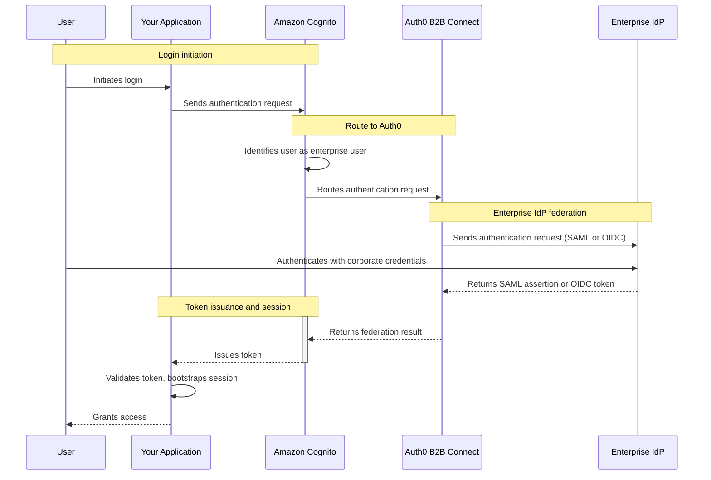

[Amazon Cognito](https://aws.amazon.com/cognito/) is an enterprise-grade identity management service from Amazon Web Services (AWS) that provides user authentication, authorization, and federation for web and mobile applications. Configure Amazon Cognito to federate to Auth0 B2B Connect as an <Tooltip tip="OpenID: Open standard for authentication that allows applications to verify users' identities without collecting and storing login information." cta="View Glossary" href="/docs/glossary?term=OpenID">OpenID Connect (OIDC)</Tooltip> or <Tooltip tip="Security Assertion Markup Language (SAML): Standardized protocol allowing two parties to exchange authentication information without a password." cta="View Glossary" href="/docs/glossary?term=SAML">SAML 2.0</Tooltip> <Tooltip tip="Identity Provider (IdP): Service that stores and manages digital identities." cta="View Glossary" href="/docs/glossary?term=identity+provider">identity provider</Tooltip> to add <Tooltip tip="Single Sign-On (SSO): Service that, after a user logs into one application, automatically logs that user in to other applications." cta="View Glossary" href="/docs/glossary?term=SSO">enterprise single sign-on (SSO)</Tooltip> to your existing Cognito User Pool.

## How authentication works



1. The user initiates login in your application.
2. The application sends an authentication request to Amazon Cognito.
3. Amazon Cognito identifies the user as an enterprise user and routes the request to Auth0 B2B Connect.
4. Auth0 B2B Connect sends an authentication request to the user's enterprise identity provider (for example, Okta or Microsoft Entra ID) using SAML or OpenID Connect (OIDC).
5. The user authenticates with their corporate credentials at the enterprise identity provider.
6. The enterprise identity provider returns a SAML assertion or OIDC token to Auth0 B2B Connect.
7. Auth0 B2B Connect performs domain discovery and returns the federation result to Amazon Cognito.
8. Amazon Cognito issues a token to the application.
9. The application validates the token, bootstraps its session, and grants the user access.

## Prerequisites

- An Auth0 tenant with [B2B Connect - Enterprise](/docs/get-started/b2b-connect-enterprise) enabled
- An [Auth0 Organization](/docs/manage-users/organizations) with domain discovery enabled to an [enterprise connection](/docs/authenticate/enterprise-connections) (for example, Okta). To learn more, read [Create Organization Domains](/docs/manage-users/organizations/configure-organizations/create-org-domains).
- An AWS account with an active Amazon Cognito User Pool
- A Cognito application client with an active Cognito Domain configured

## Configure Auth0 B2B Connect

To create a new B2B Connect integration:

1. Navigate to [**Auth0 Dashboard > Applications > B2B Connect**](https://manage.auth0.com/dashboard/#/b2b-integrations) and select **+Create Integration** to start the B2B Connect wizard.
2. Enter an **Integration Name** (for example, "AWS Cognito").
3. Under **Integration Type**, select **Third-party Managed Authorization Server**.
4. Select **Continue**.
5. Under **Authentication Protocol**, select how your auth server supports federation: OIDC or SAML.
6. Select **Continue**.

<Frame></Frame>

## Select and configure the authentication protocol

In the wizard, you have the option of OIDC or SAML. Select your authentication protocol and follow the configuration steps.

<Tabs>
<Tab title="OIDC">

1. Enter the **Application Callback URL** for your Cognito User Pool:
   ```text
   https://YOUR_AWS_COGNITO_DOMAIN/oauth2/idpresponse
   ```
2. Select **Continue**.
3. On the confirmation screen, select **Done** to finish the wizard.

### Copy credentials from the Settings tab

After the setup wizard completes, you need to select the integration you just created and copy values from the Settings tab for your AWS configuration. You need to copy the:

- Client ID
- Client Secret
- Issuer URL

<Frame></Frame>

</Tab>
<Tab title="SAML">

1. Enter the **Application Callback URL** for your Cognito User Pool:
   ```text
   https://YOUR_AWS_COGNITO_DOMAIN/saml2/idpresponse
   ```
2. Select **Continue**.
3. On the confirmation screen, select **Done** to finish the wizard.

### Download IdP metadata

After the setup wizard completes, navigate to the **Settings** tab on the integration page. Under **Authentication**, download the **IdP Metadata** file. You will upload this to AWS Cognito in the next section.

</Tab>
</Tabs>

## Configure AWS Cognito

### Add an external identity provider

In the [AWS Cognito Console](https://console.aws.amazon.com/cognito/), select your user pool. Navigate to **Authentication** in the left navigation panel and select **Social and external providers**. Then select **Add identity provider**.

<Tabs>
<Tab title="OIDC">

1. For **Identity provider**, select **OpenID Connect (OIDC)**.
2. Set the **Provider name** to the label end users see on the login screen (for example, "Auth0").
3. Enter the Client ID from the B2B Connect Settings tab.
4. Enter the Client secret from the B2B Connect Settings tab.
5. Update **Authorized scopes** based on your application's requirements (for example, `openid profile email`).
6. To enable automatic redirection to Auth0 for enterprise users, enter their email domains under **Identifiers** (for example, `acme.com`).
7. Enter the Issuer URL from the B2B Connect Settings tab into the **Issuer URL** field.
8. Select **Add identity provider**.

</Tab>
<Tab title="SAML">

1. For **Identity provider**, select **SAML**.
2. Set the **Provider name** to the label users see on the login screen (for example, "Auth0").
3. To enable automatic redirection to Auth0 for enterprise users, enter their email domains under **Identifiers** (for example, `acme.com`).
4. Under **Metadata document source**, upload the IdP Metadata file you downloaded from the B2B Connect Settings tab.
5. Select **Add identity provider**.

</Tab>
</Tabs>

### Configure attribute mapping (recommended)

Attribute mapping links user identity attributes from Auth0 to local user records in your Cognito User Pool. This ensures that email addresses and names are automatically provisioned.

1. Under **Attribute mapping**, select **Edit** and map the user attributes required by your application:

   - OIDC: Map `username` to `sub` and `email` to `email`
   - SAML: Map `email` to `http://schemas.xmlsoap.org/ws/2005/05/identity/claims/emailaddress`

2. Select **Save changes**.

### Allow users to sign in with the identity provider

1. In the AWS Cognito Console, select your user pool, navigate to **Applications** in the left navigation, select **App clients**, and select your application.
2. Select the **Login pages** tab and select **Edit**.
3. Under **Identity providers**, select your identity provider (for example, "Auth0") from the dropdown.
4. Select **Save changes**.

### Verify the identity provider

1. Open your application's login page and verify that a **Continue with Auth0** button appears and successfully redirects you to Auth0.
2. On the Auth0 login screen, enter your email address. Auth0 domain discovery triggers and redirects you to your upstream IdP to complete authentication.

## OIDC silent redirection (optional)

To skip both the AWS Cognito and Auth0 login pages and route users silently to their enterprise IdP, configure your application to pass `login_hint` and `idp_identifier` in the authorization request.

1. Update your application to include an email address input field. On form submission, extract the email and pass both `login_hint` and `idp_identifier` in the authorize request to AWS Cognito:

   ```js lines
   const params = new URLSearchParams({
     response_type: 'code',
     client_id: 'YOUR_COGNITO_APP_CLIENT_ID',
     redirect_uri: 'YOUR_REDIRECT_URI',
     scope: 'openid profile email',
     identity_provider: 'Auth0',
     login_hint: userEmail,
     idp_identifier: userEmail.split('@')[1],
   });

   window.location.href =
     `https://YOUR_AWS_COGNITO_DOMAIN/oauth2/authorize?${params}`;
   ```

2. With this in place, your application passes `login_hint` and `idp_identifier` to AWS Cognito, which silently redirects through AWS Cognito and Auth0, landing directly on the upstream enterprise IdP.
