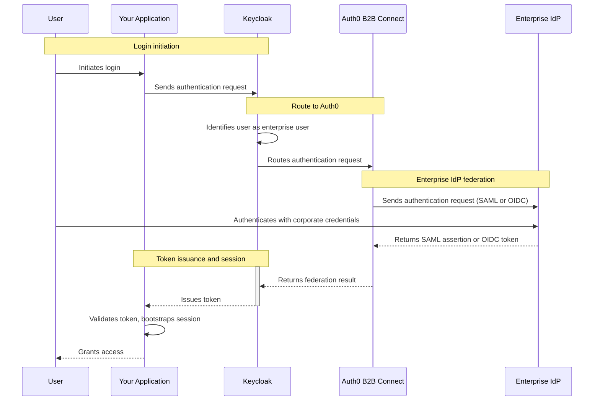

[Keycloak](https://keycloak.org) is an open-source identity and access management platform that provides authentication, authorization, and user federation for applications. Configure Keycloak to federate to Auth0 B2B Connect as an <Tooltip tip="OpenID: Open standard for authentication that allows applications to verify users' identities without collecting and storing login information." cta="View Glossary" href="/docs/glossary?term=OpenID">OpenID Connect (OIDC)</Tooltip> or <Tooltip tip="Security Assertion Markup Language (SAML): Standardized protocol allowing two parties to exchange authentication information without a password." cta="View Glossary" href="/docs/glossary?term=SAML">SAML</Tooltip> <Tooltip tip="Identity Provider (IdP): Service that stores and manages digital identities." cta="View Glossary" href="/docs/glossary?term=identity+provider">identity provider</Tooltip> to add <Tooltip tip="Single Sign-On (SSO): Service that, after a user logs into one application, automatically logs that user in to other applications." cta="View Glossary" href="/docs/glossary?term=SSO">enterprise single sign-on (SSO)</Tooltip> to your existing Keycloak authentication stack.

## How authentication works



1. The user initiates login in your application.
2. The application sends an authentication request to Keycloak.
3. Keycloak identifies the user as an enterprise user and routes the request to Auth0 B2B Connect.
4. Auth0 B2B Connect sends an authentication request to the user's enterprise identity provider (for example, Okta or Microsoft Entra ID) using SAML or OpenID Connect (OIDC).
5. The user authenticates with their corporate credentials at the enterprise identity provider.
6. The enterprise identity provider returns a SAML assertion or OIDC token to Auth0 B2B Connect.
7. Auth0 B2B Connect performs domain discovery and returns the federation result to Keycloak.
8. Keycloak issues a token to the application.
9. The application validates the token, bootstraps its session, and grants the user access.

## Prerequisites

- An Auth0 tenant with [B2B Connect - Enterprise](/docs/get-started/b2b-connect-enterprise) enabled
- An [Auth0 Organization](/docs/manage-users/organizations) with domain discovery enabled to an [enterprise connection](/docs/authenticate/enterprise-connections) (for example, Okta). To learn more, read [Create Organization Domains](/docs/manage-users/organizations/configure-organizations/create-org-domains).
- Keycloak server with administrator access
- A realm configured in Keycloak for your application
- [Identity provider mappers](https://www.keycloak.org/docs/latest/server_admin/#_mappers) configured as required for your application

## Configure Auth0 B2B Connect

To create a new B2B Connect integration:

1. Navigate to [**Auth0 Dashboard > Applications > B2B Connect**](https://manage.auth0.com/dashboard/#/b2b-integrations) and select **+Create Integration** to start the B2B Connect wizard. 
2. Enter an **Integration Name** (for example, "Keycloak Production").
3. Under **Integration Type**, select **Third-party Managed Authorization Server**.
4. Select **Save And Continue**.

<Frame></Frame>

### Select and configure the authentication protocol

In the wizard, you have the option of OIDC or SAML. Select your authenication protocol and follow the configuration steps.

<Tabs>
<Tab title="OIDC">

1. Enter the **Application Callback URL**. This is your Keycloak broker endpoint, following this format:

   ```text
   https://YOUR_KEYCLOAK_DOMAIN/realms/YOUR_REALM_NAME/broker/YOUR_ALIAS/endpoint
   ```
    <Callout icon="file-lines" color="#0EA5E9" iconType="regular">
    Replace `YOUR_ALIAS` with the identity provider alias you want to use in Keycloak (for example, "oidc").
    </Callout>

2. Select **Save And Continue**.
3. On the confirmation screen, select **Done** to finish the wizard.

### Copy credentials from the Settings tab

After the setup wizard completes, navigate to the **Settings** tab on the integration page. Copy the following values for use during your Keycloak setup:

- Client ID
- Client Secret
- Issuer URL

</Tab>
<Tab title="SAML">

1. Enter the **Application Callback URL**. This is your Keycloak broker endpoint, following this format:

   ```text
   https://YOUR_KEYCLOAK_DOMAIN/realms/YOUR_REALM_NAME/broker/YOUR_ALIAS/endpoint
   ```
   <Callout icon="file-lines" color="#0EA5E9" iconType="regular">
   Replace `YOUR_ALIAS` with the identity provider alias you want to use in Keycloak (for example, "saml").
   </Callout>

2. Select **Save And Continue**.

3. On the confirmation screen, select **Done** to finish the wizard.

### Download IdP metadata

After the setup wizard completes, navigate to the **Settings** tab on the integration page. Under **Authentication**, download the **IdP Metadata** file. You will upload this to Keycloak in the next section.

</Tab>
</Tabs>

## Configure Keycloak

### Add an identity provider

In the Keycloak Admin Console, select your realm and go to **Identity providers** in the left sidebar.

Under **User-defined**, select:

- OpenID Connect v1.0
- SAML v2.0

<Tabs>
<Tab title="OIDC">

1. Set the **Alias** to the value you used in the **Application Callback URL** in Auth0 (for example, "oidc"). The **Redirect URI** at the top of the form is auto-generated from this alias.
2. Set a **Display name** (for example, "Sign in with SSO").
3. In the **Discovery endpoint** field, enter your **Issuer URL** from the B2B Connect Settings tab followed by `.well-known/openid-configuration` (for example, `https://YOUR_TENANT.auth0.com/.well-known/openid-configuration`).
4. Enter the Client ID from the B2B Connect Settings tab.
5. Enter the Client Secret from the B2B Connect Settings tab.
6. Leave Client authentication as the default. The Client Secret is sent in the request body.
7. Select **Add**.
8. In the provider's settings page, scroll to **OpenID Connect settings** and expand the **Advanced** section. 
9. Enable **Pass login_hint**.

</Tab>
<Tab title="SAML">

1. Set the **Alias** to the value you used in the **Application Callback URL** in Auth0 (for example, "saml"). The **Redirect URI** at the top of the form is auto-generated from this alias.
2. Set a **Display name** (for example, "Sign in with SSO").
3. Leave **Service provider entity ID** as the default (your realm URL).
4. Toggle off **Use entity descriptor**.
5. Under **Import config from file**, upload the IdP Metadata XML file you downloaded from the B2B Connect Settings tab. Keycloak will auto-populate the **Identity provider entity ID**, **Single Sign-On service URL**, and **Validating X509 certificates**.
6. Select **Add**.

</Tab>
</Tabs>

### Set up Home Realm Discovery

Auth0 recommends [Home Realm Discovery (HRD)](/docs/authenticate/login/auth0-universal-login/identifier-first) set up using [Keycloak Organizations](https://www.keycloak.org/docs/latest/server_admin/#_managing_organizations) to automatically route enterprise users to Auth0 based on their email domain.

#### Route users with HRD example

To route all users with `@acme.com` emails to Auth0 B2B Connect:

1. Go to **Configure > Realm settings** and enable the **Organizations** toggle.
2. Select **Save**.
3. In the left sidebar, go to **Organizations** and select **Create organization**.
4. Enter a **Name** (for example, "AcmeCorp"), set the **Domain** to `acme.com`, and select **Save**.
5. Go to the **Identity providers** tab and select **Link identity provider**.
6. Select the Auth0 identity provider from the dropdown.
7. Under **Domain**, select the domain you added (for example, `acme.com`).
8. Enable **Redirect when email domain matches**.
9. Select **Save**.

When a user with an `@acme.com` email logs in, Keycloak automatically redirects them to Auth0 B2B Connect for authentication.

### Verify the identity provider

1. Open your application's login page.
2. Verify the identity provider button appears with the display name you configured.
3. Select it and confirm you are redirected to your identity provider's sign-in page.
