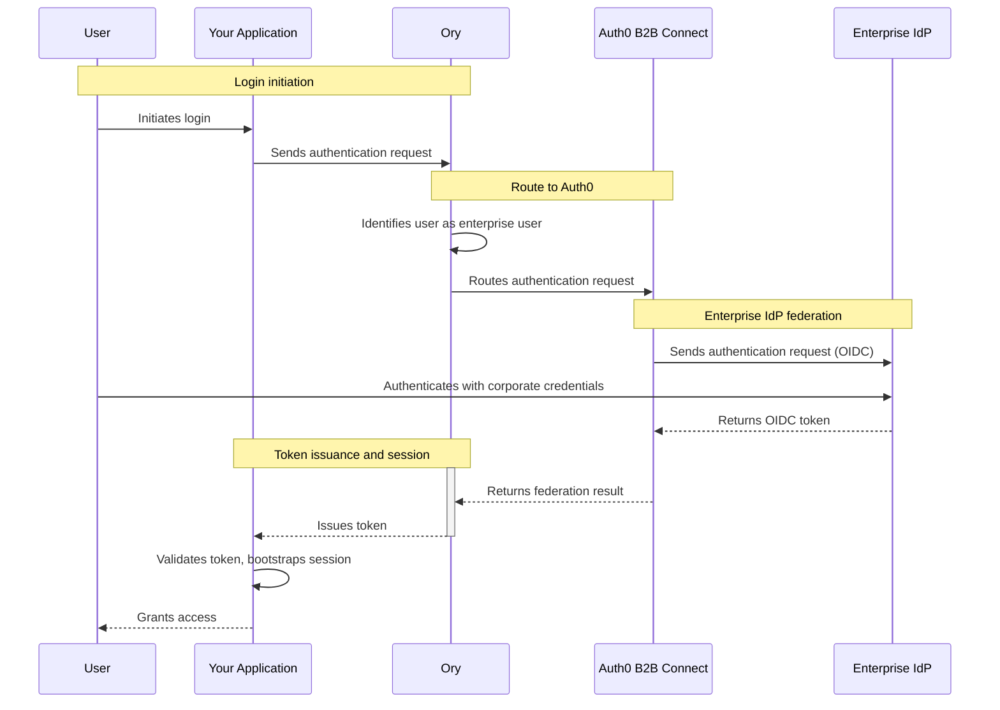

[Ory](https://www.ory.sh) is an open-source, enterprise-grade identity platform that provides API-first authentication, authorization, and user federation for modern applications. Configure Ory to federate to Auth0 B2B Connect as an <Tooltip tip="OpenID: Open standard for authentication that allows applications to verify users' identities without collecting and storing login information." cta="View Glossary" href="/docs/glossary?term=OpenID">OpenID Connect (OIDC)</Tooltip> <Tooltip tip="Identity Provider (IdP): Service that stores and manages digital identities." cta="View Glossary" href="/docs/glossary?term=identity+provider">identity provider</Tooltip> to add <Tooltip tip="Single Sign-On (SSO): Service that, after a user logs into one application, automatically logs that user in to other applications." cta="View Glossary" href="/docs/glossary?term=SSO">enterprise single sign-on (SSO)</Tooltip> to your existing Ory authentication stack.

## How authentication works



1. The user initiates login in your application.
2. The application sends an authentication request to Ory.
3. Ory identifies the user as an enterprise user and routes the request to Auth0 B2B Connect.
4. Auth0 B2B Connect sends an authentication request to the user's enterprise identity provider (for example, Okta or Microsoft Entra ID) using OpenID Connect (OIDC).
5. The user authenticates with their corporate credentials at the enterprise identity provider.
6. The enterprise identity provider returns an OIDC token to Auth0 B2B Connect.
7. Auth0 B2B Connect performs domain discovery and returns the federation result to Ory.
8. Ory issues a token to the application.
9. The application validates the token, bootstraps its session, and grants the user access.

## Prerequisites

To use Auth0 B2B Connect Enterprise with Ory, you need to:

- Have an Auth0 tenant with [B2B Connect - Enterprise](/docs/get-started/b2b-connect-enterprise) enabled
- Create an [Auth0 Organization](/docs/manage-users/organizations) with domain discovery enabled to an [enterprise connection](/docs/authenticate/enterprise-connections) (for example, Okta). To learn more, read [Create Organization Domains](/docs/manage-users/organizations/configure-organizations/create-org-domains).
- Be able to access your Ory Network Developer Tier project via the Ory Network Console
- Have an existing Ory OAuth 2.0 application

<Callout icon="file-lines" color="#0EA5E9" iconType="regular">

Enterprise Home Realm Discovery (HRD) strictly requires Ory B2B Organizations. Native automated domain routing relies on linking verified email domains and upstream identity providers (SAML or OIDC) directly to an Organization for Ory to silently redirect users to their enterprise SSO during an [Identifier-First login flow](/docs/authenticate/login/auth0-universal-login/identifier-first).

</Callout>

## Configure Auth0 B2B Connect

To create a new B2B Connect integration:

1. Navigate to [**Auth0 Dashboard > Applications > B2B Connect**](https://manage.auth0.com/dashboard/#/b2b-integrations) and select **+Create Integration** to start the B2B Connect wizard.
2. Enter an **Integration Name** (for example, "Ory").
3. Under **Integration Type**, select **Third-party Managed Authorization Server**.
4. Select **Continue**.

<Frame></Frame>

5. Under **Authentication Protocol**, select **OIDC** (OpenID Connect).
6. Select **Continue**.
7. Enter the **Application Callback URL**. This is the Redirect URI for your Ory OIDC authentication provider, following this format:

   ```text lines
   https://YOUR_ORY_DOMAIN/self-service/methods/oidc/callback/YOUR_PROVIDER_ID
   ```

   A. Replace `YOUR_PROVIDER_ID` with the identity provider alias you can find in your Ory console. If you don't have this value yet, you can update the **Application Callback URL** later from the B2B Connect **Settings** tab at:

   ```text lines
   https://YOUR_AUTH_DOMAIN/dashboard/YOUR_REGION/YOUR_TENANT_NAME/b2b-integrations/YOUR_B2B_CONNECT_CLIENT_ID/settings
   ```

8. Select **Continue**.
9. On the confirmation screen, select **Done** to finish the wizard.

### Copy credentials from the Settings tab

After the setup wizard completes, you need to select the integration you just created and copy values from the **Settings** tab for your Ory configuration. You need to copy the:

- Client ID
- Client Secret
- Issuer URL 

<Frame></Frame>

## Configure Ory

Use the Ory Console to configure Auth0 B2B Connect as a Social Sign-In OIDC provider for your Ory Developer Tier project.

### Add and configure an identity provider

To add Auth0 as an IdP, follow the instructions in your Ory Console:

1. Select your workspace. 
2. Navigate to **Authentication** and select **Social Sign-In (OIDC)**. 
3. Select **Add new OpenID Connect provider**.
<Callout icon="file-lines" color="#0EA5E9" iconType="regular">
Add the displayed **Redirect URI** in Auth0 Dashboard to your Auth0 B2B Connect application under **Allowed Callback URLs** in the **Settings** tab from Step 7.
</Callout>
4. Set the **Label** to the name displayed to users on the sign-in screen.
5. Enter the **Client ID** from the B2B Connect Settings tab.
6. Enter the **Client Secret** from the B2B Connect Settings tab.
7. Enter the **Issuer URL** from the B2B Connect Settings tab into the **Tenant URL** field.
8. Select **Save**.

### Verify the identity provider

1. Using an application integrated with your existing Ory OAuth 2 Client, initiate a sign-in flow and verify that the **Sign in with Auth0** button appears and successfully redirects you to Auth0.

2. On the Auth0 login screen, enter your email address. Auth0 domain discovery triggers and redirects you to your upstream IdP (for example, Okta) to complete authentication.