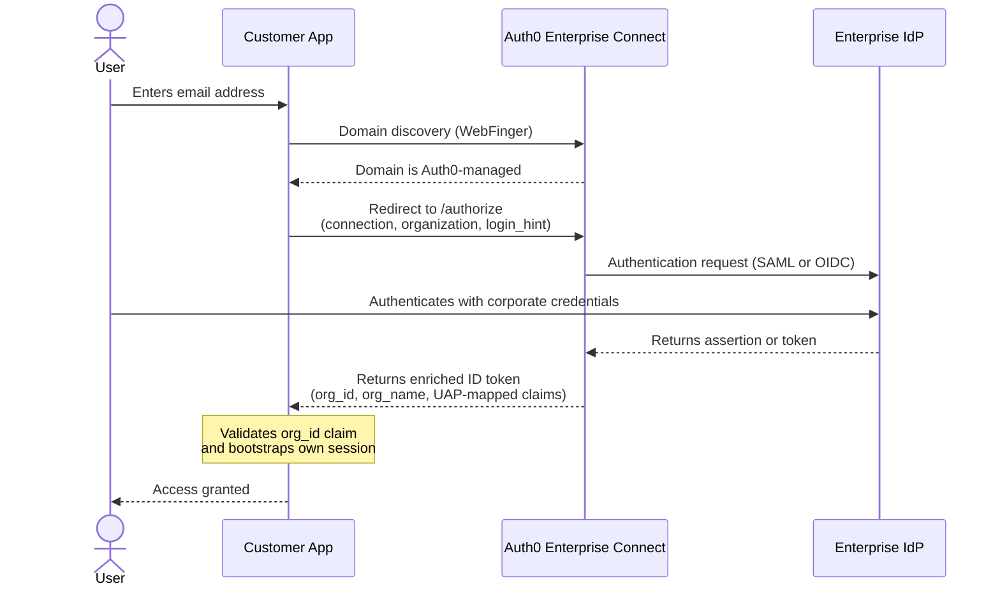

import {ReleaseStageNotice} from "/snippets/ReleaseStageNotice.jsx";

<ReleaseStageNotice 
feature="Auth0 Enterprise Connect" 
stage="beta"
contact="Auth0 Support"
terms="true" />

Auth0 Enterprise Connect is an enterprise-ready integration layer in which you can integrate Auth0's B2B enterprise features, such as [Single Sign-on (SSO)](/docs/authenticate/single-sign-on), [System for Cross-domain Identity Management (SCIM)](/docs/authenticate/protocols/scim), and [Universal Logout](/docs/authenticate/login/logout/universal-logout), when you already have a configured authentication stack. Enterprise Connect allows you to add Auth0 B2B services on your existing authorization server, allowing you to maintain control of token issuance, session management, and login while offering enterprise authentication flows for B2B customers.

## How it works



1. An enterprise user enters their email address in your application.
2. Your application calls Auth0's domain discovery endpoint (WebFinger) with the user's email domain. If the domain is managed through Enterprise Connect, the user proceeds through the Auth0 SSO flow. If not, your application routes the user through your existing login path — non-enterprise users are unaffected.
3. Your application redirects the user to Auth0 with the enterprise connection name, organization ID, and email as a login hint.
4. Auth0 sends an authentication request to the enterprise identity provider (IdP) using SAML or OIDC.
5. The user authenticates with their corporate credentials at the enterprise IdP.
6. The enterprise IdP returns a SAML assertion or OIDC token to Auth0.
7. Auth0 enriches an ID token with enterprise claims mapped via a [User Attribute Profile](/docs/authenticate/enterprise-connections/user-attribute-profile) — including `org_id`, `org_name`, and any custom claims from the IdP — and returns it to your application.
8. Your application validates the `org_id` claim and uses the token claims to bootstrap its own session. Auth0 writes no session. Your authorization server remains the session authority.
9. The user is granted access to your application.

<Card title="Before you start">
Auth0 Enterprise Connect uses [Self-Service Enterprise Configuration](/docs/authenticate/enterprise-connections/self-service-enterprise-configuration) and [Auth0 Organizations](/docs/manage-users/organizations) to help your B2B customers onboard and manage users.

Before you enable Enterprise Connect:
* Create an Auth0 Organization or multiple Organizations to use with Enterprise Connect
* Review Self-Service Enterprise Configuration

</Card>

## Enable Auth0 Enterprise Connect

You can enable Enterprise Connect when you create a new tenant or configure an existing tenant through the Auth0 Dashboard or Auth0 SDKs.

### Create a new tenant

From your Auth0 Dashboard instance, select the tenant drop-down menu. Choose **[Create Tenant](/docs/get-started/auth0-overview/create-tenants)**.

1. Select your agreement as Custom or Personal Account.
2. Give the tenant a unique name under Tenant Domain. Your tenant name cannot be changed.
3. Under Tenant Type, select **Enterprise Connect Tenant**.
4. Choose the region for your tenant.
5. Choose the environment type.
6. Select **Save**.

### Update an existing tenant

Use the following guidelines to enable Enterprise Connect on an existing tenant.

<Tabs>
<Tab title="Auth0 Dashboard">

First, set up your Enterprise Connect integration:

1. Navigate to [**Auth0 Dashboard > Applications > B2B Integrations**](https://manage.auth0.com/#/b2b-integrations).
2. Select **Enterprise Connect Integration**.
3. In the editor, add an integration name for your existing authorization server. This name cannot be changed.
4. Select the integration type: a customer authorization server you've built, or a managed authorization server from a third-party such as Keycloak.
5. Select a protocol: OpenID Connect (OIDC) or SAML protocols.
6. Add the provided endpoint(s) to your IdP's configuration to make Auth0 an OIDC identity provider.
7. Add the callback URL from your application so Auth0 can route your users after authentication.
8. Select **Done**.

Next, set up [Self-Service Enterprise Configuration](/docs/authenticate/enterprise-connections/self-service-enterprise-configuration) through [Auth0 Organizations](/docs/manage-users/organizations).

1. In [Enterprise Connect](https://manage.auth0.com/#/b2b-integrations), select **Set Up**.
2. Enter a name for your Self-Service Enterprise Configuration Profile.
3. Optional. Add a description.
4. Auth0 creates a [User Attribute Profile (UAP)](/docs/authenticate/enterprise-connections/user-attribute-profile) named after your Self-Service Enterprise Configuration Profile name. Select **Continue**.
5. Choose how you want to generate Self-Service Enterprise Configuration tickets:
    * **API Integration**: Programmatically generate tickets with the Management API.
    * **Auth0 Dashboard**: Manually generate tickets in Auth0 Dashboard.

Then, associate an Auth0 Organization for your self-service ticket request

Under the Organizations tab, select an existing Auth0 Organization to configure or create a new Organization by selecting **+Create Organization**.

1. When you create a new Organization, provide a name for end users. Then provide a Display Name.
2. Select the checkbox to create a self-service onboarding ticket for this Organization.
3. Select **Create and Continue**.
4. Follow the next steps when an Organization already exists.

If you have an existing Organization:

1. Select the Organization from the list.
2. Add a Connection Name.
3. Add a Display Name.
4. Select **Create and Continue**.
5. You return to the Enterprise Connect main page with a new B2B Integration.

</Tab>

<Tab title="Auth0 SDKs">
<AccordionGroup>
<Accordion title="JavaScript (auth0-spa-js)">
**Install**: `npm install @auth0/auth0-spa-js`
**Initialize**:

```js
import { createAuth0Client } from '@auth0/auth0-spa-js';

const auth0 = await createAuth0Client({
  domain: 'YOUR_AUTH0_DOMAIN',
  clientId: 'YOUR_CLIENT_ID',
  authorizationParams: {
    redirect_uri: window.location.origin + '/callback',
    scope: 'openid profile email' // no offline_access — EC has no refresh token
  }
});
```

**Step 1: Domain discovery**

```js
import { createAuth0Client, isFederatedDomain } from '@auth0/auth0-spa-js';

const email = document.getElementById('email').value;
const emailDomain = email.split('@')[1];
const isFederated = await isFederatedDomain('YOUR_AUTH0_DOMAIN', emailDomain);

if (isFederated) {
  await triggerSSOLogin(email);
} else {
  await existingAuthFlow(email);
}
```

**Step 2: Redirect to Auth0**

```js
async function triggerSSOLogin(email) {
  await auth0.loginWithRedirect({
    authorizationParams: {
      connection: 'YOUR_ENTERPRISE_CONNECTION',
      organization: 'org_XXXX',
      login_hint: email
    },
    appState: { returnTo: window.location.pathname }
  });
}
```

**Step 3: Callback and session bootstrap**

```js
if (window.location.search.includes('code=')) {
  const result = await auth0.handleRedirectCallback();
  const claims = await auth0.getIdTokenClaims();

  if (claims.org_id !== YOUR_EXPECTED_ORG_ID) {
    throw new Error('org mismatch');
  }

  await myApp.createSession({
    sub: claims.sub,
    email: claims.email,
    orgId: claims.org_id,
    department: claims.department,
    employeeId: claims.employee_id
  });

  const returnTo = result.appState?.returnTo ?? '/';
  window.history.replaceState({}, '', returnTo);
}
```

</Accordion>

<Accordion title="React (auth0-react)">

**Install:** `npm install @auth0/auth0-react`

**Initialize — src/main.jsx:**

```jsx
import { Auth0Provider } from '@auth0/auth0-react';

ReactDOM.createRoot(document.getElementById('root')).render(
  <Auth0Provider
    domain="YOUR_AUTH0_DOMAIN"
    clientId="YOUR_CLIENT_ID"
    authorizationParams={{
      redirect_uri: window.location.origin + '/callback',
      scope: 'openid profile email'
    }}
  >
    <App />
  </Auth0Provider>
);
```

**Step 1: Domain discovery**

```jsx
import { useAuth0 } from '@auth0/auth0-react';
import { isFederatedDomain } from '@auth0/auth0-spa-js';

function LoginForm() {
  const { loginWithRedirect } = useAuth0();

  async function handleSubmit(e) {
    e.preventDefault();
    const email = e.target.email.value;
    const emailDomain = email.split('@')[1];
    const isFederated = await isFederatedDomain('YOUR_AUTH0_DOMAIN', emailDomain);

    if (isFederated) {
      await loginWithRedirect({
        authorizationParams: {
          connection: 'YOUR_ENTERPRISE_CONNECTION',
          organization: 'org_XXXX',
          login_hint: email
        },
        appState: { returnTo: window.location.pathname }
      });
    } else {
      await existingAuthFlow(email);
    }
  }
  return <form onSubmit={handleSubmit}>...</form>;
}
```

**Step 2: Callback and session bootstrap**

```jsx
import { useAuth0 } from '@auth0/auth0-react';
import { useEffect, useRef } from 'react';

export function Callback() {
  const { handleRedirectCallback, getIdTokenClaims } = useAuth0();
  const hasProcessed = useRef(false);

  useEffect(() => {
    if (hasProcessed.current) return;
    hasProcessed.current = true;

    async function finish() {
      try {
        const result = await handleRedirectCallback();
        const claims = await getIdTokenClaims();

        if (!claims || claims['org_id'] !== YOUR_EXPECTED_ORG_ID) {
          throw new Error('org mismatch');
        }

        await myApp.createSession({
          sub: claims.sub,
          email: claims.email,
          orgId: claims['org_id'],
          department: claims['department'],
          employeeId: claims['employee_id']
        });

        window.location.replace(result.appState?.returnTo ?? '/');
      } catch {
        window.location.replace('/login?error=callback_failed');
      }
    }
    finish();
  }, []);

  return <p>Completing login...</p>;
}
```

</Accordion>

<Accordion title="Angular (auth0-angular)">

**Install:** `npm install @auth0/auth0-angular`

**Initialize — app.module.ts:**

```ts
import { AuthModule } from '@auth0/auth0-angular';

@NgModule({
  imports: [
    AuthModule.forRoot({
      domain: 'YOUR_AUTH0_DOMAIN',
      clientId: 'YOUR_CLIENT_ID',
      authorizationParams: {
        redirect_uri: window.location.origin + '/callback',
        scope: 'openid profile email'
      }
    })
  ]
})
export class AppModule {}
```

**Step 1: Domain discovery**

```ts
import { Component, inject } from '@angular/core';
import { AuthService } from '@auth0/auth0-angular';
import { isFederatedDomain } from '@auth0/auth0-spa-js';

@Component({ selector: 'app-login', template: '...' })
export class LoginComponent {
  private auth = inject(AuthService);

  async onSubmit(email: string) {
    const emailDomain = email.split('@')[1];
    const isFederated = await isFederatedDomain('YOUR_AUTH0_DOMAIN', emailDomain);

    if (isFederated) {
      this.auth.loginWithRedirect({
        authorizationParams: {
          connection: 'YOUR_ENTERPRISE_CONNECTION',
          organization: 'org_XXXX',
          login_hint: email
        },
        appState: { target: '/' }
      });
    } else {
      this.existingAuthFlow(email);
    }
  }
}
```

**Step 2: Callback and session bootstrap**

```ts
import { Component, inject } from '@angular/core';
import { AuthService } from '@auth0/auth0-angular';
import { takeUntilDestroyed } from '@angular/core/rxjs-interop';
import { filter, take, switchMap } from 'rxjs/operators';

@Component({ selector: 'app-callback', template: '<p>Completing login...</p>' })
export class CallbackComponent {
  constructor() {
    const auth = inject(AuthService);
    auth.isLoading$
      .pipe(
        filter(isLoading => !isLoading),
        take(1),
        switchMap(() => auth.idTokenClaims$),
        take(1),
        takeUntilDestroyed()
      )
      .subscribe(async (claims) => {
        if (!claims) return;
        if (claims['org_id'] !== YOUR_EXPECTED_ORG_ID) {
          window.location.replace('/login?error=org_mismatch');
          return;
        }
        await myApp.createSession({
          sub: claims.sub!,
          email: claims.email!,
          orgId: claims['org_id'],
          department: claims['department'],
          employeeId: claims['employee_id']
        });
        window.location.replace('/');
      });
  }
}
```

</Accordion>

<Accordion title="Vue (auth0-vue)">

**Install:** `npm install @auth0/auth0-vue`

**Initialize — main.ts:**

```ts
import { createApp } from 'vue';
import { createAuth0 } from '@auth0/auth0-vue';
import App from './App.vue';

const app = createApp(App);
app.use(
  createAuth0({
    domain: 'YOUR_AUTH0_DOMAIN',
    clientId: 'YOUR_CLIENT_ID',
    authorizationParams: {
      redirect_uri: window.location.origin + '/callback',
      scope: 'openid profile email'
    }
  })
);
app.mount('#app');
```

**Step 1: Domain discovery (LoginForm.vue)**

```vue
<script setup>
import { useAuth0 } from '@auth0/auth0-vue';
import { isFederatedDomain } from '@auth0/auth0-spa-js';

const { loginWithRedirect } = useAuth0();

async function onSubmit(email) {
  const emailDomain = email.split('@')[1];
  const isFederated = await isFederatedDomain('YOUR_AUTH0_DOMAIN', emailDomain);

  if (isFederated) {
    await loginWithRedirect({
      authorizationParams: {
        connection: 'YOUR_ENTERPRISE_CONNECTION',
        organization: 'org_XXXX',
        login_hint: email
      },
      appState: { returnTo: '/' }
    });
  } else {
    await existingAuthFlow(email);
  }
}
</script>
```

**Step 2: Callback (Callback.vue)**

```vue
<script setup>
import { onMounted } from 'vue';
import { useAuth0 } from '@auth0/auth0-vue';

const { handleRedirectCallback, getIdTokenClaims } = useAuth0();

onMounted(async () => {
  try {
    const result = await handleRedirectCallback();
    const claims = await getIdTokenClaims();

    if (claims?.['org_id'] !== YOUR_EXPECTED_ORG_ID) {
      window.location.replace('/login?error=org_mismatch');
      return;
    }

    await myApp.createSession({
      sub: claims.sub,
      email: claims.email,
      orgId: claims['org_id'],
      department: claims['department'],
      employeeId: claims['employee_id']
    });

    window.location.replace(result.appState?.returnTo ?? '/');
  } catch {
    window.location.replace('/login?error=callback_failed');
  }
});
</script>
<template><p>Completing login...</p></template>
```

</Accordion>

<Accordion title="Next.js (nextjs-auth0)">

**Install:** `npm install @auth0/nextjs-auth0`

**Initialize — lib/auth0.ts:**

```ts
import { Auth0Client } from '@auth0/nextjs-auth0/server';

export const auth0 = new Auth0Client({
  authorizationParams: {
    scope: 'openid profile email',
  },
  async onCallback(error, context, session) {
    if (error) throw error;
    if (session?.user) {
      if (session.user['org_id'] !== process.env.EXPECTED_ORG_ID) {
        throw new Error('org mismatch');
      }
      await mySessionStore.upsert({
        sub: session.user.sub,
        email: session.user.email,
        orgId: session.user['org_id'],
        department: session.user['department'],
        employeeId: session.user['employee_id'],
      });
    }
    return null;
  }
});
```

**Mount routes — app/auth/[auth0]/route.ts:**

```ts
import { auth0 } from '@/lib/auth0';
export const GET = auth0.handler;
export const POST = auth0.handler;
```

**Step 1: Domain discovery (server-side)**

```ts
import { NextRequest, NextResponse } from 'next/server';
import { isFederatedDomain } from '@auth0/nextjs-auth0';

export async function POST(req: NextRequest) {
  const { email } = await req.json();
  const emailDomain = email.split('@')[1];
  const isFederated = await isFederatedDomain(process.env.AUTH0_DOMAIN!, emailDomain);
  return NextResponse.json({ isFederated });
}
```

**Step 2: SSO redirect**

```ts
'use server';
import { redirect } from 'next/navigation';

export async function loginWithSSO(email: string, orgId: string) {
  redirect(
    `/auth/login?connection=YOUR_ENTERPRISE_CONNECTION` +
    `&organization=${encodeURIComponent(orgId)}` +
    `&login_hint=${encodeURIComponent(email)}`
  );
}
```

**Step 3: Read from your own session store**

```ts
import { getMySession } from '@/lib/session';

export default async function Dashboard() {
  const session = await getMySession();
  if (!session) return redirect('/login');
  const { email, orgId, department } = session;
  return (
    <main>
      <p>Welcome, {email}</p>
      <p>Department: {department}</p>
    </main>
  );
}
```

</Accordion>

<Accordion title="Express (express-openid-connect)">

**Install:** `npm install express express-openid-connect`

**Setup — app.js:**

```js
const express = require('express');
const { auth } = require('express-openid-connect');
const app = express();

app.use(
  auth({
    issuerBaseURL: `https://${process.env.AUTH0_DOMAIN}`,
    baseURL: process.env.BASE_URL,
    clientID: process.env.CLIENT_ID,
    clientSecret: process.env.CLIENT_SECRET,
    secret: process.env.SESSION_SECRET,
    authorizationParams: {
      response_type: 'code',
      scope: 'openid profile email'
    },
    afterCallback: async (req, res, session, decodedState) => {
      const claims = req.oidc.idTokenClaims;
      if (claims.org_id !== process.env.EXPECTED_ORG_ID) {
        throw new Error('org mismatch');
      }
      await mySessionStore.upsert({
        sub: claims.sub,
        email: claims.email,
        orgId: claims.org_id,
        department: claims.department,
        employeeId: claims.employee_id
      });
      return undefined;
    }
  })
);
```

**Step 1: Domain discovery**

```js
const { isFederatedDomain } = require('express-openid-connect');

app.post('/login', express.json(), async (req, res) => {
  const { email } = req.body;
  const emailDomain = email.split('@')[1];
  const isFederated = await isFederatedDomain(process.env.AUTH0_DOMAIN, emailDomain);

  if (isFederated) {
    return req.oidc.login({
      authorizationParams: {
        connection: 'YOUR_ENTERPRISE_CONNECTION',
        organization: 'org_XXXX',
        login_hint: email
      },
      returnTo: '/dashboard'
    });
  }
  res.redirect('/existing-login');
});
```

**Step 2: Read from your own session store**

```js
app.get('/dashboard', (req, res) => {
  const session = req.session.myApp;
  if (!session) return res.redirect('/login');
  res.json({ email: session.email, department: session.department });
});
```

</Accordion>

<Accordion title="Node.js (auth0-server-js)">

**Install:** `npm install @auth0/auth0-server-js`

**Initialize — auth.ts:**

```ts
import { ServerClient } from '@auth0/auth0-server-js';

export const auth0 = new ServerClient({
  domain: 'YOUR_AUTH0_DOMAIN',
  clientId: 'YOUR_CLIENT_ID',
  clientSecret: 'YOUR_CLIENT_SECRET',
  appBaseUrl: 'http://localhost:3000',
  authorizationParams: {
    redirect_uri: 'http://localhost:3000/auth/callback',
    scope: 'openid profile email',
  },
  transactionStore,
  // stateStore intentionally omitted — enables stateless mode
});
```

**Step 1: Domain discovery**

```ts
import { isFederatedDomain } from '@auth0/auth0-server-js';

const emailDomain = email.split('@')[1];
const isFederated = await isFederatedDomain('YOUR_AUTH0_DOMAIN', emailDomain);
```

**Step 2: SSO redirect**

```ts
async function redirectToSSO(req, res, email) {
  const authorizationUrl = await auth0.startInteractiveLogin(
    {
      authorizationParams: {
        connection: 'YOUR_ENTERPRISE_CONNECTION',
        organization: 'org_XXXX',
        login_hint: email
      }
    },
    { req, res }
  );
  res.writeHead(302, { Location: authorizationUrl });
  res.end();
}
```

**Step 3: Callback and session bootstrap**

```ts
async function handleCallback(req, res) {
  const result = await auth0.completeInteractiveLogin(
    new URL(req.url!, process.env.APP_BASE_URL),
    { req, res }
  );
  const user = result.user;

  if (user['org_id'] !== process.env.EXPECTED_ORG_ID) {
    res.writeHead(403);
    return res.end('org mismatch');
  }

  await mySessionStore.upsert({
    sub: user.sub,
    email: user.email,
    orgId: user['org_id'],
    department: user['department'],
    employeeId: user['employee_id'],
  });

  const returnTo = result.appState?.returnTo ?? '/';
  res.writeHead(302, { Location: returnTo });
  res.end();
}
```

**Step 4: Protected routes**

```ts
async function protectedHandler(req, res) {
  const session = await mySessionStore.get(req);
  if (!session) {
    res.writeHead(302, { Location: '/auth/login' });
    return res.end();
  }
  res.writeHead(200, { 'Content-Type': 'application/json' });
  res.end(JSON.stringify({ email: session.email, department: session.department }));
}
```

</Accordion>

<Accordion title="Python (auth0-server-python)">

**Install:** `pip install auth0-server-python`

**Initialize — auth.py:**

```python
from auth0_server_python.auth_server.server_client import ServerClient

auth0 = ServerClient(
    domain="YOUR_AUTH0_DOMAIN",
    client_id="YOUR_CLIENT_ID",
    client_secret="YOUR_CLIENT_SECRET",
    secret="YOUR_SESSION_SECRET",
    app_base_url="http://localhost:3000",
    authorization_params={"scope": "openid profile email"},
    transaction_store=transaction_store,
    # state_store intentionally omitted — enables stateless mode
)
```

**Step 1: Domain discovery**

```python
from auth0_server_python.auth_server import is_federated_domain

email_domain = email.split("@")[1]
if await is_federated_domain("YOUR_AUTH0_DOMAIN", email_domain):
    # Route through Auth0 Enterprise Connect
    ...
```

**Step 2: SSO redirect**

```python
from auth0_server_python.auth_server.types import StartInteractiveLoginOptions

async def login(request, response):
    url = await auth0.start_interactive_login(
        options=StartInteractiveLoginOptions(
            authorization_params={
                "connection": "YOUR_ENTERPRISE_CONNECTION",
                "organization": "org_XXXX",
                "login_hint": email
            },
            app_state={"return_to": str(request.url.path)}
        ),
        store_options={"request": request, "response": response}
    )
    return RedirectResponse(url=url)
```

**Step 3: Callback and session bootstrap**

```python
import os

async def callback(request, response):
    result = await auth0.complete_interactive_login(
        url=str(request.url),
        store_options={"request": request, "response": response}
    )
    user = result["user"]

    if user.get("org_id") != os.environ["EXPECTED_ORG_ID"]:
        raise HTTPException(status_code=403, detail="org mismatch")

    await my_session_store.upsert({
        "sub": user["sub"],
        "email": user["email"],
        "org_id": user.get("org_id"),
        "department": user.get("department"),
        "employee_id": user.get("employee_id")
    })

    return_to = result.get("app_state", {}).get("return_to", "/")
    return RedirectResponse(url=return_to)
```

**Step 4: Protected routes**

```python
async def dashboard(request):
    session = await my_session_store.get(request)
    if not session:
        return RedirectResponse(url="/login")
    return {"email": session["email"], "department": session.get("department")}
```

</Accordion>

</AccordionGroup>

</Tab>
</Tabs>
