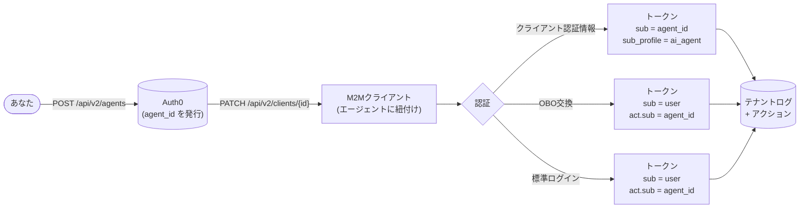

import { ReleaseStageNotice } from "/snippets/ja-jp/ReleaseStageNotice.jsx"

<ReleaseStageNotice feature="Agent as Principal" stage="ea" contact="Auth0 Support" terms="true" />

Agent as Principal は、AI エージェントを Auth0 における第一級のアイデンティティとして扱う機能で、人間のユーザーや従来のマシンツーマシン (M2M) クライアントとは区別されます。エージェントは、安定した識別子を持ち、独自のライフサイクル管理、credentials、監査履歴を備えた登録済みのエンティティです。

Auth0 のプリンシパルとして登録されたエージェントは、次のことができます。

* ユーザーに代わって動作する
* ユーザーセッションなしで自律的に動作する
* トークン交換によるマルチホップの委任を行う

## ユースケース {#use-cases}

* 自律型エージェント: AIエージェントがクライアント認証情報を使って、自分自身としてAPIを直接呼び出します。そのアイデンティティはログとトークンに記録されます。
* 委任アクセス: ユーザーがAIエージェントに対し、自分に代わって動作する権限を付与します。エージェントはユーザーのアクセストークンを委任トークンに交換します。この委任トークンでは、サブジェクトはユーザーのまま保持され、エージェントはアクターとして識別されます。
* マルチホップチェーン: オーケストレーションを担うエージェントがサブエージェントに委任します。委任チェーンは入れ子になった `act` クレームに保持されるため、どのリソースサーバーでも完全な追跡が可能です。

## 仕組み {#how-it-works}

Agent as Principal は、登録、クライアントの関連付け、トークンの発行という 3 つの段階で動作します。

1. [エージェントを登録する](/docs/ja-jp/ai-agents-mcp/agent-as-principal/register-an-agent)：Dashboard または Management API を使用して、エージェントを Auth0 に登録します。Auth0 は一意で変わらない `agent_id` を持つ[エージェントオブジェクト](/docs/ja-jp/ai-agents-mcp/agent-as-principal/register-an-agent#agent-object)を作成します。この ID により、ライフサイクル全体を通じてトークン、ログ、Management API をまたいだ追跡が可能になります。

2. [エージェントをクライアントに関連付ける](/docs/ja-jp/ai-agents-mcp/agent-as-principal/associate-agent-client)：エージェント自体は credentials を持たず、関連付けられた 1 つ以上のクライアントを通じて認証します。1 つのエージェントを複数のクライアントに紐付けることもできるため、環境やリージョンごとにクライアントを分けつつ、ログ上では単一の論理的なアイデンティティを維持できます。

3. [トークン内のエージェントアイデンティティ](/docs/ja-jp/ai-agents-mcp/agent-as-principal/agent-identity-in-tokens)：エージェントに紐付いたクライアントが認証されると、Auth0 は付与タイプに応じて、発行するトークンにエージェントのアイデンティティを埋め込みます。

`agent_id` (作成時に設定した場合は `external_agent_id`) は、トークン発行のたびに[テナントログ](/docs/ja-jp/ai-agents-mcp/agent-as-principal/tenant-logs)にも記録されるため、エージェント単位の完全な監査証跡が得られます。さらに、[Actions](/docs/ja-jp/ai-agents-mcp/agent-as-principal/actions-context) では `event.agent` からエージェントアイデンティティを参照し、トークン発行時にカスタムロジックを適用できます。

## 移行ガイダンス {#migration-guidance}

既存のクライアントとリソースサーバーを Agent as Principal に対応するよう移行しましょう。

### クライアント {#clients}

既存のクライアントは、エージェントと明示的に関連付けない限り影響を受けません。エージェントの関連付けはオプトイン方式で、後から解除することもできます。詳しくは[クライアントとエージェントを関連付ける](/docs/ja-jp/ai-agents-mcp/agent-as-principal/associate-agent-client)をご覧ください。

### リソースサーバー {#resource-servers}

`sub_profile` および `client_profile` クレームを受け取るには、対象のリソースサーバーの設定で `agent_subject_claims: 'auth0-v1'` を指定します。これはリソースサーバーごとのオプトイン方式です。詳細については、[エージェントのサブジェクトクレームを受け取るためのリソースサーバーの設定](/docs/ja-jp/ai-agents-mcp/agent-as-principal/agent-identity-in-tokens#configure-resource-server-to-receive-agent-subject-claims)をお読みください。