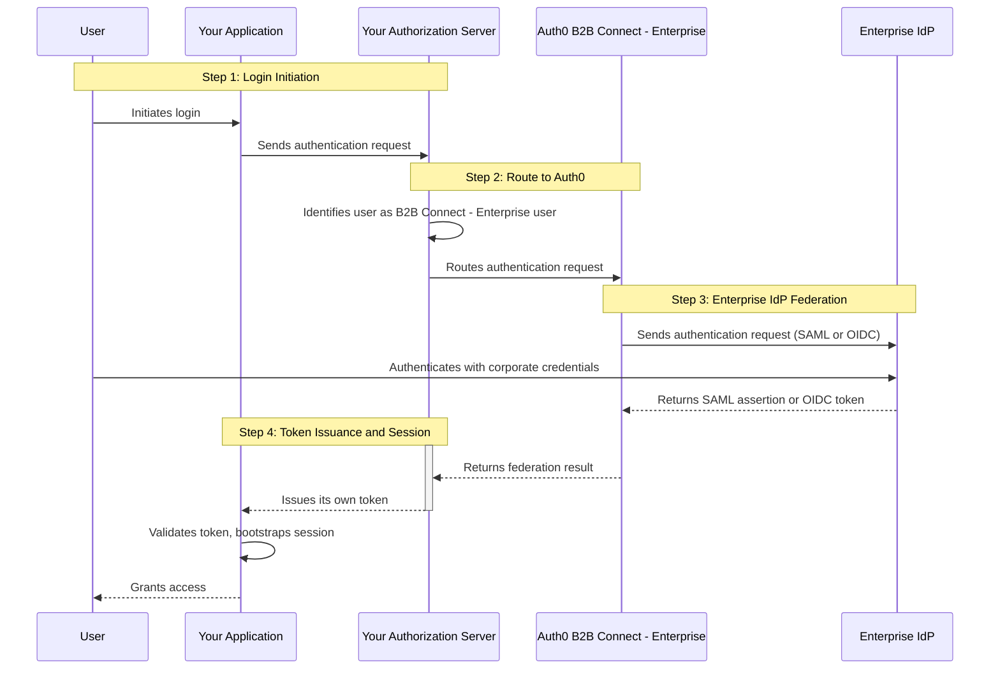

import { ReleaseStageNotice } from "/snippets/ja-jp/ReleaseStageNotice.jsx"

<ReleaseStageNotice feature="B2B Connect - Enterprise" stage="ea" contact="your Technical Account Team or Auth0 Support" terms="true" />

Auth0 B2B Connect - Enterpriseは、エンタープライズ対応のモジュール型統合レイヤーであり、Auth0のB2Bエンタープライズ機能 (<Tooltip tip="Single Sign-On (SSO): Service that, after a user logs into one application, automatically logs that user in to other applications." cta="View Glossary" href="/docs/ja-jp/glossary?term=SSO">シングルサインオン (SSO) </Tooltip>、System for Cross-domain Identity Management (SCIM) によるユーザープロビジョニング、Universal Logoutなど) を既存の認証スタックに追加します。B2B Connect - Enterpriseを利用すれば、既存の認可サーバー上にAuth0のB2Bサービスを追加し、トークンの発行やセッション管理、ログインの制御を自社で維持したまま、B2B顧客にはユーザー認証に自社のエンタープライズIDプロバイダー (IdP) を使用するという選択肢を提供できます。

## メリット {#benefits}

B2B Connect - エンタープライズを使う理由は何でしょうか。B2B 顧客向けの製品を構築しようとすると、オンボーディングや顧客管理といった基礎的な部分に対応するだけのために、複雑な B2B ID 基盤を自前で作り込むことになりがちです。

こうした作業は通常、相反する優先事項の間でバランスを取るプラットフォーム ID チームが担うことになります。その結果、構造的に重要な次の 3 つの柱をめぐって、絶えずトレードオフを迫られます。

1. 厳格なセキュリティと相互運用性を維持する。
2. 非の打ちどころのない顧客オンボーディングとライフサイクル体験を提供する。
3. 自社のコア製品のイノベーションを解き放ち、加速させる。

これらの柱に取り組む際、選択肢は通常 2 つです。最新の ID プラットフォームへ移行するか、既存のスタックにエンタープライズ機能を重ねるかです。移行は実績のある方法ですが、相応の準備期間を要します。より短期間でエンタープライズ機能を必要とするチームや、全面移行が不要なリスクを招くプラットフォームには、B2B Connect - エンタープライズが第 3 の道を用意します。既存のスタックを置き換えることなく、エンタープライズ品質の B2B 機能を追加できるのです。

## ユースケース {#use-cases}

B2B Connect - エンタープライズ は、プラットフォームを移行することなく、高度な B2B アイデンティティのシナリオに対応します。たとえば、次のようなユースケースがあります。

* 既存の認可サーバーにエンタープライズ SSO を追加する
* エンタープライズ顧客向けにセルフサービス型のオンボーディングを提供する
* 既存のログイン体験とトークン発行をそのまま維持する
* アプリケーションの IDトークンをエンタープライズのクレームで強化する
* 検証済みのメールドメインに基づいてユーザーをエンタープライズ IdP へ振り分ける
* アイデンティティ管理を B2B 顧客に委任する
* IPSIE に準拠したセッション管理と Universal Logout をサポートする

## 仕組み {#how-it-works}

Auth0 B2B Connect - エンタープライズは、アプリケーションの認可サーバーと顧客のエンタープライズIDプロバイダーの間に位置します。



1. ユーザーがアプリケーションでログインを開始します。
2. アプリケーションは既存のフローを使用して、認可サーバーに認証リクエストを送信します。
3. 認可サーバーはそのユーザーを B2B Connect - エンタープライズ のユーザーとして識別し、リクエストを Auth0 にルーティングします。
4. Auth0 B2B Connect - エンタープライズ は、SAML または OpenID Connect (OIDC) を使用して、ユーザーの企業 IdP (Okta、Microsoft Entra ID、Google Workspace、PingFederate など) に認証リクエストを送信します。
5. ユーザーは企業 IdP で社内の資格情報を使用して認証します。
6. 企業 IdP は SAML アサーションまたは OIDC トークンを Auth0 B2B Connect - エンタープライズ に返します。
7. 認可サーバーは自身のトークンをアプリケーションに返します。
8. アプリケーションはトークンを検証し、独自のセッションを確立します。
9. ユーザーにアプリケーションへのアクセスが許可されます。

アプリケーション統合タイプでは、アプリが直接 Auth0 にリダイレクトするため、フェデレーションフローから中間の認可サーバーが不要になります。

## サポートされているエンタープライズ接続 {#supported-enterprise-connections}

B2B Connect - エンタープライズ は、次の[エンタープライズ接続](/docs/ja-jp/authenticate/enterprise-connections)をサポートしています。

* SAML
* OIDC
* Okta Workforce
* Microsoft Entra ID (Azure AD)
* Google Workspace
* Active Directory / LDAP
* ADFS
* PingFederate

## B2B Connect - エンタープライズを統合する {#integrate-b2b-connect-enterprise}

B2B Connect - エンタープライズは、[Auth0 Dashboard](https://manage.auth0.com/#/b2b-integrations)の［B2B Connect統合の作成］ウィザードで統合でき、これによってトポロジーが確立されます。ウィザードのステップ1 (名前と種類) での選択によって、統合の経路全体が決まります。

<Frame></Frame>

| 種類 | 統合                 | Auth0へのリダイレクト元 | Auth0 SDKの要否 | プロトコル       |
| -- | ------------------ | -------------- | ------------ | ----------- |
| 1  | カスタム認可サーバー         | 認可サーバー         | 不要           | OIDCまたはSAML |
| 2  | サードパーティが管理する認可サーバー | 認可サーバー         | 不要           | OIDCまたはSAML |
| 3  | アプリケーション (直接)      | アプリケーション       | 推奨           | OIDC        |

### カスタム認可サーバー {#custom-authorization-server}

独自の認可サーバーを構築済みで、OIDCまたはSAML経由でAuth0に対するリライングパーティとして動作できる場合は、このタイプを使用します。エンタープライズユーザーは自社の認可サーバーからAuth0へリダイレクトされ、エンタープライズ以外のユーザーは自社の認可サーバー上に留まります。

```
Application → Custom Auth Server → Auth0 B2B Connect - Enterprise → Enterprise IdP
                    ↑                         |
                    └─────── identity ────────┘
```

ウィザードでの手順は次のとおりです。

1. 名前と種類: 統合に名前を付け、**Custom Authorization Server** を選択します。
2. 認証: **OIDC (推奨)&#x20;**&#x20;または **SAML** を選択します。
3. Auth0 を IdP として設定: Auth0 が認可サーバーのIDプロバイダーとして機能できるよう、認可サーバー側の値を入力します。
   * OIDC: 発行者 URL とアプリケーションの Callback URL。
   <Callout icon="file-lines" color="#0EA5E9" iconType="regular">
     認可サーバーが発行者ディスカバリーに対応していない場合は、**Show individual endpoints** を展開して、Authorization URL、Token URL、Client ID、Client Secret を取得してください。
   </Callout>
   * SAML: 発行者、Identity Provider SHA1 Fingerprint、Identity Provider Login URL、Auth0 証明書または IdP メタデータ、およびアプリケーションの Callback URL。
4. 統合の作成完了: 続いて [Organizations](/docs/ja-jp/manage-users/organizations) と [セルフサービスエンタープライズ構成 (SSEC) ](/docs/ja-jp/authenticate/enterprise-connections/self-service-enterprise-configuration) をセットアップし、最初の B2B 顧客をオンボーディングしましょう。

### サードパーティー管理型の認可サーバー {#third-party-managed-authorization-server}

購入した認可サーバーやマネージド型の認可サーバーを使用する場合は、このタイプを選択します。トポロジーとウィザードのフローはタイプ1と同じです。Auth0をIDプロバイダーとして設定する方法については、ご利用の認可サーバーのプロバイダーが提供するドキュメントを参照してください。

```
Application → Third-party Auth Server → Auth0 B2B Connect - Enterprise → Enterprise IdP
                    ↑                              |
                    └──────────identity ───────────┘
```

B2B Connect - エンタープライズは、OIDCまたはSAMLによるフェデレーションに対応したサードパーティ管理の認可サーバーをサポートしています。例としては次のようなものがあります。

* Amazon Cognito
* PingIdentity PingOne
* Ory
* Keycloak
* Transmit Security

ウィザードでの手順は次のとおりです。

1. 名前と種類: 統合に名前を付け、**Third-party Managed Authorization Server**を選択します。
2. 認証プロトコル: OIDC (推奨) またはSAMLを選択します。
3. Auth0をIdPとして設定: 項目はタイプ1のOIDCまたはSAMLと同じです。管理型認可サーバーに、Auth0をアップストリームのIDプロバイダーとして登録します。
4. 統合の作成完了: 続いて[Organizations](/docs/ja-jp/manage-users/organizations)と[SSEC](/docs/ja-jp/authenticate/enterprise-connections/self-service-enterprise-configuration)のセットアップに進みます。

### アプリケーション {#application}

アプリケーションが別個の認可サーバーを介さずにAuth0と直接統合する場合は、このタイプを使用します。アプリケーションにAuth0 SDKを組み込み、セッションをアプリケーション自身が完全に管理します。このタイプはOIDCのみに対応しており、プロトコルを選択する手順はありません。

```
Application (embeds Auth0 SDK) → Auth0 B2B Connect - Enterprise → Enterprise IdP
         ↑                                    |
         └──────────── identity ──────────────┘
```

ウィザードの手順は次のとおりです。

1. 名前とタイプ: 統合に名前を付け、**Application**を選択します。
2. 統合の構成: 許可するCallback URLを入力します。Auth0は認証後、ユーザーをこれらのURLにリダイレクトします。URLは1つ以上指定する必要があります。
3. セットアップの続行: 統合が作成されました。クイックスタートに従って、アプリケーションにLogin with SSOボタンを追加し、[Organizations](/docs/ja-jp/manage-users/organizations)と[SSEC](/docs/ja-jp/authenticate/enterprise-connections/self-service-enterprise-configuration)を構成します。

## 顧客オンボーディングを構成する {#configure-customer-onboarding}

セルフサービス・エンタープライズ構成 (SSEC) では、B2B顧客が自社のエンタープライズIdPやクレームのマッピングを、貴社チームの直接的なサポートなしに構成できるガイド付きフローを提供します。

顧客オンボーディングを構成するには、次の手順に従います。

1. Auth0 Dashboardで、[B2B Connect](https://manage.auth0.com/#/b2b-integrations)に移動します。Organizationsタブで、**セットアップ**を選択します。
2. セルフサービス・エンタープライズ構成プロファイルの名前を入力します。
   <Frame></Frame>
3. 任意。説明を追加します。
4. Auth0は、SSECプロファイルの名前を付けた[ユーザー属性プロファイル (UAP) ](/docs/ja-jp/authenticate/enterprise-connections/user-attribute-profile)を作成します。**続行**を選択します。
5. SSECチケットの生成方法を選択します。
   * API統合
   * Auth0 Dashboard
6. **完了**を選択します。

<Callout icon="file-lines" color="#0EA5E9" iconType="regular">
  テナントごとに作成できるSSECプロファイルの最大数については、[セルフサービス・エンタープライズ構成](/docs/ja-jp/authenticate/enterprise-connections/self-service-enterprise-configuration#how-it-works)をお読みください。
</Callout>

## Auth0 Organization の作成または設定 {#create-or-configure-an-auth0-organization}

顧客のオンボーディング設定が完了したら、セルフサービスチケットのリクエストごとに Auth0 Organization を関連付けます。

B2B 顧客が認証できるようにするには、各 Organization でエンタープライズ接続を有効にするとともに、B2B 統合アプリケーションへのアクセス権を付与してください。

### 新しい Auth0 Organization を作成する {#create-a-new-auth0-organization}

1. **+Create Organization** を選択します。API 統合の手順を確認する場合は **&lt;&gt;** の記号を選択します。
2. エンドユーザーに表示される **Name** を入力します。
3. 省略可。**Display Name** を入力します。省略した場合、Display Name には Organization 名が使用されます。
4. オンボーディングチケットを作成しない場合は、**Create** を選択します。
5. この Organization のオンボーディングチケットを作成する場合は、次の手順に従います。
   * チェックボックスを選択し、**Create and Continue** を選択します。
   * **Connection Name** と **Display Name** を追加します。
   * **Create and Continue** を選択します。
   * チケットの URL をコピーし、B2B の顧客に共有します。**Copy and Close** を選択します。
6. 顧客の管理者はチケットの URL から セルフサービスアシスタント を起動し、手順に従って接続を構成し、ドメイン検証を完了します。
   <Frame></Frame>

### 既存の Auth0 Organization を構成する {#configure-an-existing-auth0-organization}

1. B2B Connect - エンタープライズで、一覧から構成対象の Organization のアイコンを選択します。
2. Connection Name と Display Name を入力します。
3. [Create and Continue] を選択します。
4. チケット URL をコピーし、B2B のお客様に共有します。[Copy and Close] を選択します。
5. お客様の管理者がチケット URL からセルフサービスアシスタントを起動し、表示される手順に従って接続を構成し、ドメイン検証を完了します。

セットアップが完了したら、テストユーザーで構成を検証します。

## Auth0 Events {#auth0-events}

[Auth0 Event](/docs/ja-jp/customize/events) でライフサイクルイベントのリアルタイム通知を設定すると、Auth0 での変更に合わせてダウンストリームの identity store を同期した状態に保てます。ユーザー、Organizations、エンタープライズ接続のイベントをサブスクライブできます。

### ライフサイクルイベントの構成 {#configure-lifecycle-events}

ライフサイクルイベントを構成するには、次の手順に従います。

1. Auth0 Dashboardで、**[Event Streams](https://manage.auth0.com/#/event-streams)** に移動します。
2. **+ Create Event Stream** を選択します。
3. 配信先として **Webhooks**、**AWS EventBridge**、**[Auth0 Actions](/docs/ja-jp/customize/actions)** のいずれかを選択します。
4. 構成内容を入力し、受信するイベントのカテゴリーを選択します。
   * ユーザーイベント：[`user.created`](/docs/ja-jp/events/user/user.created)、[`user.deleted`](/docs/ja-jp/events/user/user.deleted)、[`user.updated`](/docs/ja-jp/events/user/user.updated)
   * Organizationイベント：[`organization.created`](/docs/ja-jp/events/organization/organization.created)、[`organization.deleted`](/docs/ja-jp/events/organization/organization.deleted)、`organization.member.*`、[`organization.updated`](/docs/ja-jp/events/organization/organization.updated)
   * 接続イベント：[`connection.created`](/docs/ja-jp/events/connection/connection.created)、[`connection.deleted`](/docs/ja-jp/events/connection/connection.deleted)、[`connection.updated`](/docs/ja-jp/events/connection/connection.updated)
5. **Save** を選択します。

Auth0は、event streamのエンドポイントにイベントを配信します。これらのイベントを利用すれば、Management APIをポーリングせずに、Auth0と認可サーバーの間でエンタープライズIDの状態を同期できます。

<Callout icon="file-lines" color="#0EA5E9" iconType="regular">
  [サポートされている接続](#supported-enterprise-connections)を構成すると、サポートされているすべての接続タイプについて、`connection.created`、`connection.updated`、`connection.deleted` のライフサイクルイベントを受信します。これらのイベントを利用すれば、B2Bの顧客がエンタープライズ接続を構成・変更するのに合わせて、ローカルのドメインマップを最新の状態に保てます。
</Callout>

## Auth0 SDK の統合 {#integrate-auth0-sdks}

Auth0 では、B2B Connect - エンタープライズをアプリケーションや認可サーバーに統合するための SDK を提供しています。

### 対応SDK {#supported-sdks}

| SDK                      | 言語                   | アプリの種類          |
| ------------------------ | -------------------- | --------------- |
| `@auth0/auth0-server-js` | Node.js              | 通常のWebアプリケーション  |
| `@auth0/nextjs-auth0`    | Node.js / Next.js    | 通常のWebアプリケーション  |
| `express-openid-connect` | Node.js / Express    | 通常のWebアプリケーション  |
| `auth0-server-python`    | Python               | 通常のWebアプリケーション  |
| `@auth0/auth0-spa-js`    | JavaScript           | シングルページアプリケーション |
| `@auth0/auth0-react`     | JavaScript / React   | シングルページアプリケーション |
| `@auth0/auth0-angular`   | JavaScript / Angular | シングルページアプリケーション |
| `@auth0/auth0-vue`       | JavaScript / Vue     | シングルページアプリケーション |

各SDKのクイックスタートは、B2B統合の**［Quickstart］**タブから確認できます。

### 統合パターン {#integration-pattern}

B2B Connect - エンタープライズ はステートレスなパススルーモデルを採用しています。Auth0 がエンタープライズ IdP との SSO ラウンドトリップを処理し、情報を付加した IDトークンを返します。セッションの管理主体は、引き続き既存の認可サーバーまたはアプリケーションです。標準的な Auth0 統合とは、以下の点が異なります。

* ステートレスモード: サーバー SDK ではセッションストア (`stateStore` / `state_store`) を使用しません。コールバックメソッド (`completeInteractiveLogin` / `complete_interactive_login`) がユーザークレームと IDトークンを直接返すため、getSession() ではなく戻り値からアイデンティティを読み取ってください。
* リフレッシュトークンなし: B2B Connect - エンタープライズ はリフレッシュトークンを発行しません。`scope` には `openid profile email` を指定し、`offline_access` は省略してください。
* Organization が必須: `/authorize` に `organization` を渡すことで、ログインを正しい Auth0 Organization に紐付け、エンタープライズ IdP へのサイレントパススルーを有効にできます。ログインを信頼する前に、返されたトークン内の org&#95;id クレームを必ず検証してください。
* フェデレーションログアウト: ログアウト時は Auth0 の `/v2/logout` に `federated: true` を付けてリダイレクトし、エンタープライズ IdP のセッションを終了させます。これを行わないと、IdP のセッションは有効なまま残ります。

### SSO でのログイン {#login-with-sso}

認証フローを開始するには、`loginWithRedirect` (SPA SDK) または `startInteractiveLogin` (サーバー SDK) を使用します。`authorizationParams` には `login_hint` (ユーザーの email) 、`connection`、`organization` を渡します。**クイックスタート**タブには、各 SDK の統合手順が一通り掲載されています。

### ドメインベースのユーザールーティング (Webfinger) {#domain-based-user-routing-webfinger}

B2B Connect - エンタープライズは、標準のWebfingerエンドポイントを公開しており、ユーザーのメールドメインがAuth0で管理されているかどうかを検出できます。

Webfingerエンドポイントを使用する前に、テナント管理者がLocal Resource Discoveryフラグを有効にしておく必要があります。

[**Tenant Settings &gt; Advanced**](https://manage.auth0.com/#/tenant/advanced)に移動し、Local Resource Discoveryを有効にします。
<Frame></Frame>

```bash
GET https://{your-auth0-domain}/.well-known/webfinger
  ?resource=urn:auth0:discovery:domain:{user-domain}
  &rel=http://openid.net/specs/connect/1.0/issuer
```

ユーザーのemailドメインがAuth0のOrganizationおよびエンタープライズ接続に登録されている場合、エンドポイントはAuth0の発行者を返します。登録されていない場合は、既存の認証パスにフォールバックします。
また、Auth0ではこのエンドポイントをラップしたドメインルックアップSDKも提供しており、より手軽に利用できます。

```javascript
const isAuth0Managed = await isFederatedDomain(AUTH0_DOMAIN, 'acme.com');
if (isAuth0Managed) {
  // B2B Connect - エンタープライズにルーティング
} else {
  // 既存の認証フローにルーティング
}
```

#### 推奨されるルーティング方法 {#recommended-routing-approach}

Webfinger でユーザーが Auth0 管理下であると確認できたら、ユーザーのメールアドレスのみを `login_hint` として Auth0 に渡します。ドメインと organization、ドメインと接続の対応付けを自前で管理する必要はありません。Auth0 が、オンボーディング時にセットアップした Organization とドメインの設定を基に、`login_hint` から Home Realm Discovery を処理します。

その後、Auth0 はユーザーをエンタープライズ IdP へサイレントにルーティングします。Organization で有効になっている接続の数によって、次の2つのケースに分かれます。

* 接続が1つだけ有効な場合：Auth0 はメールのドメインを使って org レベルの HRD を実行し、ユーザーをエンタープライズ IdP へ直接ルーティングします。追加の設定は不要です。
* 複数の接続が有効な場合：Auth0 は org レベルの HRD に続いて接続レベルの HRD を実行します。この場合、ユーザーに入力を求めずに Auth0 が正しい接続を判別できるよう、テナントで [Identifier First](/docs/ja-jp/authenticate/login/auth0-universal-login/identifier-first) を有効にしておく必要があります。

B2B 統合ウィザードは、これが自動的に機能するために必要な organization とドメインの設定をクライアントに構成します。Organizations でのloginフローの仕組みについて詳しくは、[Organizations のloginフロー](/docs/ja-jp/manage-users/organizations/login-flows-for-organizations)をお読みください。

## セッション管理 {#session-management}

### IPSIE セッション有効期限 (OIDC) {#ipsie-session-expiry-oidc}

Auth0 B2B Connect - エンタープライズ は、エンタープライズ OIDC IDプロバイダー向けに [IPSIE の `session_expiry` クレーム](/docs/ja-jp/authenticate/enterprise-connections/session-expiry-enterprise-connections) をサポートしています。Auth0 はエンタープライズ OIDC IdP からセッション有効期限のシグナルを受け取ると、認可サーバーに返すトークンに `session_expiry` クレームを含めます。このクレームを利用して、エンタープライズ IdP のセッションポリシーに合わせてダウンストリームのセッションを終了してください。

### DPoP {#dpop}

B2B Connect - エンタープライズは、エンタープライズ接続で[Demonstrating Proof-of-Possession (DPoP) ](/docs/ja-jp/secure/sender-constraining/demonstrating-proof-of-possession-dpop)をサポートしています。DPoPはトークンを要求元のクライアントに紐付けることで、トークンの盗難やリプレイ攻撃を防ぎます。

既存の認可サーバーも[DPoP](/docs/ja-jp/authenticate/enterprise-connections/enable-dpop-enterprise-connections)をサポートしている場合、Auth0がIDプロバイダーとして機能する構成であれば、B2B Connectクライアントと併用できます。

### Universal Logout {#universal-logout}

B2B Connect - エンタープライズは、Auth0 Dashboardで有効化できるOkta ワークフォースアイデンティティ、OIDC、SAMLの接続で[Universal Logout](/docs/ja-jp/authenticate/login/logout/universal-logout)をサポートしています。Universal Logoutは、B2Bのお客さまご自身で構成することはできないため、お客さまに代わって有効化する必要があります。

## 委任管理 {#delegated-administration}

B2B Connect - エンタープライズでは、[My Organization API と UI コンポーネント](/docs/ja-jp/manage-users/my-organization-api)による委任管理もサポートしています。My Organization を利用すれば、B2B顧客が自社の Organization 設定を貴社チームに問い合わせることなく自ら管理できる、セルフサービス型の管理環境を構築できます。

My Organization のインターフェースを利用する B2B顧客は、次のことが可能になります。

* 自社 organization のエンタープライズ IdP 設定の管理
* ドメイン検証の管理
* organization メンバーの招待と管理
* メンバーロールの割り当てと削除
* organization の詳細情報とブランディングの更新

My Organization の UI コンポーネントは、既存の管理者ポータルに埋め込むことも、独立したページとして表示することもできます。

## トラブルシューティング {#troubleshoot}

### 接続リストが空になっている {#connection-list-is-empty}

Organization でエンタープライズ接続が有効になっていても、B2B 統合アプリケーションへのアクセスが許可されていない場合、テナント管理者が Auth0 Dashboard の[Enterprise Connections]タブを開いても接続は表示されません。

この問題を解決するには、**[Auth0 Dashboard &gt; Organizations](https://manage.auth0.com/dashboard/#/organizations/list)** に移動してアプリケーションを選択し、**Applications** タブを開きます。該当する B2B 統合が一覧に表示されているかを確認してください。表示されていない場合は、**+ Add Application** でアプリケーションを追加する必要があります。Webfinger によるLocal Resource Discoveryを使用するには、現時点ではその Organization でアプリケーション単位のアクセスを無効にしておく必要があります。

### B2B顧客がセルフサービスチケットを受け取っていない {#b2b-customer-did-not-receive-self-service-ticket}

B2B顧客がオンボーディングチケットを受け取っていない場合は、新しいチケットを作成します。B2B Connect - エンタープライズで**[Organizations](https://manage.auth0.com/dashboard/#/b2b-integrations/organizations)**タブに移動し、該当するOrganizationを選択して、新しいオンボーディングチケットを生成してください。

### エンタープライズ接続がloginフローに表示されない {#enterprise-connection-does-not-surface-in-the-login-flow}

以下の条件を確認してください。

1. 対象のOrganizationでエンタープライズ接続が有効になっているか確認します。
2. そのOrganizationにB2B統合アプリケーションへのアクセス権 (アプリケーション単位のアクセス) が付与されているか確認します。
3. ユーザーのemailドメインが、Organizationに関連付けられた検証済みドメインと一致しているか確認します。