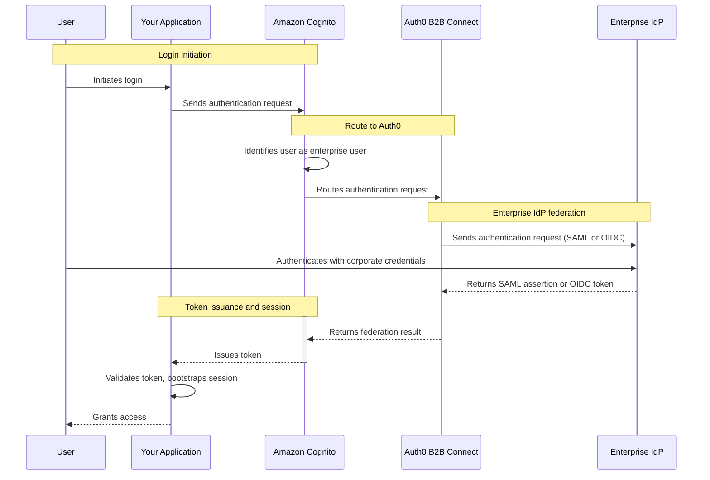

import { ReleaseStageNotice } from "/snippets/ja-jp/ReleaseStageNotice.jsx"

<ReleaseStageNotice feature="B2B Connect - Enterprise" stage="ea" contact="担当のテクニカルアカウントチームまたはAuth0サポート" terms="true" />

[Amazon Cognito](https://aws.amazon.com/cognito/)は、Amazon Web Services (AWS) が提供するエンタープライズ級のID管理サービスで、Webアプリケーションおよびモバイルアプリケーション向けにユーザー認証、認可、フェデレーションの機能を提供します。既存のCognitoユーザープールに<Tooltip tip="シングルサインオン（SSO）：ユーザーが1つのアプリケーションにログインした後、他のアプリケーションにも自動的にログインさせるサービスです。" cta="用語集を表示" href="/docs/ja-jp/glossary?term=SSO">エンタープライズシングルサインオン (SSO) </Tooltip>を追加するには、Amazon Cognitoを<Tooltip tip="OpenID：アプリケーションがログイン情報を収集・保存することなくユーザーのIDを検証できるようにする、認証のためのオープン標準です。" cta="用語集を表示" href="/docs/ja-jp/glossary?term=OpenID">OpenID Connect (OIDC) </Tooltip>または<Tooltip tip="Security Assertion Markup Language（SAML）：2者間でパスワードを使わずに認証情報を交換できるようにする標準化されたプロトコルです。" cta="用語集を表示" href="/docs/ja-jp/glossary?term=SAML">SAML 2.0</Tooltip>の<Tooltip tip="IDプロバイダー（IdP）：デジタルIDを保存・管理するサービスです。" cta="用語集を表示" href="/docs/ja-jp/glossary?term=identity+provider">IDプロバイダー</Tooltip>としてAuth0 B2B Connectにフェデレーションするよう構成します。

## 認証の仕組み {#how-authentication-works}



1. ユーザーがアプリケーションでログインを開始します。
2. アプリケーションが Amazon Cognito に認証リクエストを送信します。
3. Amazon Cognito がそのユーザーをエンタープライズユーザーとして識別し、リクエストを Auth0 B2B Connect にルーティングします。
4. Auth0 B2B Connect が、SAML または OpenID Connect (OIDC) を使用して、ユーザーのエンタープライズIDプロバイダー (Okta や Microsoft Entra ID など) に認証リクエストを送信します。
5. ユーザーがエンタープライズIDプロバイダーで社内の認証情報を使って認証を行います。
6. エンタープライズIDプロバイダーが SAML アサーションまたは OIDC トークンを Auth0 B2B Connect に返します。
7. Auth0 B2B Connect がドメインディスカバリーを実行し、フェデレーション結果を Amazon Cognito に返します。
8. Amazon Cognito がアプリケーションにトークンを発行します。
9. アプリケーションがトークンを検証し、セッションを初期化して、ユーザーにアクセスを許可します。

## 前提条件 {#prerequisites}

* [B2B Connect - Enterprise](/docs/ja-jp/get-started/b2b-connect-enterprise)が有効化されたAuth0テナント
* [エンタープライズ接続](/docs/ja-jp/authenticate/enterprise-connections) (Oktaなど) へのドメインディスカバリーが有効化された[Auth0 Organization](/docs/ja-jp/manage-users/organizations)。詳細については、[Organizationドメインを作成する](/docs/ja-jp/manage-users/organizations/configure-organizations/create-org-domains)をお読みください。
* 有効なAmazon Cognitoユーザープールを持つAWSアカウント
* 有効なCognitoドメインが構成されたCognitoアプリケーションクライアント

## Auth0 B2B Connectを構成する {#configure-auth0-b2b-connect}

新しいB2B Connect統合を作成するには、次の手順に従います。

1. [**Auth0 Dashboard &gt; Applications &gt; B2B Connect**](https://manage.auth0.com/dashboard/#/b2b-integrations)に移動し、**+Create Integration**を選択してB2B Connectウィザードを開始します。
2. **Integration Name** (統合名) を入力します (例：「AWS Cognito」) 。
3. **Integration Type**で、**Third-party Managed Authorization Server**を選択します。
4. **Continue**を選択します。
5. **認証 Protocol**で、認可サーバーがサポートするフェデレーションの方式 (OIDCまたはSAML) を選択します。
6. **Continue**を選択します。

<Frame></Frame>

## 認証プロトコルを選択して構成する {#select-and-configure-the-authentication-protocol}

ウィザードでは、OIDCまたはSAMLを選択できます。認証プロトコルを選択し、構成手順に従ってください。

<Tabs>
  <Tab title="OIDC">
    1. Cognitoユーザープールの**Application Callback URL**を入力します：
       ```text
       https://YOUR_AWS_COGNITO_DOMAIN/oauth2/idpresponse
       ```
    2. **[続行]**を選択します。
    3. 確認画面で**[完了]**を選択し、ウィザードを終了します。

### [設定]タブからcredentialsをコピーする {#copy-credentials-from-the-settings-tab}

    セットアップウィザードが完了したら、作成した統合を選択し、AWSの構成に使用する値を[設定]タブからコピーします。コピーする項目は次のとおりです：

    * Client ID
    * Client Secret
    * 発行者URL

    <Frame></Frame>
  </Tab>

  <Tab title="SAML">
    1. Cognitoユーザープールの**Application Callback URL**を入力します：
       ```text
       https://YOUR_AWS_COGNITO_DOMAIN/saml2/idpresponse
       ```
    2. **[続行]**を選択します。
    3. 確認画面で**[完了]**を選択し、ウィザードを終了します。

### IdPメタデータをダウンロードする {#download-idp-metadata}

    セットアップウィザードが完了したら、統合ページの**[設定]**タブに移動します。**[認証]**で**IdPメタデータ**ファイルをダウンロードします。このファイルは次のセクションでAWS Cognitoにアップロードします。
  </Tab>
</Tabs>

## AWS Cognito の設定 {#configure-aws-cognito}

### 外部IDプロバイダーを追加する {#add-an-external-identity-provider}

[AWS Cognito コンソール](https://console.aws.amazon.com/cognito/)で、対象のユーザープールを選択します。左側のナビゲーションパネルで**認証**に移動し、**Social and external providers**を選択します。続いて**Add identity provider**を選択します。

<Tabs>
  <Tab title="OIDC">
    1. **IDプロバイダー**で**OpenID Connect (OIDC)**を選択します。
    2. **Provider name**には、エンドユーザーがログイン画面で目にするラベルを設定します (例：「Auth0」) 。
    3. B2B Connectの設定タブに表示されているClient IDを入力します。
    4. B2B Connectの設定タブに表示されているClient secretを入力します。
    5. アプリケーションの要件に応じて**Authorized scopes**を更新します (例：`openid profile email`) 。
    6. エンタープライズユーザーをAuth0へ自動的にリダイレクトさせるには、**Identifiers**にそのユーザーのメールドメインを入力します (例：`acme.com`) 。
    7. B2B Connectの設定タブに表示されている発行者URLを**発行者URL**フィールドに入力します。
    8. **Add identity provider**を選択します。
  </Tab>

  <Tab title="SAML">
    1. **IDプロバイダー**で**SAML**を選択します。
    2. **Provider name**には、ユーザーがログイン画面で目にするラベルを設定します (例：「Auth0」) 。
    3. エンタープライズユーザーをAuth0へ自動的にリダイレクトさせるには、**Identifiers**にそのユーザーのメールドメインを入力します (例：`acme.com`) 。
    4. **Metadata document source**で、B2B Connectの設定タブからダウンロードしたIdPメタデータファイルをアップロードします。
    5. **Add identity provider**を選択します。
  </Tab>
</Tabs>

### 属性のmappingを設定する (推奨) {#configure-attribute-mapping-recommended}

属性のmappingにより、Auth0のユーザーID属性がCognitoユーザープール内のローカルユーザーレコードに関連付けられます。これにより、emailアドレスと名前が自動的にプロビジョニングされます。

1. **Attribute mapping** で **Edit** を選択し、アプリケーションで必要となるユーザー属性をmapします。

   * OIDC: `username` を `sub` に、`email` を `email` にmapします
   * SAML: `email` を `http://schemas.xmlsoap.org/ws/2005/05/identity/claims/emailaddress` にmapします

2. **Save changes** を選択します。

### IDプロバイダーでのユーザーのサインインを許可する {#allow-users-to-sign-in-with-the-identity-provider}

1. AWS Cognito コンソールでユーザープールを選択し、左側のナビゲーションで **Applications** に移動して **App clients** を選択し、対象のアプリケーションを選択します。
2. **Login pages** タブを選択し、**Edit** を選択します。
3. **Identity providers** で、ドロップダウンからIDプロバイダー (例:「Auth0」) を選択します。
4. **Save changes** を選択します。

### IDプロバイダーを検証する {#verify-the-identity-provider}

1. アプリケーションのログインページを開き、**Continue with Auth0**ボタンが表示され、Auth0へ正しくリダイレクトされることを確認します。
2. Auth0のログイン画面でメールアドレスを入力します。Auth0のドメインディスカバリーがトリガーされ、認証を完了するためにアップストリームのIdPへリダイレクトされます。

## OIDC サイレントリダイレクト (任意) {#oidc-silent-redirection-optional}

AWS Cognito と Auth0 の両方のログインページをスキップし、ユーザーをエンタープライズ IdP へサイレントにルーティングするには、認可リクエストで `login_hint` と `idp_identifier` を渡すようにアプリケーションを設定します。

1. email アドレスの入力フィールドを追加するようにアプリケーションを更新します。フォーム送信時に email を取得し、AWS Cognito への authorize リクエストで `login_hint` と `idp_identifier` の両方を渡します。

   ```js lines
   const params = new URLSearchParams({
     response_type: 'code',
     client_id: 'YOUR_COGNITO_APP_CLIENT_ID',
     redirect_uri: 'YOUR_REDIRECT_URI',
     scope: 'openid profile email',
     identity_provider: 'Auth0',
     login_hint: userEmail,
     idp_identifier: userEmail.split('@')[1],
   });

   window.location.href =
     `https://YOUR_AWS_COGNITO_DOMAIN/oauth2/authorize?${params}`;
   ```

2. この設定により、アプリケーションが `login_hint` と `idp_identifier` を AWS Cognito に渡し、AWS Cognito と Auth0 を経由してサイレントにリダイレクトされ、アップストリームのエンタープライズ IdP に直接到達します。