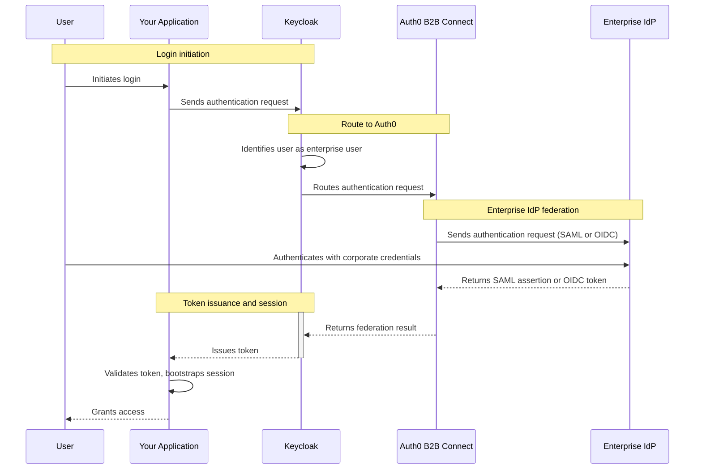

import { ReleaseStageNotice } from "/snippets/ja-jp/ReleaseStageNotice.jsx"

<ReleaseStageNotice feature="B2B Connect - Enterprise" stage="ea" contact="担当のテクニカルアカウントチームまたはAuth0サポート" terms="true" />

[Keycloak](https://keycloak.org)は、アプリケーションに認証、認可、ユーザーフェデレーションを提供するオープンソースのIDおよびアクセス管理プラットフォームです。Keycloakを<Tooltip tip="OpenID: ログイン情報を収集・保存することなく、アプリケーションがユーザーのIDを検証できるようにする認証のオープン標準です。" cta="用語集を表示" href="/docs/ja-jp/glossary?term=OpenID">OpenID Connect (OIDC) </Tooltip>または<Tooltip tip="Security Assertion Markup Language（SAML）: 2つの当事者がパスワードなしで認証情報を交換できるようにする標準化されたプロトコルです。" cta="用語集を表示" href="/docs/ja-jp/glossary?term=SAML">SAML</Tooltip>の<Tooltip tip="IDプロバイダー（IdP）: デジタルIDを保存・管理するサービスです。" cta="用語集を表示" href="/docs/ja-jp/glossary?term=identity+provider">IDプロバイダー</Tooltip>としてAuth0 B2B Connectにフェデレーションするように構成すれば、既存のKeycloak認証スタックに<Tooltip tip="シングルサインオン（SSO）: ユーザーが1つのアプリケーションにログインした後、他のアプリケーションにも自動的にログインさせるサービスです。" cta="用語集を表示" href="/docs/ja-jp/glossary?term=SSO">エンタープライズシングルサインオン (SSO) </Tooltip>を追加できます。

## 認証の仕組み {#how-authentication-works}



1. ユーザーがアプリケーションでログインを開始します。
2. アプリケーションが Keycloak に認証リクエストを送信します。
3. Keycloak がそのユーザーをエンタープライズユーザーとして識別し、リクエストを Auth0 B2B Connect にルーティングします。
4. Auth0 B2B Connect が、SAML または OpenID Connect (OIDC) を使用して、ユーザーのエンタープライズIDプロバイダー (Okta、Microsoft Entra ID など) に認証リクエストを送信します。
5. ユーザーはエンタープライズIDプロバイダーで、企業の credentials を使って認証を行います。
6. エンタープライズIDプロバイダーが、SAML アサーションまたは OIDC トークンを Auth0 B2B Connect に返します。
7. Auth0 B2B Connect がドメインディスカバリーを実行し、フェデレーションの結果を Keycloak に返します。
8. Keycloak がアプリケーションにトークンを発行します。
9. アプリケーションがトークンを検証し、セッションを初期化して、ユーザーにアクセスを許可します。

## 前提条件 {#prerequisites}

* [B2B Connect - Enterprise](/docs/ja-jp/get-started/b2b-connect-enterprise)が有効になっているAuth0テナント
* [エンタープライズ接続](/docs/ja-jp/authenticate/enterprise-connections) (Oktaなど) に対するドメインディスカバリーが有効になっている[Auth0 Organization](/docs/ja-jp/manage-users/organizations)。詳細については、[Create Organization Domains](/docs/ja-jp/manage-users/organizations/configure-organizations/create-org-domains)をお読みください。
* [管理者アクセス権のある](https://www.keycloak.org/docs/latest/server_admin/index.html#using-the-admin-console)Keycloakサーバー
* アプリケーション向けにKeycloakで構成したレルム
* アプリケーションの要件に応じて構成した[IDプロバイダーマッパー](https://www.keycloak.org/docs/latest/server_admin/#_mappers)

## Auth0 B2B Connectを構成する {#configure-auth0-b2b-connect}

新しいB2B Connect統合を作成するには、以下の手順に従います。

1. [**Auth0 Dashboard &gt; Applications &gt; B2B Connect**](https://manage.auth0.com/dashboard/#/b2b-integrations)に移動し、**+Create Integration**を選択してB2B Connectウィザードを開始します。
2. **Integration Name** (たとえば「Keycloak Production」) を入力します。
3. **Integration Type**で**Third-party Managed Authorization Server**を選択します。
4. **Save And Continue**を選択します。

<Frame></Frame>

### 認証プロトコルを選択して設定する {#select-and-configure-the-authentication-protocol}

ウィザードでは、OIDCまたはSAMLのいずれかを選択できます。認証プロトコルを選択し、設定手順に従ってください。

<Tabs>
  <Tab title="OIDC">
    1. **Application Callback URL**を入力します。これは次の形式のKeycloakブローカーエンドポイントです。

       ```text
       https://YOUR_KEYCLOAK_DOMAIN/realms/YOUR_REALM_NAME/broker/YOUR_ALIAS/endpoint
       ```

       <Callout icon="file-lines" color="#0EA5E9" iconType="regular">
         `YOUR_ALIAS`は、Keycloakで使用するIDプロバイダーのエイリアス (例：「oidc」) に置き換えてください。
       </Callout>

    2. **Save And Continue**を選択します。

    3. 確認画面で**Done**を選択し、ウィザードを完了します。

### Settingsタブから認証情報をコピーする {#copy-credentials-from-the-settings-tab}

    セットアップウィザードが完了したら、統合ページの**Settings**タブに移動します。Keycloakのセットアップで使用する以下の値をコピーしてください。

    * Client ID
    * Client Secret
    * Issuer URL
  </Tab>

  <Tab title="SAML">
    1. **Application Callback URL**を入力します。これは次の形式のKeycloakブローカーエンドポイントです。

       ```text
       https://YOUR_KEYCLOAK_DOMAIN/realms/YOUR_REALM_NAME/broker/YOUR_ALIAS/endpoint
       ```

       <Callout icon="file-lines" color="#0EA5E9" iconType="regular">
         `YOUR_ALIAS`は、Keycloakで使用するIDプロバイダーのエイリアス (例：「saml」) に置き換えてください。
       </Callout>

    2. **Save And Continue**を選択します。

    3. 確認画面で**Done**を選択し、ウィザードを完了します。

### IdPメタデータをダウンロードする {#download-idp-metadata}

    セットアップウィザードが完了したら、統合ページの**Settings**タブに移動します。**Authentication**にある**IdP Metadata**ファイルをダウンロードしてください。このファイルは次のセクションでKeycloakにアップロードします。
  </Tab>
</Tabs>

## Keycloak の設定 {#configure-keycloak}

### IDプロバイダーを追加する {#add-an-identity-provider}

Keycloak Admin Consoleでレルムを選択し、左サイドバーの**Identity providers**に移動します。

**User-defined**の下から、次のいずれかを選択します:

* OpenID Connect v1.0
* SAML v2.0

<Tabs>
  <Tab title="OIDC">
    1. **Alias**には、Auth0の**Application Callback URL**で使用した値 (例: 「oidc」) を設定します。フォーム上部の**Redirect URI**は、このエイリアスから自動生成されます。
    2. **Display name**を設定します (例: 「Sign in with SSO」) 。
    3. **Discovery endpoint**フィールドに、B2B Connect Settingsタブに表示されている**Issuer URL**の末尾に`.well-known/openid-configuration`を付けた値を入力します (例: `https://YOUR_TENANT.auth0.com/.well-known/openid-configuration`) 。
    4. B2B Connect Settingsタブに表示されているClient IDを入力します。
    5. B2B Connect Settingsタブに表示されているClient Secretを入力します。
    6. Client authenticationはデフォルトのままにします。Client Secretはリクエストボディで送信されます。
    7. **Add**を選択します。
    8. providerの設定ページで、**OpenID Connect settings**までスクロールし、**Advanced**セクションを展開します。
    9. **Pass login&#95;hint**を有効にします。
  </Tab>

  <Tab title="SAML">
    1. **Alias**には、Auth0の**Application Callback URL**で使用した値 (例: 「saml」) を設定します。フォーム上部の**Redirect URI**は、このエイリアスから自動生成されます。
    2. **Display name**を設定します (例: 「Sign in with SSO」) 。
    3. **Service provider entity ID**はデフォルト (レルムのURL) のままにします。
    4. **Use entity descriptor**をオフにします。
    5. **Import config from file**で、B2B Connect Settingsタブからダウンロードした IdP Metadata XML ファイルをアップロードします。**Identity provider entity ID**、**シングルサインオン service URL**、**Validating X509 certificates**はKeycloakが自動入力します。
    6. **Add**を選択します。
  </Tab>
</Tabs>

### Home Realm Discovery のセットアップ {#set-up-home-realm-discovery}

Auth0 では、[Keycloak Organizations](https://www.keycloak.org/docs/latest/server_admin/#_managing_organizations) を使って [Home Realm Discovery (HRD)](/docs/ja-jp/authenticate/login/auth0-universal-login/identifier-first) をセットアップし、メールのドメインに基づいてエンタープライズユーザーを自動的に Auth0 へルーティングすることを推奨しています。

#### HRDによるユーザーのルーティング例 {#route-users-with-hrd-example}

`@acme.com` のメールアドレスを持つすべてのユーザーをAuth0 B2B Connectにルーティングするには、次の手順に従います。

1. **Configure &gt; Realm settings** に移動し、**Organizations** トグルを有効にします。
2. **Save** を選択します。
3. 左サイドバーで **Organizations** に移動し、**Create organization** を選択します。
4. **Name** (例：「AcmeCorp」) を入力し、**Domain** に `acme.com` を設定して、**Save** を選択します。
5. **Identity providers** タブに移動し、**Link identity provider** を選択します。
6. ドロップダウンからAuth0のIDプロバイダーを選択します。
7. **Domain** で、追加したドメイン (例：`acme.com`) を選択します。
8. **Redirect when email domain matches** を有効にします。
9. **Save** を選択します。

`@acme.com` のメールアドレスを持つユーザーがログインすると、Keycloakはそのユーザーを認証のためにAuth0 B2B Connectへ自動的にリダイレクトします。

### IDプロバイダーを確認する {#verify-the-identity-provider}

1. アプリケーションのログインページを開きます。
2. 設定した表示名でIDプロバイダーのボタンが表示されていることを確認します。
3. そのボタンを選択し、IDプロバイダーのサインインページにリダイレクトされることを確認します。