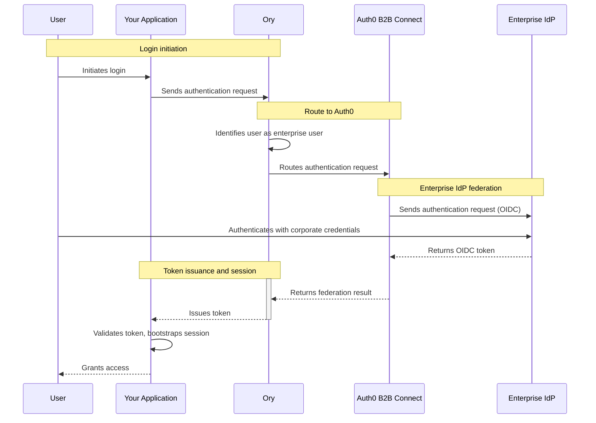

import { ReleaseStageNotice } from "/snippets/ja-jp/ReleaseStageNotice.jsx"

<ReleaseStageNotice feature="B2B Connect - Enterprise" stage="ea" contact="担当のテクニカルアカウントチームまたはAuth0サポート" terms="true" />

[Ory](https://www.ory.sh)は、最新のアプリケーション向けにAPIファーストの認証、認可、ユーザーフェデレーションを提供する、オープンソースのエンタープライズグレードのIDプラットフォームです。Auth0 B2B ConnectへフェデレーションするようにOryを構成すれば、<Tooltip tip="OpenID: ログイン情報を収集・保存せずにアプリケーションがユーザーのIDを検証できるようにする、認証のオープン標準です。" cta="用語集を見る" href="/docs/ja-jp/glossary?term=OpenID">OpenID Connect (OIDC) </Tooltip>の<Tooltip tip="IDプロバイダー（IdP）: デジタルIDを保存・管理するサービスです。" cta="用語集を見る" href="/docs/ja-jp/glossary?term=identity+provider">IDプロバイダー</Tooltip>として機能させ、既存のOry認証スタックに<Tooltip tip="シングルサインオン（SSO）: ユーザーが1つのアプリケーションにログインした後、他のアプリケーションにも自動的にログインさせるサービスです。" cta="用語集を見る" href="/docs/ja-jp/glossary?term=SSO">エンタープライズシングルサインオン (SSO) </Tooltip>を追加できます。

## 認証の仕組み {#how-authentication-works}



1. ユーザーがアプリケーションでログインを開始します。
2. アプリケーションがOryに認証リクエストを送信します。
3. Oryはユーザーをエンタープライズユーザーと判別し、リクエストをAuth0 B2B Connectにルーティングします。
4. Auth0 B2B ConnectはOpenID Connect (OIDC) を使用して、ユーザーの企業IDプロバイダー (例：OktaやMicrosoft Entra ID) に認証リクエストを送信します。
5. ユーザーは企業IDプロバイダーで社内の認証情報を使って認証を行います。
6. 企業IDプロバイダーはOIDCトークンをAuth0 B2B Connectに返します。
7. Auth0 B2B Connectはドメインディスカバリーを実行し、フェデレーションの結果をOryに返します。
8. Oryはアプリケーションにトークンを発行します。
9. アプリケーションはトークンを検証し、セッションを初期化して、ユーザーにアクセスを許可します。

## 前提条件 {#prerequisites}

Auth0 B2B Connect Enterprise を Ory で使用するには、次のものが必要です。

* [B2B Connect - Enterprise](/docs/ja-jp/get-started/b2b-connect-enterprise) が有効になっている Auth0 テナント
* [エンタープライズ接続](/docs/ja-jp/authenticate/enterprise-connections) (例: Okta) へのドメインディスカバリーを有効にした [Auth0 Organization](/docs/ja-jp/manage-users/organizations) の作成。詳しくは [Create Organization Domains](/docs/ja-jp/manage-users/organizations/configure-organizations/create-org-domains) をご覧ください。
* Ory Network Console から Ory Network Developer Tier プロジェクトにアクセスできること
* 既存の Ory OAuth 2.0 アプリケーション

<Callout icon="file-lines" color="#0EA5E9" iconType="regular">
  エンタープライズ Home Realm Discovery (HRD) の利用には Ory B2B Organizations が必須です。ネイティブの自動ドメインルーティングは、検証済みのメールドメインとアップストリームのIDプロバイダー (SAML または OIDC) を Organization に直接リンクすることで実現されます。これにより Ory は、[Identifier-First ログインフロー](/docs/ja-jp/authenticate/login/auth0-universal-login/identifier-first)の中でユーザーをエンタープライズ SSO へ自動的にリダイレクトします。
</Callout>

## Auth0 B2B Connectを構成する {#configure-auth0-b2b-connect}

新しいB2B Connect統合を作成するには、次の手順に従います。

1. [**Auth0 Dashboard &gt; Applications &gt; B2B Connect**](https://manage.auth0.com/dashboard/#/b2b-integrations)に移動し、**+Create Integration**を選択してB2B Connectウィザードを開始します。
2. **Integration Name** (統合名) を入力します (例：「Ory」) 。
3. **Integration Type**で、**Third-party Managed Authorization Server**を選択します。
4. **Continue**を選択します。

<Frame></Frame>

5. **Authentication Protocol**で、**OIDC** (OpenID Connect) を選択します。

6. **Continue**を選択します。

7. **Application Callback URL**を入力します。これはOryのOIDC認証プロバイダーのリダイレクトURIで、形式は次のとおりです。

   ```text lines
   https://YOUR_ORY_DOMAIN/self-service/methods/oidc/callback/YOUR_PROVIDER_ID
   ```

   A. `YOUR_PROVIDER_ID`は、Oryコンソールで確認できるIDプロバイダーのエイリアスに置き換えます。この値がまだ分からない場合は、後から次のURLにあるB2B Connectの**Settings**タブで**Application Callback URL**を更新できます。

   ```text lines
   https://YOUR_AUTH_DOMAIN/dashboard/YOUR_REGION/YOUR_TENANT_NAME/b2b-integrations/YOUR_B2B_CONNECT_CLIENT_ID/settings
   ```

8. **Continue**を選択します。

9. 確認画面で**Done**を選択してウィザードを完了します。

### Settings タブから credentials をコピーする {#copy-credentials-from-the-settings-tab}

セットアップウィザードが完了したら、作成した統合を選択し、Ory の設定に使用する値を **Settings** タブからコピーします。コピーする項目は次のとおりです。

* Client ID
* Client Secret
* 発行者 URL

<Frame></Frame>

## Ory の設定 {#configure-ory}

Ory Console を使用して、Ory Developer Tier プロジェクトのソーシャルサインイン用 OIDC provider として Auth0 B2B Connect を設定します。

### IDプロバイダーの追加と設定 {#add-and-configure-an-identity-provider}

Auth0をIdPとして追加するには、Ory Consoleで次の手順に従います。

1. ワークスペースを選択します。
2. **Authentication**に移動し、**Social Sign-In (OIDC)**を選択します。
3. **Add new OpenID Connect provider**を選択します。

<Callout icon="file-lines" color="#0EA5E9" iconType="regular">
  表示された**Redirect URI**を、Auth0 Dashboardで、手順7の**Settings**タブにあるAuth0 B2B Connectアプリケーションの**Allowed Callback URLs**に追加してください。
</Callout>

4. **Label**には、サインイン画面でユーザーに表示される名前を設定します。
5. B2B ConnectのSettingsタブにある**Client ID**を入力します。
6. B2B ConnectのSettingsタブにある**Client Secret**を入力します。
7. B2B ConnectのSettingsタブにある**発行者 URL**を**Tenant URL**フィールドに入力します。
8. **Save**を選択します。

### IDプロバイダーを検証する {#verify-the-identity-provider}

1. 既存のOry OAuth 2クライアントと統合されたアプリケーションでサインインフローを開始し、**Sign in with Auth0**ボタンが表示され、Auth0へ正常にリダイレクトされることを確認します。

2. Auth0のログイン画面でメールアドレスを入力します。Auth0のドメインディスカバリーが動作し、認証を完了するためにアップストリームのIdP (Oktaなど) へリダイレクトされます。