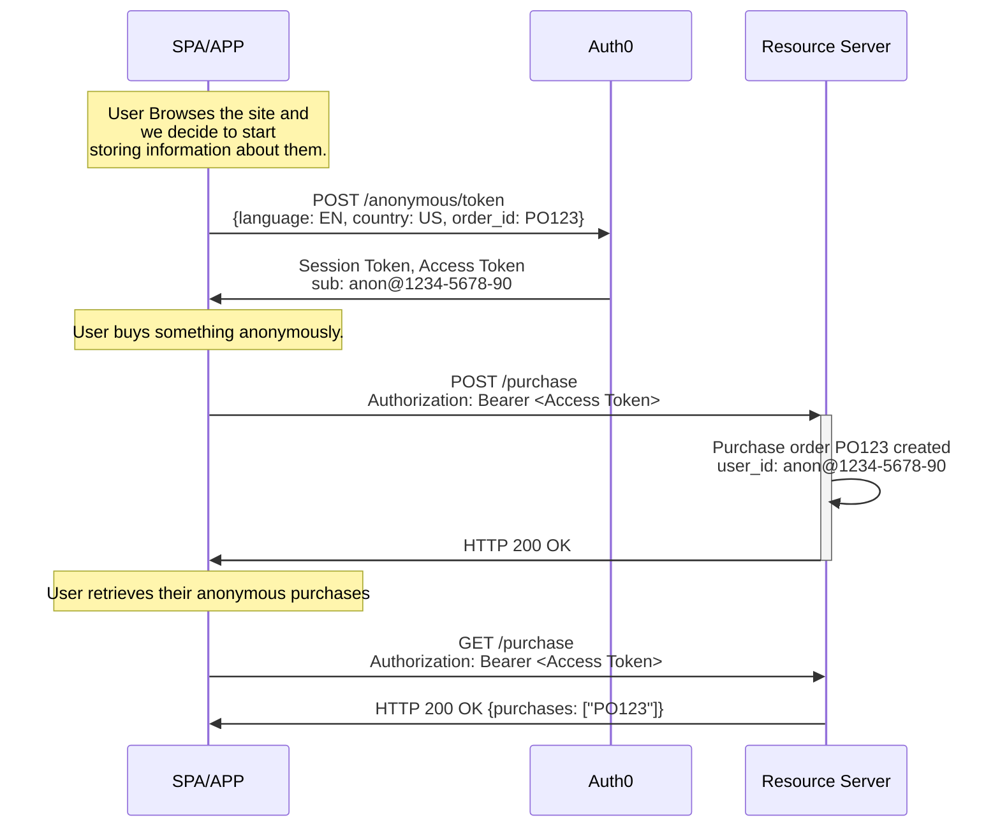
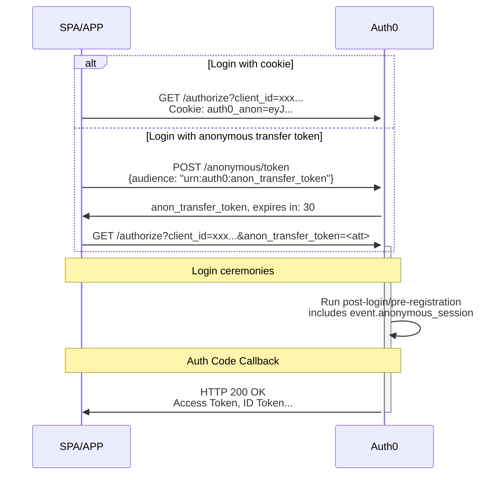

import { ReleaseStageNotice } from "/snippets/ja-jp/ReleaseStageNotice.jsx"

<ReleaseStageNotice feature="Anonymous Sessions" stage="ea" plans="Enterprise" contact="your Account Executive" />

匿名セッションを使用すると、認証なしで[ユーザーセッション](/docs/ja-jp/manage-users/sessions)を作成・管理できます。

ユーザーは、アカウントを作成する前に、閲覧、カートやほしいものリストへの商品の追加、購入の完了、設定の指定を行えます。サインアップまたはログインすると、それまでのアクティビティが認証済みプロファイルに引き継がれます。

匿名セッションは、[Auth0 Identity Conversion Suite](/docs/ja-jp/customize/identity-conversion-suite)の一部です。

匿名セッションは、次のユースケースで使用できます。

* ページの読み込みやセッションをまたいで**ゲストユーザーを追跡する**
* ショッピングカートの参照情報、設定、同意、プロファイリング情報などの**メタデータを保存する**
* 認証なしでAPI呼び出し用の**アクセストークンを発行する**
* ユーザーがサインアップまたはログインした際に、**匿名でのアクティビティを認証済みアカウントに移行する**

<Warning>
  Auth0の匿名セッションのメタデータは安全なデータストアではないため、機密情報の保存には使用しないでください。
  これには、シークレットや社会保障番号、クレジットカード番号などの高リスクなPIIが含まれます。

  また、匿名セッションに保存されるデータは真実性や正確性が検証されていないため、鵜呑みにしないでください。

  Auth0のお客様には、メタデータに保存するデータを評価し、セッションのタグ付けおよびアクセス管理に必要なものだけを保存することを強く推奨します。
  詳細については、[Auth0 General Data Protection Regulation Compliance](/docs/ja-jp/secure/data-privacy-and-compliance/gdpr)をお読みください。
</Warning>

## 匿名セッションのデータを収集する {#gather-anonymous-sessions-data}

まだ認証されていないユーザーも含め、ユーザーに関する情報の収集を開始すると、アプリケーションは `/anonymous/token` エンドポイントに `POST` リクエストを送信します。

Auth0 は2つのトークンを返します。

* 匿名セッションを識別し、維持するための [**セッショントークン**](/docs/ja-jp/secure/tokens/session-tokens)。
* ユーザーが [リソースサーバー (API) ](/docs/ja-jp/get-started/apis)に提示できる [**アクセストークン**](/docs/ja-jp/secure/tokens/access-tokens)。

セッショントークンを含む後続の呼び出しでは、同じ `user_id` のセッションが継続されるため、すべてのアクティビティを単一の起点にたどることができます。
アクセストークンを使用すると、匿名ユーザーは既存の任意の API を呼び出せます。



```json Anonymous session data of user anon@1234-5678-90
{
  "user_id": "anon@1234-5678-90",
  "session_id": "sess_456",
  "metadata": {
    "language": "EN",
    "country": "US",
    "purchase": "P0123"
  }
}
```

## 匿名セッションのデータをユーザーの メタデータ に引き継ぐ {#transfer-anonymous-session-data-to-the-users-metadata}

匿名セッションを認証済みユーザーへ引き継ぐ仕組みは、利用するフローや、アプリケーションがどのドメイン・FQDN に配置されているかによって異なります。リダイレクト型のフロー (認可コード、PKCE を用いた認可コード) では、Cookie または転送チケットのいずれかを使用します。

### クッキーを通じてセッションを移行する {#transfer-a-session-through-a-cookie}

匿名セッション中のユーザーがログインまたはサインアップする際、アプリケーションはクッキーを使用して、`anonymous_session_token`を`/authorize`エンドポイントに渡します。この仕組みは、アプリケーションと認可サーバーが同じドメインにある場合に機能します。たとえば、アプリケーションが`application.mydomain.com`にあり、認可サーバーのカスタムドメインが`auth.mydomain.com`である場合です。この場合、クッキーは同一ドメインと見なされ、自動的に認可サーバーへ転送されるため、ログインは通常どおり機能します。

```javascript cookie example
// 追加のコードは不要です。Cookie は自動的に送信されます
await auth0.loginWithRedirect();
```

### 転送チケットを使用してセッションを移行する {#transfer-a-session-through-a-transfer-ticket}

クッキーをクロスドメインで送信する必要があるシナリオでは、ブラウザーの複数の仕組みによって、匿名セッションクッキーのネットワーク送信がブロックされます。サーバーとクライアントでCORS設定が正しく構成されていても、AppleのIntelligent Tracking Protection (ITP) などの高度な仕組みによってクッキーがブロックまたは破棄され、ユーザーが一致しなくなる場合があります。

これを回避するには、クッキーに依存しない2段階の匿名セッション転送の仕組みを使用します。

1. `urn:auth0:anon_transfer_token`オーディエンスを要求して`/anonymous/token`エンドポイントを呼び出し、引き換えに`anon_transfer_token`を受け取ります。
2. `/authorize`の呼び出しにパラメーターとして`anon_transfer_token`を含めます。

`anon_transfer_token`は、それを要求したIPアドレスに紐付けられます。このクッキーを使用しない仕組みをログインに使用する予定がある場合は、意図しない衝突や注入を避けるため、[テナント設定](/docs/ja-jp/manage-users/sessions/anonymous-sessions/configure-anonymous-sessions#configure-anonymous-sessions)で匿名セッションクッキーの発行を無効にすることをAuth0では推奨しています。



ログインに成功すると、Auth0 では、[`pre-user-registration`](/docs/ja-jp/customize/actions/explore-triggers/signup-and-login-triggers/pre-user-registration-trigger) および [`post-login`](/docs/ja-jp/customize/actions/explore-triggers/signup-and-login-triggers/login-trigger) の Actions トリガーで、`event.anonymous_session` オブジェクトを通じて匿名セッションデータを利用できます。

```json anonymous session object
{
  "anonymous_session": {
    "user_id": "anon@1234-5678-90",
    "session_id": "sess_123",
    "created_at": "2026-05-14T10:30:00Z",
    "metadata": {
      "language": "en",
      "country": "US",
      "order_id": "PO123"
    }
  }
}
```

### リソースオーナーパスワードグラント (ROPG) のシナリオでセッションを移行する {#transfer-a-session-in-a-resource-owner-password-grant-ropg-scenario}

ログインに ROPG を使用する場合は、`/oauth/token` 呼び出しのリクエストボディに `anonymous_session_token` を含めます。

```http Anonymous session token in a ROPG request
POST /oauth/token HTTP/1.1

username=YOUR_USERNAME&
password=YOUR_PASSWORD&
client_id=YOUR_CLIENT_ID&
scope=YOUR_SCOPES&
grant_type=http://auth0.com/oauth/grant-type/password-realm&
client_secret=YOUR_CLIENT_SECRET&
realm=YOUR_REALM&
audience=YOUR_AUDIENCE&
anonymous_session_token=ANONYMOUS_SESSION_eyJ...
```

Actions を使用した匿名セッションについて詳しくは、[匿名セッションのユースケース](/docs/ja-jp/manage-users/sessions/anonymous-sessions/anonymous-sessions-use-cases)をご覧ください。

## 転送後に匿名セッションを終了する {#end-the-anonymous-session-after-transfer}

ユーザーが認証されても匿名セッションのクッキーは自動的に破棄されないため、その後のログインでもクッキーが送信され続ける可能性があります。セッションを終了するには、`/anonymous/logout` エンドポイントを使用します。

```javascript wrap lines
// アプリケーションでのログイン成功後
if (wasAnonymousSession) {
  await fetch('https://YOUR_DOMAIN/anonymous/logout', {
    method: 'POST',
    headers: { 'Content-Type': 'application/json' },
    credentials: 'include', // Cookie を送信
    body: JSON.stringify({ client_id: 'YOUR_CLIENT_ID' }),
  });
}
```

Auth0 は匿名セッションに対するサーバー側での無効化を提供していません。セッションをログアウトしても、匿名セッションのクッキーが削除されるだけです。クッキーが削除された後もブラウザーやアプリケーションがトークンを保持している場合、そのトークンは引き続き通常どおり使用できます。

匿名セッションをより細かく制御したい場合は、[匿名セッションのクッキーを一切発行しないようにテナントを構成](/docs/ja-jp/manage-users/sessions/anonymous-sessions/configure-anonymous-sessions#configure-anonymous-sessions)することもできます。

## ベストプラクティス {#best-practices}

匿名セッションに関するベストプラクティスは以下のとおりです。

* ユーザーの匿名セッションデータが失われないよう、適切な[匿名セッションの有効期間](/docs/ja-jp/manage-users/sessions/anonymous-sessions/configure-anonymous-sessions#configure-anonymous-sessions)を設定します。Auth0では、30日以上の有効期間を推奨しています。

* 匿名の`anon@`ユーザーがAPIで実行できる操作を制限します。

* トークンを検証し、メタデータをサニタイズします。サーバー側でバリデーションを行わずに、クライアントからのメタデータやトークンを決して信頼しないでください。

* [アクセストークン](/docs/ja-jp/secure/tokens/access-tokens)は有効期限まで再利用できるため、キャッシュします。

## 制限事項 {#limitations}

* 匿名セッションでは、[パスワードリセット](/docs/ja-jp/customize/actions/explore-triggers/password-reset-triggers#password-reset-triggers)フローはサポートされていません。
* 認証リクエストと実際のログインが別のデバイスで行われるため、[デバイスコード](/docs/ja-jp/get-started/authentication-and-authorization-flow/device-authorization-flow)はサポートされていません。
* 認証リクエストと確認が別のデバイスで行われるため、[クライアント主導のバックチャネル認証 (CIBA)](/docs/ja-jp/get-started/applications/configure-client-initiated-backchannel-authentication)はサポートされていません。
* トランザクションの性質上 (たとえば、代理ログイン) 、匿名データが誤ったユーザーに関連付けられるおそれがあるため、[カスタムトークン交換](/docs/ja-jp/authenticate/custom-token-exchange/cte-example-use-cases)はサポートされていません。
* リフレッシュトークンを持つユーザーはすでにログイン済みであるため、匿名セッションでは[リフレッシュトークン交換](/docs/ja-jp/secure/call-apis-on-users-behalf/token-vault/configure-token-vault#configure-token-exchange)はサポートされていません。