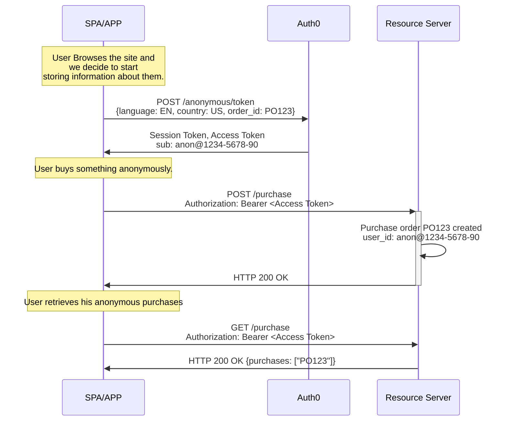

import { ReleaseStageNotice } from "/snippets/ReleaseStageNotice.jsx"

<ReleaseStageNotice
    feature="Anonymous Sessions"
    stage="beta"
    terms="true"
    contact="Auth0 Support"
/>

Anonymous sessions allow you to create and manage [user sessions](/docs/manage-users/sessions) without requiring authentication. Users can browse, add items to carts or wishlists, complete purchases, and set preferences before creating an account and then carry their activity into their authenticated profile when they sign up or log in. 


## How it works



When you decide to start tracking a user — even one who has not authenticated yet — your application sends a `POST /anonymous/token` request. Auth0 responds with two tokens:

- A **session token** (JWT or JWE) that identifies and persists the anonymous session
- An **access token** (OAuth 2.0-compliant) that the user can present to your resource servers

Subsequent calls that include the session token continue the same session for the same `user_id`, so all activity is traceable to a single origin. Because the access token is OAuth 2.0-compliant, anonymous users can call any of your existing APIs without additional plumbing.


### What Anonymous Sessions provide

- **Track guest users** across page loads and sessions
- **Store metadata** such as shopping cart references, preferences, consents, and profiling information
- **Issue OAuth 2.0 access tokens** for API calls without requiring authentication
- **Transfer anonymous activity** to authenticated accounts when users sign up or log in

### Anonymous user ID

Each anonymous user has a unique identifier in UUID format, consistent across all tokens for that session. If you include a `user_id` in the initial session creation call, Auth0 uses it instead of generating one.

### Anonymous session ID

Each anonymous session has its own identifier. The same anonymous user may have more than one session — for example, when a previous session expired, or when you supply your own user IDs.


## Anonymous sessions use cases

### Guest checkout
You can allow users to add items to a cart and complete purchases without creating an account:

```javascript
// Create anonymous session with cart metadata
const session = await anonymousClient.createSession({
  audience: 'https://api.example.com',
  metadata: { cart: [] }
});

// Add item to cart
await anonymousClient.updateSession(session.session_token, {
  metadata: { cart: [...anonymousClient.getMetadata().cart, { sku: 'ITEM-001', qty: 1 }] }
});

// Add other information, relevant to the purchase e.g. postcode
await anonymousClient.updateSession(session.session_token, {
  metadata: { postcode: "67002", city: "Andover", state: "Kansas" }
});

// Execute the purchase with the anonymous access token 
// (you may need to request one if the current is expired)
await webStoreClient.executePurchase(
  headers: {
    'Authorization': `Bearer ${anonymousClient.getAnonymousAccessTokenSilently()}`
  },
  body: {
    anonymousClient.getMetadata().cart
  }
);
```

Once the purchase is complete, you can present the user with a login screen: to add the anonymous session data to their profile using [Actions](/docs/customize/actions/actions-overview):

```javascript
// Purchase completed, clean up the shopping cart, and
// add the order ID to the list of orders inside the anonymous session
await anonymousClient.updateSession(session.session_token, {
  metadata: { 
    orders: [...anonymousClient.getMetadata().orders, { order_id: "PO-12345" }],
    cart: null
  }
});

// Now link the anonymous session to the user
// The session should travel in a cookie to the auth server
// But you could also include it in anonymous_session_token 
await auth0.loginWithRedirect();
```

Once the user authenticates, you can use a [`pre-user-registration`](/docs/customize/actions/explore-triggers/signup-and-login-triggers/pre-user-registration-trigger) Action trigger to add the anonymous session data to their profile: 

```javascript
// In your Auth0 Action (Post-login)
exports.onExecutePreUserRegistration = async (event, api) => {
  if (event.anonymous_session) {
    // Copy anonymous session details to the user profile
    let current_anon_session = event.anonymous_session;
    /* current_anon_session will be:
        {
          user_id: "anon|123",
          session_id: "sess_123456",
          metadata: {
            postcode: "67002", 
            city: "Andover",
            state: "Kansas",
            orders: [ { order_id: "PO-12345" } ]
          }
        }
    */
    let anon_sessions = [...event.user.metadata.conversion, current_anon_session]
    api.user.setAppMetadata('conversion', anon_sessions );
  }
};
```
### Preference/Wishlist tracking

You can store user preferences before they create an account and drive conversion:

```javascript
// Create anonymous session with empty metadata
const session = await anonymousClient.createSession({
  audience: 'https://api.example.com',
  metadata: { wishlist: [] }
});

// Add information about the user
await anonymousClient.updateSession(session.session_token, {
  metadata: { cookie_consent: true, marketing_consent: true, email: informed_email }
});

// Add item to wishlist
addItemToWishlist: (item) => {
  await anonymousClient.updateSession(session.session_token, {
    metadata: { wishlist: [...anonymousClient.getMetadata().wishlist, item] }
  });
  // If the person added 10 items to the wishlist, they must log in
  if(anonymousClient.getMetadata().wishlist.size >= 10) {
    await auth0.loginWithRedirect();
  }
}

// Send wishlist by email with the anonymous access token 
// (you may need to request one if the current is expired)
await email.sendWishlistByEmail(
  headers: {
    'Authorization': `Bearer ${anonymousClient.getAnonymousAccessTokenSilently()}`
  },
  body: {
    from: anonymousClient.getMetadata().email,
    to: friends_email
    body: anonymousClient.getMetadata().wishlist
  }
);
```

### Progressive profiling

You can collect user information gradually:

```javascript
// Create anonymous session with empty metadata
const session = await anonymousClient.createSession({
  audience: 'https://api.example.com',
  metadata: {}
});

// Add information about the user
await anonymousClient.updateSession(session.session_token, {
  metadata: { 
    theme: 'dark', 
    favorite_color: 'blue',
    favorite_country: 'Japan', 
    email: informed_email
  }
});

// Make them signup now, use the captured intel
await auth0.loginWithRedirect({
  authorization_params: {
    login_hint: anonymousClient.getMetadata().email,
    screen_hint: 'signup'
  }
});
```

Once the user authenticates, use a `pre-user-registration` Action trigger to add the anonymous session data to their profile: 

```javascript
// In your Auth0 Action (Pre-Registration)
exports.onExecutePreUserRegistration = async (event, api) => {
  if (event.anonymous_session) {
    // Copy anonymous preferences to the new user profile
    api.user.setAppMetadata('preferences', event.anonymous_session?.metadata?.preferences);
  }
};
```


## Limitations

- Session transfer only occurs during login (Post-Login Action) and sign-up (Pre-Registration Action).
- Password reset flows do not link anonymous sessions.
- The following grant types are not supported: Device Code, Client-Initiated Backchannel Authentication (CIBA), custom token exchange, and refresh token exchange.
- Anonymous sessions are not a secure data store. To learn more, read [Anonymous Sessions Best Practices](/docs/manage-users/sessions/anonymous-sessions/best-practices).

## Learn more

- [Configure Anonymous Sessions](/docs/manage-users/sessions/anonymous-sessions/quickstart) — Configure Anonymous Sessions and create your first session in five steps.
- [Transfer Anonymous Sessions to Users](/docs/manage-users/sessions/anonymous-sessions/transfer-to-users) — Migrate cart, preference, and activity data when a guest signs up or logs in.
- [Anonymous Sessions Best Practices](/docs/manage-users/sessions/anonymous-sessions/best-practices) — Security, performance, and implementation recommendations.