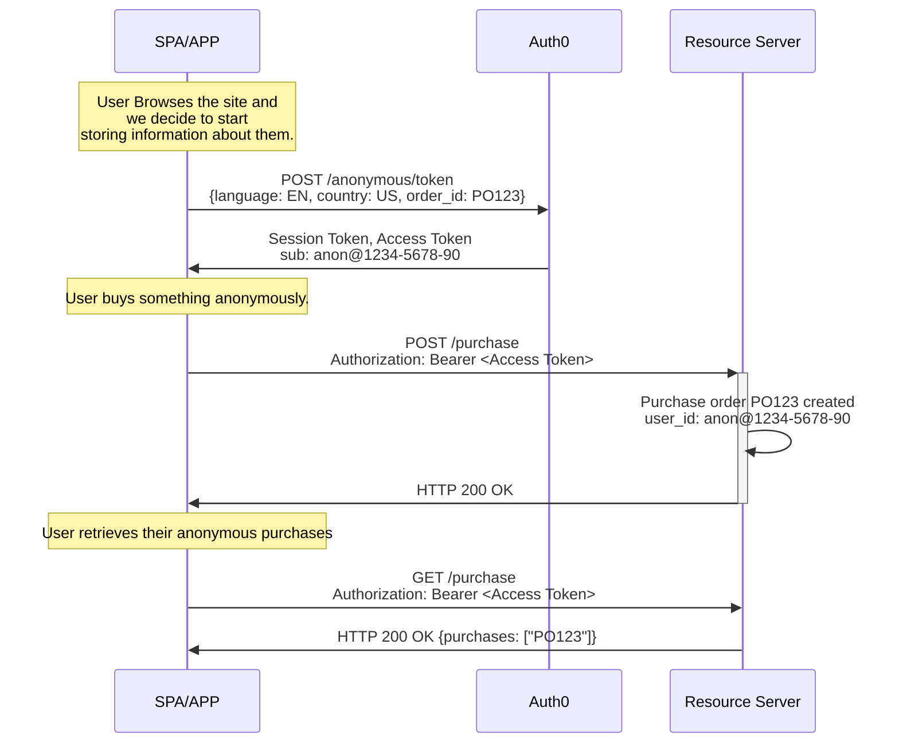
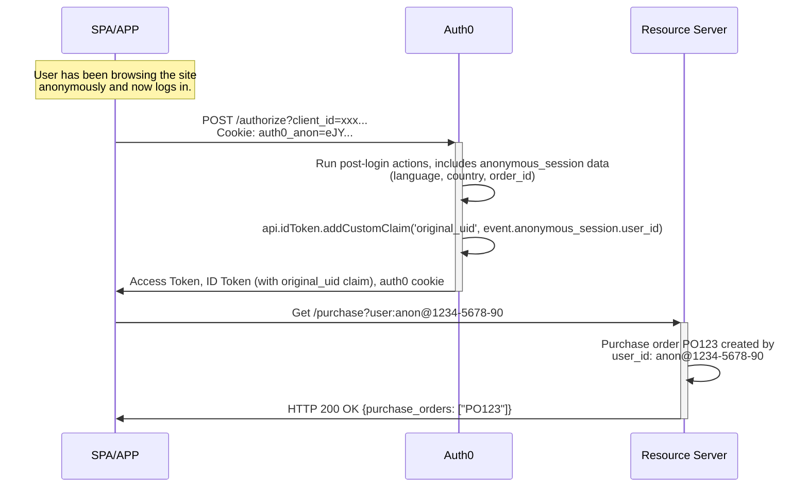

import { ReleaseStageNotice } from "/snippets/ReleaseStageNotice.jsx"

<ReleaseStageNotice
    feature="Anonymous Sessions"
    stage="beta"
    terms="true"
    contact="Auth0 Support"
/>

Anonymous sessions allow you to create and manage [user sessions](/docs/manage-users/sessions) without requiring authentication.

Users can browse, add items to carts or wishlists, complete purchases, and set preferences before creating an account.  Users then bring their activity into their authenticated profile when they sign up or log in. 

Use anonymous sessions for the following use cases:

- **Track guest users** across page loads and sessions
- **Store metadata** such as shopping cart references, preferences, consents, and profiling information
- **Issue access tokens** for API calls without requiring authentication
- **Transfer anonymous activity** to authenticated accounts when users sign up or log in

<Warning>
Auth0 anonymous session Metadata is not a secure data store and should not be used to store sensitive information. 
This includes secrets and high-risk PII like social security numbers or credit card numbers, etc. 

Additionally, the data stored in an anonymous session is not verified for truthness or accuracy and should never be taken at face value. 

Auth0 customers are strongly encouraged to evaluate the data stored in metadata and only store that which is necessary for session tagging and access management purposes. 
To learn more, read [Auth0 General Data Protection Regulation Compliance](/docs/secure/data-privacy-and-compliance/gdpr)."
</Warning>

## How it works

### Gather anonymous sessions data

When you decide to start gathering information about a user, even one who has not authenticated yet, your application sends a `POST` request to the `/anonymous/token` endpoint. 

Auth0 responds with two tokens:

- A [**session token**](/docs/secure/tokens/session-tokens) that identifies and persists the anonymous session.
- An [**access token**](/docs/secure/tokens/access-tokens) that the user can present to your [resource servers (APIs)](/docs/get-started/apis).

Subsequent calls that include the session token continue the same session for the same `user_id`, so all activity is traceable to a single origin. 
Using the access token, anonymous users can call any of your existing APIs.



```json Anonymous session data of user anon@1234-5678-90
{
  "user_id": "anon@1234-5678-90",
  "session_id": "sess_456",
  "metadata": {
    "language": "EN",
    "country": "US",
    "purchase": "P0123"
  }
}
```
### Transfer anonymous sessions data to user's metadata 

When a user who has an anonymous session decides to log in or sign up, your application passes the `anonymous_session_token` to the `/authorize` endpoint using a cookie or an HTTP header. 

```javascript cookie example
// No extra code needed — cookie is sent automatically
await auth0.loginWithRedirect();
```

```javascript authorize endpoint example
GET /authorize?
  client_id: YOUR_CLIENT_ID&
  redirect_uri: https://YOUR_ClIENT_URL/callback&
  response_type: code&
  scope: openid&
  Auth0-Anonymous-Session: eyJhbGciOiJkaXIiLCJlbmMiOiJBMjU2R0NNIn0...
```



Auth0 makes the anonymous session data available in your [`pre-user-registration`](/docs/customize/actions/explore-triggers/signup-and-login-triggers/pre-user-registration-trigger)  and [`post-login`](/docs/customize/actions/explore-triggers/signup-and-login-triggers/login-trigger) Actions triggers using the `event.anonymous_session` object.

```json anonymous session object
{
  "anonymous_session": {
    "user_id": "anon@1234-5678-90",
    "session_id": "sess_123",
    "created_at": "2026-05-14T10:30:00Z",
    "metadata": {
      "language": "en",
      "country": "US",
      "order_id": "PO123"
    }
  }
}
```

To learn more about anonymous sessions with Actions, read [Anonymous Sessions Use Cases](/docs/manage-users/sessions/anonymous-sessions/anonymous-sessions-use-cases).

### End the anonymous session after transfer

Anonymous sessions are not automatically invalidated when a user authenticates. To end the session use the `/anonymous/logout` endpoint:

```javascript wrap lines
// In your application, after successful login
if (wasAnonymousSession) {
  await fetch('https://YOUR_DOMAIN/anonymous/logout', {
    method: 'POST',
    headers: { 'Content-Type': 'application/json' },
    credentials: 'include', // Send cookies
    body: JSON.stringify({ client_id: 'YOUR_CLIENT_ID' }),
  });
}
```

## Best practices

Here are some best practices for anonymous sessions:

- Configure appropriate [anonymous session lifetimes](/docs/manage-users/sessions/anonymous-sessions/configure-anonymous-sessions#configure-anonymous-sessions-in-your-auth0-tenant) to avoid losing a user's anonymous session data; Auth0 recommends a lifetime of 30 days or longer.

- Select anonymous session's [JSON Web Encryption (JWE)](/docs/manage-users/sessions/anonymous-sessions/configure-anonymous-sessions#configure-anonymous-sessions-in-your-auth0-tenant) encryption to ensure that potential attackers cannot see the contents of the session. 

- Restrict what anonymous `anon@` users can do in your API. 

- Validate tokens and sanitize metadata, never trust metadata or tokens from clients without server-side validation. 

- Cache [access tokens](/docs/secure/tokens/access-tokens) since they can be reused until they expire.

- Batch and minimize [metadata updates](/docs/manage-users/sessions/anonymous-sessions/configure-anonymous-sessions#update-the-session-with-metadata). Avoid frequent metadata updates. 


## Limitations

- [Password reset](/docs/customize/actions/explore-triggers/password-reset-triggers#password-reset-triggers) flows are not supported by anonymous sessions.
- [Device Code](/docs/get-started/authentication-and-authorization-flow/device-authorization-flow) is not supported because the authentication request and the actual login happen on different devices.
- [Client-Initiated Backchannel Authentication (CIBA)](/docs/get-started/applications/configure-client-initiated-backchannel-authentication) is not supported because the authentication request and confirmation happen on different devices.
- [Custom token exchange](/docs/authenticate/custom-token-exchange/cte-example-use-cases) is not supported due to the nature of the transactions (for example, impersonation), which creates a likelihood of attributing anonymous data to the wrong user.
- [Refresh token exchange](/docs/secure/call-apis-on-users-behalf/token-vault/configure-token-vault#configure-token-exchange) is not supported by anonymous sessions because the user is already logged in if they had a refresh token.

## Learn more

- [Configure Anonymous Sessions](/docs/manage-users/sessions/anonymous-sessions/configure-anonymous-sessions) Learn how to configure anonymous sessions.
- [Anonymous Sessions Use Cases](/docs/manage-users/sessions/anonymous-sessions/anonymous-sessions-use-cases) Learn about anonymous sessions use cases. 