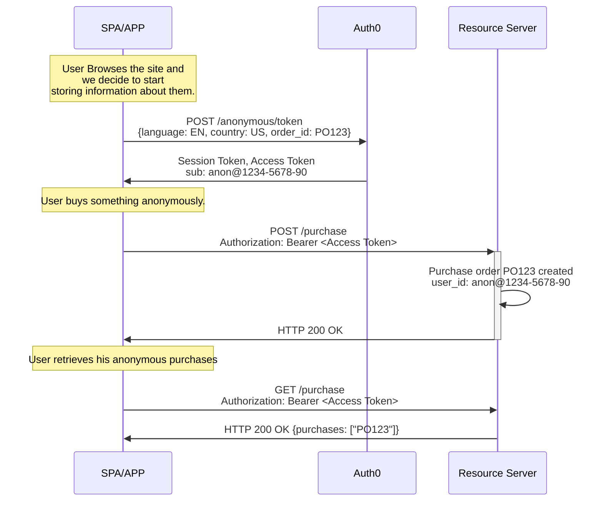
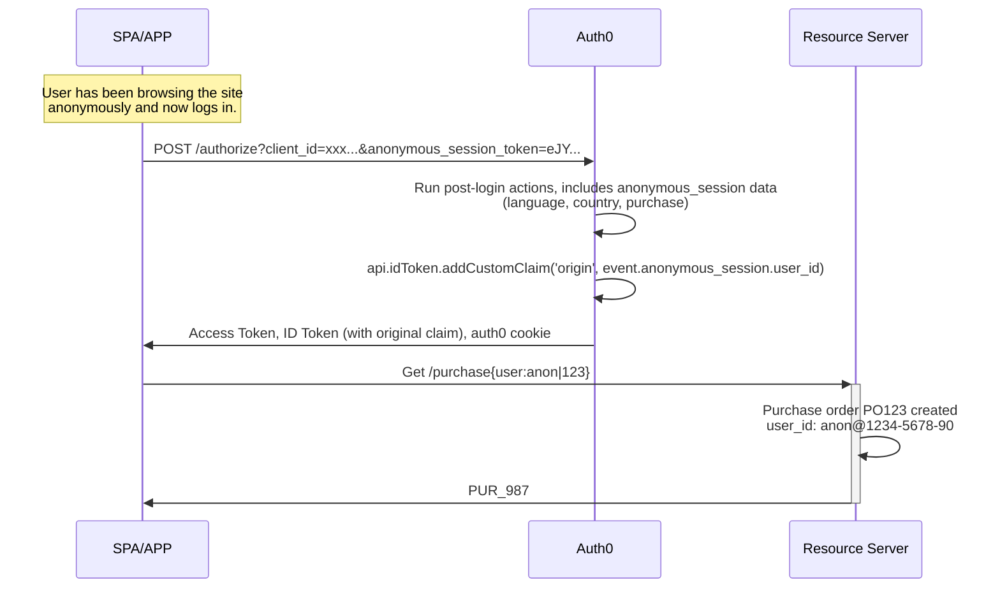

import { ReleaseStageNotice } from "/snippets/ReleaseStageNotice.jsx"

<ReleaseStageNotice
    feature="Anonymous Sessions"
    stage="beta"
    terms="true"
    contact="Auth0 Support"
/>

Anonymous sessions allow you to create and manage [user sessions](/docs/manage-users/sessions) without requiring authentication. 

Users can browse, add items to carts or wishlists, complete purchases, and set preferences before creating an account and then carry their activity into their authenticated profile when they sign up or log in. 

Use cases for Anonymous sessions include: 

- **Track guest users** across page loads and sessions
- **Store metadata** such as shopping cart references, preferences, consents, and profiling information
- **Issue OAuth 2.0 access tokens** for API calls without requiring authentication
- **Transfer anonymous activity** to authenticated accounts when users sign up or log in


## How it works

### Gather anonymous sessions data

When you decide to start gathering information about a user, even one who has not authenticated yet, your application sends a `POST` request to the `/anonymous/token` endpoint. 

Auth0 responds with two tokens:

- A [**session token**](/docs/secure/tokens/session-tokens) that identifies and persists the anonymous session.
- An [**access token**](/docs/secure/tokens/access-tokens) that the user can present to your resource servers.

Subsequent calls that include the session token continue the same session for the same `user_id`, so all activity is traceable to a single origin. 
Because the access token is OAuth 2.0-compliant, anonymous users can call any of your existing APIs.



```json Anonymous session data of user 57f0fcba-e6f0-4e74-ae65-f4c8953a72fb 
{
  user_id: "57f0fcba-e6f0-4e74-ae65-f4c8953a72fb",
  session_id: "sess_456",
  metadata: {
    language: 'EN',
    country: 'US',
    purchase: 'PO123'
  }
}
```

### Transfer anonymous sessions data to user's metadata 

When a user who has an anonymous session decides to log in or sign up, your application passes the `anonymous_session_token` to the `/authorize` endpoint using a cookie or a query parameter. 




```javascript cookie example
// No extra code needed — cookie is sent automatically
await auth0.loginWithRedirect();
```

```javascript authorize endpoint example
https://YOUR_DOMAIN/authorize?
  client_id=YOUR_CLIENT_ID&
  redirect_uri=https://YOUR_APPLICATION_URL/callback&
  response_type=code&
  scope=openid profile&
  anonymous_session_token=SESSION_TOKEN
```

Auth0 makes the anonymous session data available in your `Pre-Registration` and `Post-Login` Actions using the `event.anonymous_session` object.

```json anonymous session object
{
  "anonymous_session": {
    "user_id": "anon|abc123",
    "session_id": "sess_123",
    "created_at": "2026-05-14T10:30:00Z",
    "metadata": {
      "cart": {
        "items": [{ "sku": "ITEM-001", "qty": 2 }]
      },
      "preferences": {
        "theme": "dark"
      }
    }
  }
}
```

To learn more about using anonymous sessions with Actions, read Anonymous sessions use cases.


## Limitations

- Session transfer only occurs during login (Post-Login Action) and sign-up (Pre-Registration Action).
- Password reset flows do not link anonymous sessions.
- The following grant types are not supported: Device Code, Client-Initiated Backchannel Authentication (CIBA), custom token exchange, and refresh token exchange.
- Anonymous sessions are not a secure data store. To learn more, read [Anonymous Sessions Best Practices](/docs/manage-users/sessions/anonymous-sessions/best-practices).

## Unsupported flows

Session transfer does not occur during:

- **Device Code** — the authentication request and the actual login happen on different devices
- **Client-Initiated Backchannel Authentication (CIBA)** — the authentication request and confirmation happen on different devices
- **Custom token exchange** — given the nature of the transaction (for example, impersonation), there is a likelihood of attributing anonymous data to the wrong user
- **Refresh token exchange** — it is assumed the user was already logged in if they had a refresh token
- **Password reset flows** — intentionally excluded to prevent accidentally associating anonymous data with accounts during password recovery, and because the two-step process may result in mismatching anonymous data being merged


## Learn more

- [Configure Anonymous Sessions](/docs/manage-users/sessions/anonymous-sessions/quickstart) — Configure Anonymous Sessions and create your first session in five steps.
- [Transfer Anonymous Sessions to Users](/docs/manage-users/sessions/anonymous-sessions/transfer-to-users) — Migrate cart, preference, and activity data when a guest signs up or logs in.
- [Anonymous Sessions Best Practices](/docs/manage-users/sessions/anonymous-sessions/best-practices) — Security, performance, and implementation recommendations.