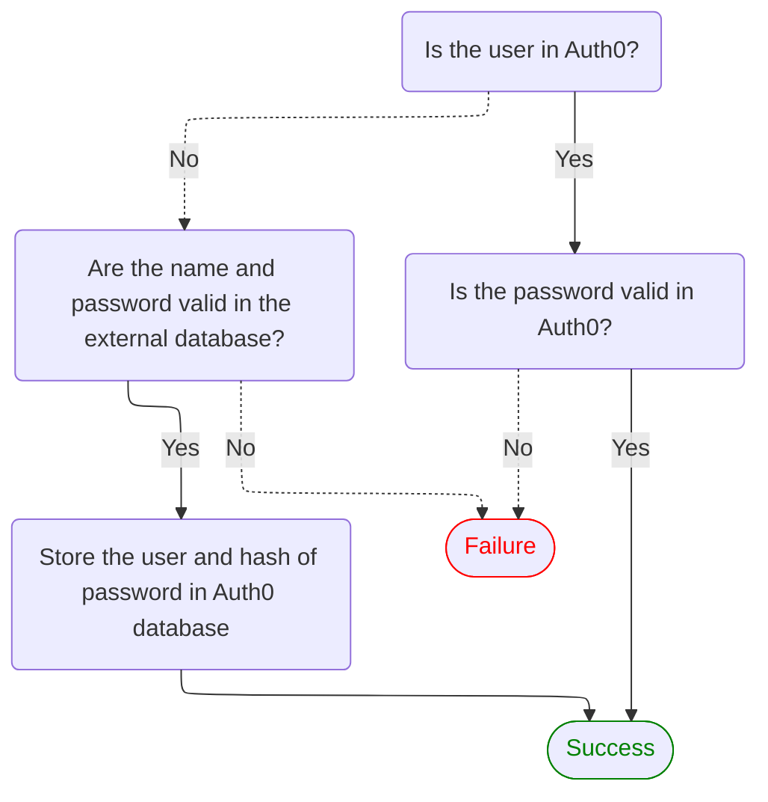

When using a [custom database connection](/docs/authenticate/database-connections/custom-db), Auth0 supports automatic migration (also known as *trickle migration* or *lazy migration*) of users from your external user store to the Auth0 user store.

When a user authenticates via a custom database connection marked for import to Auth0, the following process takes place:



If the user doesn't exist in the Auth0 user store, Auth0 authenticates against your external user store and, if successful, creates the user in the Auth0 user store using the same ID and password supplied during authentication.

In this way, your existing users are migrated to Auth0 the first time they log in and do not need to reset their password as a result. New users are added directly to the Auth0 user store. 

## Start the migration

<Steps>
<Step title="Prerequisites">
To configure automatic migration, you need:

* A [custom database connection](/docs/authenticate/database-connections/custom-db/create-db-connection) using your external user store.
</Step>

<Step title="Enable migration">
From [Auth0 Dashboard > Authentication > Database](https://manage.auth0.com/#/connections/database), select the custom database connection.

In the **Settings** tab, toggle **Import Users to Auth0** and select **Save**.
</Step>

<Step title="Configure database action scripts">
[Database action scripts](/docs/authenticate/database-connections/custom-db/templates) are code you write that Auth0 executes when interacting with your external user store, like when a user logs in or signs up.

Next, in the **Custom Database** tab, find the **Database Action Scripts** section.

<Frame>
    
</Frame>

When you enable automatic migration, you must implement two scripts:

* The [`login()` script](/docs/authenticate/database-connections/custom-db/templates/login), which executes when a user who is not in the Auth0 database tries to log in.

* The [`getUser()` script](/docs/authenticate/database-connections/custom-db/templates/get-user), which executes in scenarios like sign-ups and password changes. The data returned from the `getUser()` script is migrated into the new Auth0 user profile.
</Step>

</Steps>

## Manage external user store data during migration

We recommend the following best practices for handling user data in your external user store during automatic migration:

* Users remain in your external user store unless you explicitly archive or delete them. If a user is migrated to Auth0 and then deleted from Auth0 but remains in your external user store, it's possible that the deleted user could try to log in and be migrated again.

    We recommend marking user identities in your external user store as migrated before the Login or Get Users custom database action scripts execute to prevent the unintentional recreation of users deleted intentionally.

* Typically, users are created in the Auth0 user store after the [Login action script](/docs/authenticate/database-connections/custom-db/templates/login) completes. Instead of deleting users from your external user store as an inline operation in the Login script, we recommend deleting users as an independent process to avoid accidental user deletion in the event of an error during migration.

## Complete the migration

<Steps>
<Step title="Verify migration completion">
Verify that the migration is complete by checking that all users in your external user store are in the Auth0 user store.

You can view all users in the Auth0 user store in two ways:

* On [Auth0 Dashboard > User Management > Users](https://manage.auth0.com/#/users).

* With the Management API's [List or Search users endpoint](/docs/api/management/v2/users/get-users) (`GET /users`).

</Step>

<Step title="Disconnect external user store">
Once you confirm that all users are migrated, you can disconnect your external user store by updating your database action scripts to no operation functions. This prevents Auth0 from connecting to your external user store to authenticate users.

<Warning>
Leave the **Import Users to Auth0** option on. This setting is what tells Auth0 to use the Auth0 user store for your custom database connection (instead of using only your external user store via your database action scripts).
</Warning>

From [Auth0 Dashboard > Authentication > Database](https://manage.auth0.com/#/connections/database), select your database connection. On the **Custom Database** tab, find the **Database Action Scripts** section.

Update the **Login** script:

```javascript lines
function login (email, password, callback) {
    return callback(null, null);
}
```

Update the **Get User** script:

```javascript lines
function getByEmail (email, callback) {
    return callback(null, null);
}
```
</Step>
</Steps>

## Troubleshoot user migration issues

If you encounter any issues with automatic migration, first read [Custom Database Connection and Action Script Best Practices](/docs/authenticate/database-connections/custom-db/custom-database-connections-scripts).

### Duplicated user or user already exists

During the user migration process, Auth0 first creates a partial user profile in an internal user store, and then creates a full user profile in your database connection. If an issue occurs that prevents this full user profile from being created, you may encounter a "The user already exists" error.

A `DUPLICATED_USER` error indicates that the user exists in Auth0's internal user store but not in your tenant. You may encounter this error if:

* You try to use more than one migration method (for example, automatic migration then bulk user import).
* You delete a user from your database connection and then try to recreate the user.
* You attempt to create a new user in your database connection when the user already exists in your external user store.

To resolve `DUPLICATED_USER` or "The user already exists" errors:

1. Check the `console.log()` statements with the [Actions Real-time Logs](/docs/customize/actions/actions-real-time-logs).

2. Delete the user with the Management API [Delete a User](https://auth0.com/docs/api/management/v2#!/Users/delete_users_by_id) endpoint.

3. Delete the user with the Management API [Delete a Connection User](https://auth0.com/docs/api/management/v2#!/Connections/delete_users_by_email) endpoint.

4. Instruct the user to log in or change their password to reattempt migration.

### Missing metadata

If a user is interrupted during the login or change password flow that initiates the migration process, Auth0 may not be able to transfer their metadata (`user_metadata` or `app_metadata`) along with their other profile data.

You can mitigate this scenario by creating an [Action](/docs/customize/actions) that verifies the user's profile is missing metadata, retrieves it from the external use store, and then stores it in Auth0.
